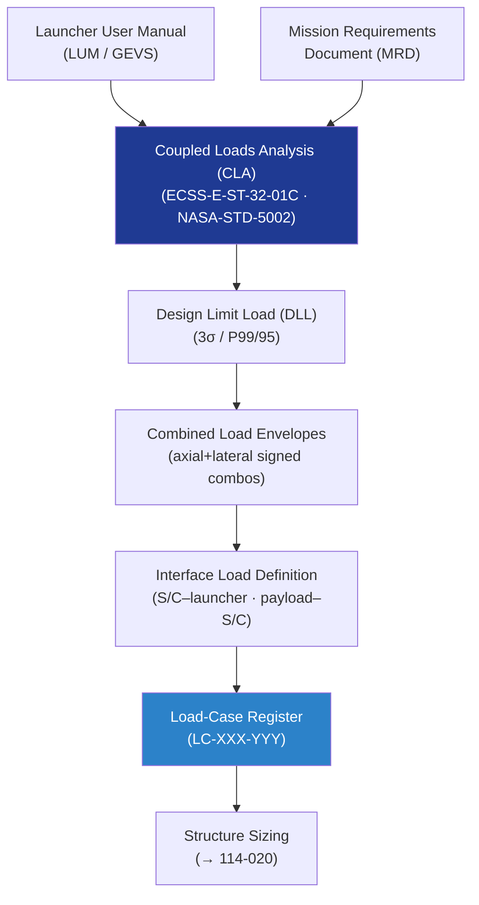

# STA 110-119 · 114-010 — Launch and On-Orbit Load Cases

## 1. Purpose

Defines the **mission-phase load-case matrix** for Q+ATLANTIDE STA-band spacecraft and payloads, establishing the normative load-case hierarchy and applicability per ECSS-E-ST-32-01C[^ecsse3201] and NASA-STD-5002[^nasastd5002].

## 2. Scope

- Covers the *Launch and On-Orbit Load Cases* subsubject (`010`) of subsection `114`.
- Inherits Q-Division authority and ORB support from the parent row in [`../../README.md` §3](../../README.md#3-architecture-table)[^archtable].
- Concepts in scope:
  - **Load-case taxonomy** — launch (lift-off, max-q, MECO, stage separation, fairing jettison), ascent transients, on-orbit (boost, attitude manoeuvres, docking/berthing, EVA loads), re-entry, and landing.
  - **Design limit load (DLL)** — envelope of maximum expected loads across all mission phases; statistical derivation at 3σ or P99/95 confidence level.
  - **Combined load envelopes** — axial + lateral simultaneous load combinations; worst-case signed combinations for structural sizing.
  - **Interface load definition** — coupled loads analysis (CLA) process; spacecraft-to-launcher interface force and moment limits; payload-to-spacecraft interface loads.
  - **Mission phases matrix** — tabulated load-case matrix listing phase, event, load type, and governing standard for each Q+ATLANTIDE STA mission class (LEO, cis-lunar, lunar surface, interplanetary).
  - **Load-case register** — unique load-case ID scheme (LC-XXX-YYY), traceability to mission requirements document (MRD) and launcher user manual (LUM).

## 3. Diagram — Load-Case Derivation Flow

## Footprint

| Metric | Value |
|---|---|
| Architecture | `STA` — Space Technology Architecture |
| Master range | `100–199` |
| Code range | `110-119` |
| Section | `01` — Estructuras y Materiales Espaciales |
| Subsection | `114` — Cargas Mecánicas, Vibración y Choque |
| Subsubject | `010` — Launch and On-Orbit Load Cases |
| Primary Q-Division | Q-SPACE[^qdiv] |
| Support Q-Divisions | Q-STRUCTURES, Q-DATAGOV, Q-HORIZON, Q-HPC, Q-INDUSTRY |
| ORB support | ORB-PMO, ORB-FIN |
| Governance class | `baseline`[^gov] |
| Folder path | `Q+ATLANTIDE/100-199_STA/110-119_Estructuras-y-Materiales-Espaciales/114_Cargas-Mecanicas-Vibracion-y-Choque/` |
| Document | `114-010-Launch-and-On-Orbit-Load-Cases.md` (this file) |
| Parent subsection | [`README.md`](./README.md) · [`114-000-General.md`](./114-000-General.md) |
| Parent architecture | [`../../README.md`](../../README.md) |
| Parent baseline | [`organization/Q+ATLANTIDE.md`](../../../../organization/Q+ATLANTIDE.md) |

## References & Citations

[^baseline]: **Q+ATLANTIDE controlled baseline (v1.0.0)** — [`organization/Q+ATLANTIDE.md`](../../../../organization/Q+ATLANTIDE.md). Defines the controlled `000-999` architecture-band taxonomy and the ATLAS-1000 register subpart.

[^archtable]: **STA §3 Architecture Table** — [`../../README.md` §3](../../README.md#3-architecture-table). Authoritative source for the `110-119` row.

[^qdiv]: **Q-Division authority** — Q-Divisions provide technical authority over an architecture row (Q+ATLANTIDE Note N-002). See [`organization/Q+ATLANTIDE.md` §4](../../../../organization/Q+ATLANTIDE.md#4-notes).

[^gov]: **Governance class** — `baseline` denotes documents under controlled change management within the Q+ATLANTIDE baseline.

[^ecsse3201]: **ECSS-E-ST-32-01C — Space Engineering: Structural General Requirements** — European standard defining structural general requirements for space systems, covering load cases, safety factors, and structural analysis.

[^ecsse3210]: **ECSS-E-ST-32-10C Rev.1 — Space Engineering: Structural Factors of Safety for Spaceflight Hardware** — European standard defining factors of safety for structural design and test.

[^ecsse3211]: **ECSS-E-ST-32-11C — Space Engineering: Modal Survey Assessment** — European standard for structural dynamic model verification through modal survey testing.

[^nasastd5002]: **NASA-STD-5002 — Loads Analyses of Spacecraft and Payloads** — NASA standard defining loads analysis process for launch, ascent, on-orbit, and re-entry mission phases.

[^nasahdbk7005]: **NASA-HDBK-7005 — Dynamic Environmental Criteria** — NASA handbook providing dynamic environmental criteria (sinusoidal, random, acoustic, shock) for spacecraft qualification.

[^nasastd5019]: **NASA-STD-5019A — Fracture Control Requirements for Spaceflight Hardware** — NASA standard defining fracture control programme requirements for pressurised and unpressurised structures.

[^iso9283]: **ISO 9283:1998 — Manipulating Industrial Robots: Performance Criteria** — Applicable to robotic structural and dynamic characterisation.

### Applicable industry standards

- ECSS-E-ST-32-01C — Space Engineering: Structural General Requirements[^ecsse3201]
- ECSS-E-ST-32-10C Rev.1 — Structural Factors of Safety for Spaceflight Hardware[^ecsse3210]
- ECSS-E-ST-32-11C — Modal Survey Assessment[^ecsse3211]
- NASA-STD-5002 — Loads Analyses of Spacecraft and Payloads[^nasastd5002]
- NASA-HDBK-7005 — Dynamic Environmental Criteria[^nasahdbk7005]
- NASA-STD-5019A — Fracture Control Requirements for Spaceflight Hardware[^nasastd5019]