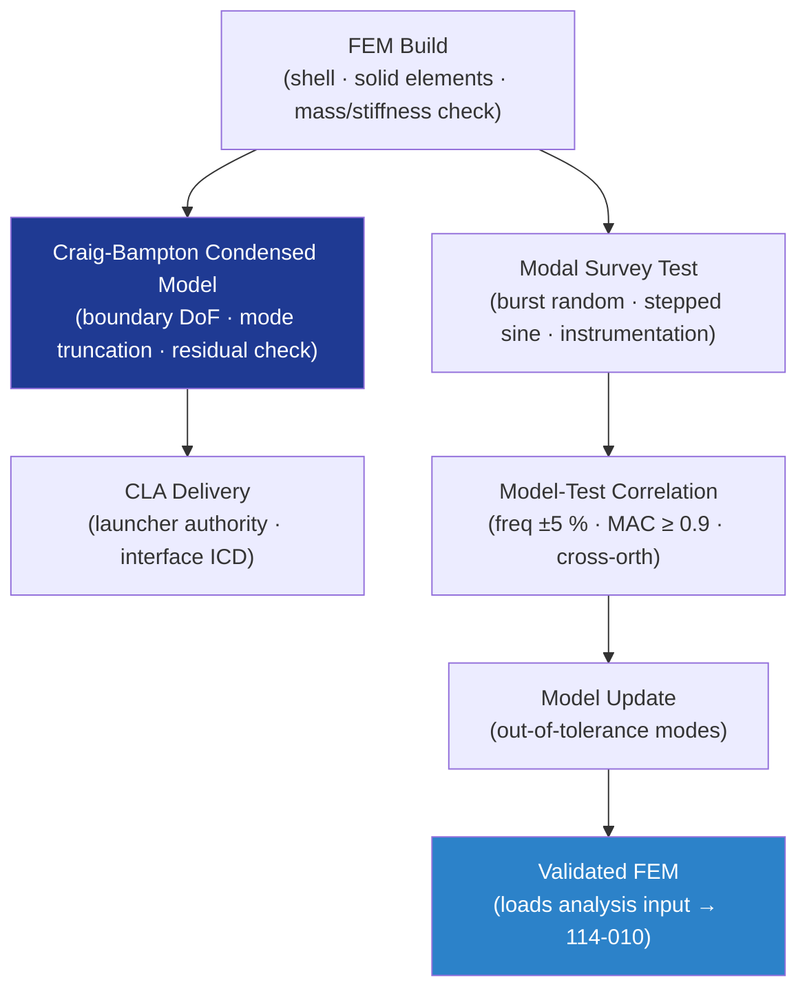

# STA 110-119 · 114-070 — Structural Dynamics Modelling and Modal Analysis

## 1. Purpose

Defines the **structural dynamics modelling standard and modal analysis requirements** for Q+ATLANTIDE STA-band spacecraft, covering FEM build standard, condensed (Craig-Bampton) model delivery, modal survey test planning, and model-test correlation criteria per ECSS-E-ST-32-11C[^ecsse3211] and ECSS-E-ST-32-01C[^ecsse3201].

## 2. Scope

- Covers the *Structural Dynamics Modelling and Modal Analysis* subsubject (`070`) of subsection `114`.
- Inherits Q-Division authority and ORB support from the parent row in [`../../README.md` §3](../../README.md#3-architecture-table)[^archtable].
- Concepts in scope:
  - **FEM build standard** — element type selection (CQUAD4/CTRIA3 for shells, CHEXA/CPENTA for solid), mesh density criteria (≥ 6 elements per wavelength at highest frequency of interest), mass and stiffness model verification.
  - **Craig-Bampton (CB) condensed model** — boundary degrees of freedom (DoF) at spacecraft-to-launcher interface; internal mode truncation at ≥ 1.5× highest frequency of interest; residual mass and inertia check.
  - **Coupled loads analysis (CLA) delivery** — CB model delivery to launcher authority; interface definition per launcher ICD; model quality checks per ECSS-E-ST-32-11C[^ecsse3211].
  - **Modal survey test (MST)** — test article configuration, suspension/boundary conditions, excitation methods (burst random, stepped sine), sensor placement (accelerometers, force gauges), degree of instrumentation.
  - **Model-test correlation criteria** — frequency correlation within ±5 % for target modes; MAC ≥ 0.9; cross-orthogonality ≥ 0.9 on diagonal; model updating procedure for out-of-tolerance modes.
  - **Damping characterisation** — identified damping ratios from curve-fitting (MDOF); damping model selection (proportional vs. modal); sensitivity analysis for boundary damping.

## 3. Diagram — Structural Dynamics Model and Correlation Flow

## Footprint

| Metric | Value |
|---|---|
| Architecture | `STA` — Space Technology Architecture |
| Master range | `100–199` |
| Code range | `110-119` |
| Section | `01` — Estructuras y Materiales Espaciales |
| Subsection | `114` — Cargas Mecánicas, Vibración y Choque |
| Subsubject | `070` — Structural Dynamics Modelling and Modal Analysis |
| Primary Q-Division | Q-SPACE[^qdiv] |
| Support Q-Divisions | Q-STRUCTURES, Q-DATAGOV, Q-HORIZON, Q-HPC, Q-INDUSTRY |
| ORB support | ORB-PMO, ORB-FIN |
| Governance class | `baseline`[^gov] |
| Folder path | `Q+ATLANTIDE/100-199_STA/110-119_Estructuras-y-Materiales-Espaciales/114_Cargas-Mecanicas-Vibracion-y-Choque/` |
| Document | `114-070-Structural-Dynamics-Modelling-and-Modal-Analysis.md` (this file) |
| Parent subsection | [`README.md`](./README.md) · [`114-000-General.md`](./114-000-General.md) |
| Parent architecture | [`../../README.md`](../../README.md) |
| Parent baseline | [`organization/Q+ATLANTIDE.md`](../../../../organization/Q+ATLANTIDE.md) |

## References & Citations

[^baseline]: **Q+ATLANTIDE controlled baseline (v1.0.0)** — [`organization/Q+ATLANTIDE.md`](../../../../organization/Q+ATLANTIDE.md). Defines the controlled `000-999` architecture-band taxonomy and the ATLAS-1000 register subpart.

[^archtable]: **STA §3 Architecture Table** — [`../../README.md` §3](../../README.md#3-architecture-table). Authoritative source for the `110-119` row.

[^qdiv]: **Q-Division authority** — Q-Divisions provide technical authority over an architecture row (Q+ATLANTIDE Note N-002). See [`organization/Q+ATLANTIDE.md` §4](../../../../organization/Q+ATLANTIDE.md#4-notes).

[^gov]: **Governance class** — `baseline` denotes documents under controlled change management within the Q+ATLANTIDE baseline.

[^ecsse3201]: **ECSS-E-ST-32-01C — Space Engineering: Structural General Requirements** — European standard defining structural general requirements for space systems, covering load cases, safety factors, and structural analysis.

[^ecsse3210]: **ECSS-E-ST-32-10C Rev.1 — Space Engineering: Structural Factors of Safety for Spaceflight Hardware** — European standard defining factors of safety for structural design and test.

[^ecsse3211]: **ECSS-E-ST-32-11C — Space Engineering: Modal Survey Assessment** — European standard for structural dynamic model verification through modal survey testing.

[^nasastd5002]: **NASA-STD-5002 — Loads Analyses of Spacecraft and Payloads** — NASA standard defining loads analysis process for launch, ascent, on-orbit, and re-entry mission phases.

[^nasahdbk7005]: **NASA-HDBK-7005 — Dynamic Environmental Criteria** — NASA handbook providing dynamic environmental criteria (sinusoidal, random, acoustic, shock) for spacecraft qualification.

[^nasastd5019]: **NASA-STD-5019A — Fracture Control Requirements for Spaceflight Hardware** — NASA standard defining fracture control programme requirements for pressurised and unpressurised structures.

[^iso9283]: **ISO 9283:1998 — Manipulating Industrial Robots: Performance Criteria** — Applicable to robotic structural and dynamic characterisation.

### Applicable industry standards

- ECSS-E-ST-32-01C — Space Engineering: Structural General Requirements[^ecsse3201]
- ECSS-E-ST-32-10C Rev.1 — Structural Factors of Safety for Spaceflight Hardware[^ecsse3210]
- ECSS-E-ST-32-11C — Modal Survey Assessment[^ecsse3211]
- NASA-STD-5002 — Loads Analyses of Spacecraft and Payloads[^nasastd5002]
- NASA-HDBK-7005 — Dynamic Environmental Criteria[^nasahdbk7005]
- NASA-STD-5019A — Fracture Control Requirements for Spaceflight Hardware[^nasastd5019]