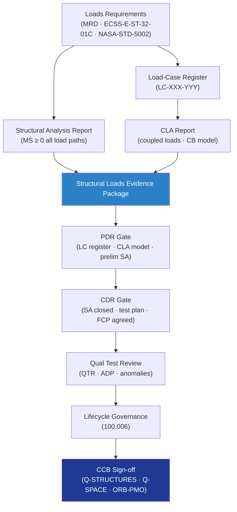

# STA 110-119 · 114-090 — Traceability Evidence and Lifecycle Governance

## 1. Purpose

Provides the **structural loads compliance traceability, evidence-package structure, and lifecycle governance rules** for subsection `114` *Cargas Mecánicas, Vibración y Choque* — declaring the controlled document hierarchy, change authority, and structural assurance evidence requirements for this structural-loads-critical subsystem.

## 2. Scope

- Covers the *Traceability, Evidence and Lifecycle Governance* subsubject (`090`) of subsection `114`.
- Inherits Q-Division authority and ORB support from the parent row in [`../../README.md` §3](../../README.md#3-architecture-table)[^archtable].
- Concepts in scope:
  - **Structural loads evidence package** — minimum evidence set: loads requirement document, load-case register (LC-XXX-YYY), structural analysis report (SA-report), coupled loads analysis report (CLA report), qualification test report (QTR), acceptance data package (ADP), fracture control plan (FCP), modal survey report, and anomaly/NCR disposition.
  - **Loads compliance traceability matrix** — maps each `114` requirement to its governing standard, verification method (A/T/I/D), and closure evidence; traceable to mission requirements document (MRD).
  - **Change authority matrix** — fracture-critical item (FCI) changes require Q-STRUCTURES + Q-SPACE + ORB-PMO sign-off; non-FCI structural changes require Q-STRUCTURES sign-off; all changes controlled through `100.006` lifecycle governance.
  - **Design review sequence** — PDR gate (load-case register complete, CLA model delivered, preliminary SA-report), CDR gate (SA-report closed at ≥ MS = 0, test plan approved, FCP agreed), qualification test review (QTR and ADP complete, all anomalies dispositioned).
  - **Linked nodes** — `110_Estructuras-Orbitales`, `111_Materiales-Espaciales`, `112_Proteccion-Termica-y-Radiacion`, `113_Mecanismos-Espaciales-y-Desplegables` per node YAML.
  - **No-AAA Rule compliance** — confirmation that no loads module uses "AAA" as an identifier per Q+ATLANTIDE Note N-004.

## 3. Diagram — Loads Evidence and Lifecycle Flow

## Footprint

| Metric | Value |
|---|---|
| Architecture | `STA` — Space Technology Architecture |
| Master range | `100–199` |
| Code range | `110-119` |
| Section | `01` — Estructuras y Materiales Espaciales |
| Subsection | `114` — Cargas Mecánicas, Vibración y Choque |
| Subsubject | `090` — Traceability Evidence and Lifecycle Governance |
| Primary Q-Division | Q-SPACE[^qdiv] |
| Support Q-Divisions | Q-STRUCTURES, Q-DATAGOV, Q-HORIZON, Q-HPC, Q-INDUSTRY |
| ORB support | ORB-PMO, ORB-FIN |
| Governance class | `baseline`[^gov] |
| Folder path | `Q+ATLANTIDE/100-199_STA/110-119_Estructuras-y-Materiales-Espaciales/114_Cargas-Mecanicas-Vibracion-y-Choque/` |
| Document | `114-090-Traceability-Evidence-and-Lifecycle-Governance.md` (this file) |
| Parent subsection | [`README.md`](./README.md) · [`114-000-General.md`](./114-000-General.md) |
| Parent architecture | [`../../README.md`](../../README.md) |
| Parent baseline | [`organization/Q+ATLANTIDE.md`](../../../../organization/Q+ATLANTIDE.md) |

## References & Citations

[^baseline]: **Q+ATLANTIDE controlled baseline (v1.0.0)** — [`organization/Q+ATLANTIDE.md`](../../../../organization/Q+ATLANTIDE.md). Defines the controlled `000-999` architecture-band taxonomy and the ATLAS-1000 register subpart.

[^archtable]: **STA §3 Architecture Table** — [`../../README.md` §3](../../README.md#3-architecture-table). Authoritative source for the `110-119` row.

[^qdiv]: **Q-Division authority** — Q-Divisions provide technical authority over an architecture row (Q+ATLANTIDE Note N-002). See [`organization/Q+ATLANTIDE.md` §4](../../../../organization/Q+ATLANTIDE.md#4-notes).

[^gov]: **Governance class** — `baseline` denotes documents under controlled change management within the Q+ATLANTIDE baseline.

[^ecsse3201]: **ECSS-E-ST-32-01C — Space Engineering: Structural General Requirements** — European standard defining structural general requirements for space systems, covering load cases, safety factors, and structural analysis.

[^ecsse3210]: **ECSS-E-ST-32-10C Rev.1 — Space Engineering: Structural Factors of Safety for Spaceflight Hardware** — European standard defining factors of safety for structural design and test.

[^ecsse3211]: **ECSS-E-ST-32-11C — Space Engineering: Modal Survey Assessment** — European standard for structural dynamic model verification through modal survey testing.

[^nasastd5002]: **NASA-STD-5002 — Loads Analyses of Spacecraft and Payloads** — NASA standard defining loads analysis process for launch, ascent, on-orbit, and re-entry mission phases.

[^nasahdbk7005]: **NASA-HDBK-7005 — Dynamic Environmental Criteria** — NASA handbook providing dynamic environmental criteria (sinusoidal, random, acoustic, shock) for spacecraft qualification.

[^nasastd5019]: **NASA-STD-5019A — Fracture Control Requirements for Spaceflight Hardware** — NASA standard defining fracture control programme requirements for pressurised and unpressurised structures.

[^iso9283]: **ISO 9283:1998 — Manipulating Industrial Robots: Performance Criteria** — Applicable to robotic structural and dynamic characterisation.

### Applicable industry standards

- ECSS-E-ST-32-01C — Space Engineering: Structural General Requirements[^ecsse3201]
- ECSS-E-ST-32-10C Rev.1 — Structural Factors of Safety for Spaceflight Hardware[^ecsse3210]
- ECSS-E-ST-32-11C — Modal Survey Assessment[^ecsse3211]
- NASA-STD-5002 — Loads Analyses of Spacecraft and Payloads[^nasastd5002]
- NASA-HDBK-7005 — Dynamic Environmental Criteria[^nasahdbk7005]
- NASA-STD-5019A — Fracture Control Requirements for Spaceflight Hardware[^nasastd5019]