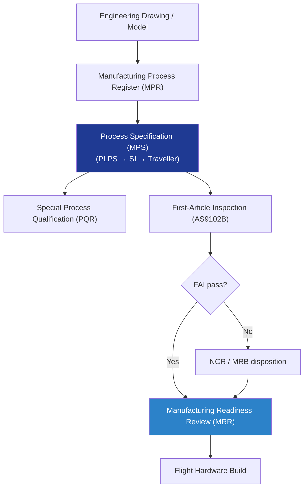

# STA 110-119 · 115-010 — Structural Manufacturing Processes and Controls

## 1. Purpose

Defines the **structural manufacturing process register and control framework** for Q+ATLANTIDE STA-band spacecraft structures, covering process specification hierarchy, first-article inspection (FAI), non-conformance and MRB disposition per ECSS-E-ST-32-01C[^ecsse3201] and NASA-STD-6016[^nasastd6016].

## 2. Scope

- Covers the *Structural Manufacturing Processes and Controls* subsubject (`010`) of subsection `115`.
- Inherits Q-Division authority and ORB support from the parent row in [`../../README.md` §3](../../README.md#3-architecture-table)[^archtable].
- Concepts in scope:
  - **Manufacturing process register (MPR)** — controlled list of all approved manufacturing process specifications (MPS); unique MPS-ID scheme; DMS revision control.
  - **Process specification hierarchy** — prime-level process specification (PLPS) → shop instruction (SI) → traveller/router.
  - **First-article inspection (FAI)** — AS9102B-aligned scope for all new structural part numbers; design characteristics, material, and process verification.
  - **Special processes** — weld, bond, NDI, surface treatment, heat treatment; process qualification record (PQR) per applicable standard.
  - **Non-conformance control** — non-conformance report (NCR), material review board (MRB) authority levels (use-as-is, repair, scrap, RTV); corrective action tracking.
  - **Manufacturing readiness review (MRR)** — gate confirming all MPS released, FAI complete, tooling certified, travellers approved.

## 3. Diagram — Manufacturing Process Control Flow

## 4. Footprint

| Metric | Value |
|---|---|
| Architecture | `STA` |
| Subsection | `115` — Fabricación, Ensamblaje e Integración Estructural |
| Subsubject | `010` — Structural Manufacturing Processes and Controls |
| Primary Q-Division | Q-SPACE[^qdiv] |
| Governance class | `baseline`[^gov] |
| Document | `115-010-Structural-Manufacturing-Processes-and-Controls.md` |
| Parent subsection | [`README.md`](./README.md) · [`115-000-General.md`](./115-000-General.md) |

## References & Citations

[^baseline]: **Q+ATLANTIDE controlled baseline (v1.0.0)** — [`organization/Q+ATLANTIDE.md`](../../../../organization/Q+ATLANTIDE.md).
[^archtable]: **STA §3 Architecture Table** — [`../../README.md` §3](../../README.md#3-architecture-table).
[^qdiv]: **Q-Division authority** — Q-Divisions provide technical authority over an architecture row.
[^gov]: **Governance class** — `baseline`.
[^ecsse3201]: **ECSS-E-ST-32-01C** — Space Engineering: Structural General Requirements.
[^nasastd6016]: **NASA-STD-6016** — Standard Materials and Processes Requirements for Spacecraft.
[^cmh17]: **CMH-17** — Composite Materials Handbook.
[^ecssq7039]: **ECSS-Q-ST-70-39C** — Welding of Metallic Materials for Flight Hardware.
[^nasastd5009]: **NASA-STD-5009** — NDE Requirements for Fracture-Critical Metallic Components.
[^ecssq7001]: **ECSS-Q-ST-70-01C** — Cleanliness and Contamination Control.
[^iso9001]: **ISO 9001:2015** — Quality Management Systems: Requirements.
