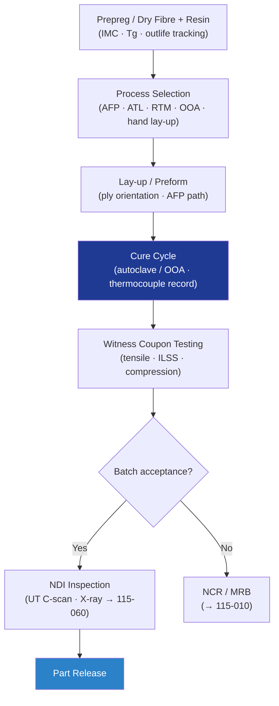

# STA 110-119 · 115-020 — Composite and Advanced Material Fabrication

## 1. Purpose

Defines the **composite and advanced material fabrication requirements** for Q+ATLANTIDE STA-band spacecraft structural components, covering lay-up, cure, resin infusion, fibre placement, and process qualification per CMH-17[^cmh17] and NASA-STD-6016[^nasastd6016].

## 2. Scope

- Covers the *Composite and Advanced Material Fabrication* subsubject (`020`) of subsection `115`.
- Inherits Q-Division authority from the parent row in [`../../README.md` §3](../../README.md#3-architecture-table)[^archtable].
- Concepts in scope:
  - **Composite process selection** — hand lay-up, AFP, ATL, RTM, VaRTM, OOA prepreg cure; selection criteria vs. part geometry and production rate.
  - **Prepreg qualification** — IMC checks: Tg, gel time, resin content, fibre volume fraction; outlife and frozen storage tracking per material specification.
  - **Autoclave cure cycle** — temperature ramp ≤ 3 °C/min, cure temperature ± 3 °C, pressure ± 0.03 MPa; thermocouple and pressure chart record.
  - **OOA cure process** — vacuum bag pressure ≥ 85 kPa below atmospheric; autoclave-equivalent property correlation test.
  - **Bonded joint process** — surface preparation (peel-ply, grit-blast, plasma activation), adhesive application control, bond-line thickness gauges, bond cycle monitoring.
  - **Witness coupon programme** — process-representative coupons co-cured per batch; tensile, compression, ILSS tests at ambient and extreme temperatures; batch acceptance per CMH-17[^cmh17].

## 3. Diagram — Composite Fabrication Flow

## 4. Footprint

| Metric | Value |
|---|---|
| Architecture | `STA` |
| Subsection | `115` — Fabricación, Ensamblaje e Integración Estructural |
| Subsubject | `020` — Composite and Advanced Material Fabrication |
| Primary Q-Division | Q-SPACE[^qdiv] |
| Governance class | `baseline`[^gov] |
| Document | `115-020-Composite-and-Advanced-Material-Fabrication.md` |
| Parent subsection | [`README.md`](./README.md) · [`115-000-General.md`](./115-000-General.md) |

## References & Citations

[^baseline]: **Q+ATLANTIDE controlled baseline (v1.0.0)** — [`organization/Q+ATLANTIDE.md`](../../../../organization/Q+ATLANTIDE.md).
[^archtable]: **STA §3 Architecture Table** — [`../../README.md` §3](../../README.md#3-architecture-table).
[^qdiv]: **Q-Division authority** — Q-Divisions provide technical authority over an architecture row.
[^gov]: **Governance class** — `baseline`.
[^cmh17]: **CMH-17** — Composite Materials Handbook.
[^nasastd6016]: **NASA-STD-6016** — Standard Materials and Processes Requirements for Spacecraft.
[^ecsse3201]: **ECSS-E-ST-32-01C** — Space Engineering: Structural General Requirements.
[^ecssq7039]: **ECSS-Q-ST-70-39C** — Welding of Metallic Materials for Flight Hardware.
[^nasastd5009]: **NASA-STD-5009** — NDE Requirements for Fracture-Critical Metallic Components.
[^ecssq7001]: **ECSS-Q-ST-70-01C** — Cleanliness and Contamination Control.
[^iso9001]: **ISO 9001:2015** — Quality Management Systems: Requirements.
