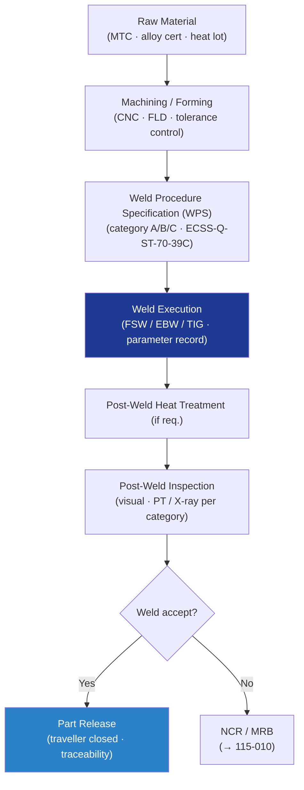

# STA 110-119 · 115-030 — Metallic Structural Fabrication and Welding

## 1. Purpose

Defines the **metallic structural fabrication and welding requirements** for Q+ATLANTIDE STA-band spacecraft structures, covering machining, sheet metal forming, friction stir welding (FSW), electron beam welding (EBW), TIG welding, and weld process qualification per ECSS-Q-ST-70-39C[^ecssq7039] and NASA-STD-6016[^nasastd6016].

## 2. Scope

- Covers the *Metallic Structural Fabrication and Welding* subsubject (`030`) of subsection `115`.
- Inherits Q-Division authority from the parent row in [`../../README.md` §3](../../README.md#3-architecture-table)[^archtable].
- Concepts in scope:
  - **Machining and forming** — CNC tolerance control (position ≤ 0.05 mm general, ≤ 0.01 mm interface), surface finish Ra ≤ 1.6 µm for faying surfaces; FLD compliance for sheet metal.
  - **Weld process qualification** — WPS, PQR, welder qualification per ECSS-Q-ST-70-39C[^ecssq7039]; weld category A/B/C per structural criticality.
  - **Friction stir welding (FSW)** — tool rotation speed, travel speed, plunge depth parameter window from coupon qualification; post-weld distortion allowance.
  - **Electron beam welding (EBW)** — vacuum level ≤ 10⁻⁴ Pa; full penetration requirement for primary structural welds.
  - **TIG/GTAW** — shielding gas purity ≥ 99.999%; interpass temperature ≤ 100 °C; post-weld heat treatment (PWHT) if required by material spec.
  - **Post-weld inspection** — visual, dimensional, PT or X-ray per weld category; consumable batch traceability in traveller.

## 3. Diagram — Metallic Fabrication and Welding Flow

## 4. Footprint

| Metric | Value |
|---|---|
| Architecture | `STA` |
| Subsection | `115` — Fabricación, Ensamblaje e Integración Estructural |
| Subsubject | `030` — Metallic Structural Fabrication and Welding |
| Primary Q-Division | Q-SPACE[^qdiv] |
| Governance class | `baseline`[^gov] |
| Document | `115-030-Metallic-Structural-Fabrication-and-Welding.md` |
| Parent subsection | [`README.md`](./README.md) · [`115-000-General.md`](./115-000-General.md) |

## References & Citations

[^baseline]: **Q+ATLANTIDE controlled baseline (v1.0.0)** — [`organization/Q+ATLANTIDE.md`](../../../../organization/Q+ATLANTIDE.md).
[^archtable]: **STA §3 Architecture Table** — [`../../README.md` §3](../../README.md#3-architecture-table).
[^qdiv]: **Q-Division authority** — Q-Divisions provide technical authority over an architecture row.
[^gov]: **Governance class** — `baseline`.
[^ecssq7039]: **ECSS-Q-ST-70-39C** — Welding of Metallic Materials for Flight Hardware.
[^nasastd6016]: **NASA-STD-6016** — Standard Materials and Processes Requirements for Spacecraft.
[^ecsse3201]: **ECSS-E-ST-32-01C** — Space Engineering: Structural General Requirements.
[^cmh17]: **CMH-17** — Composite Materials Handbook.
[^nasastd5009]: **NASA-STD-5009** — NDE Requirements for Fracture-Critical Metallic Components.
[^ecssq7001]: **ECSS-Q-ST-70-01C** — Cleanliness and Contamination Control.
[^iso9001]: **ISO 9001:2015** — Quality Management Systems.
