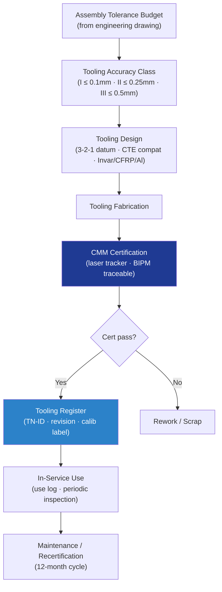

# STA 110-119 · 115-040 — Assembly Tooling and Fixture Design

## 1. Purpose

Defines the **assembly tooling and fixture design requirements** for Q+ATLANTIDE STA-band spacecraft structural assemblies, covering jig and fixture design standards, CMM-based tooling certification, tooling material selection, and maintenance programme.

## 2. Scope

- Covers the *Assembly Tooling and Fixture Design* subsubject (`040`) of subsection `115`.
- Inherits Q-Division authority from the parent row in [`../../README.md` §3](../../README.md#3-architecture-table)[^archtable].
- Concepts in scope:
  - **Tooling accuracy classes** — Class I: ≤ 0.1 mm, Class II: ≤ 0.25 mm, Class III: ≤ 0.5 mm; class assignment per assembly tolerance budget; CTE compatibility with hardware (Invar 36, CFRP tooling plate, aluminium).
  - **Assembly jig design** — 3-2-1 datum locating scheme; clamp load limits to prevent hardware distortion; tool lift-point provisions for GSE; jig structural analysis (stiffness and deflection).
  - **Drill and bond fixtures** — drill bushings, drill guide plates; bond fixture platen force and uniformity; fixture qualification by load cell.
  - **CMM tooling certification** — dimensional certification vs. tooling drawing using CMM or laser tracker; certification cycle: initial + every 12 months or after rework; calibration traceable to BIPM.
  - **Tooling identification and configuration control** — unique tool number (TN-XXXXXX), revision status, material cert, calibration label; tooling register in DMS; use log per serial number.
  - **Tooling maintenance programme** — periodic inspection; wear and damage criteria; repair/refurbishment authority; condemned tooling segregation.

## 3. Diagram — Tooling Lifecycle Flow

## 4. Footprint

| Metric | Value |
|---|---|
| Architecture | `STA` |
| Subsection | `115` — Fabricación, Ensamblaje e Integración Estructural |
| Subsubject | `040` — Assembly Tooling and Fixture Design |
| Primary Q-Division | Q-SPACE[^qdiv] |
| Governance class | `baseline`[^gov] |
| Document | `115-040-Assembly-Tooling-and-Fixture-Design.md` |
| Parent subsection | [`README.md`](./README.md) · [`115-000-General.md`](./115-000-General.md) |

## References & Citations

[^baseline]: **Q+ATLANTIDE controlled baseline (v1.0.0)** — [`organization/Q+ATLANTIDE.md`](../../../../organization/Q+ATLANTIDE.md).
[^archtable]: **STA §3 Architecture Table** — [`../../README.md` §3](../../README.md#3-architecture-table).
[^qdiv]: **Q-Division authority** — Q-Divisions provide technical authority over an architecture row.
[^gov]: **Governance class** — `baseline`.
[^ecsse3201]: **ECSS-E-ST-32-01C** — Space Engineering: Structural General Requirements.
[^nasastd6016]: **NASA-STD-6016** — Standard Materials and Processes Requirements for Spacecraft.
[^cmh17]: **CMH-17** — Composite Materials Handbook.
[^ecssq7039]: **ECSS-Q-ST-70-39C** — Welding of Metallic Materials for Flight Hardware.
[^nasastd5009]: **NASA-STD-5009** — NDE Requirements for Fracture-Critical Metallic Components.
[^ecssq7001]: **ECSS-Q-ST-70-01C** — Cleanliness and Contamination Control.
[^iso9001]: **ISO 9001:2015** — Quality Management Systems.
