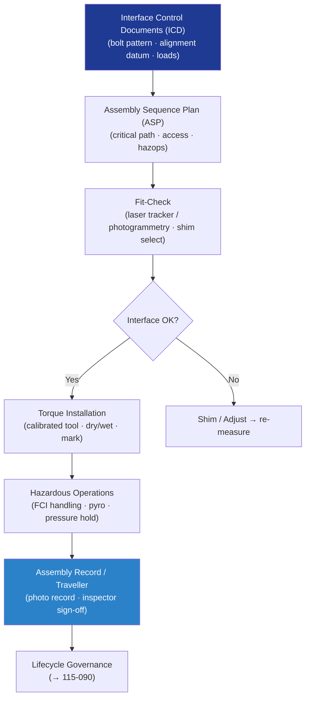

# STA 110-119 · 115-050 — Structural Integration and Interface Management

## 1. Purpose

Defines the **structural integration sequence and interface management requirements** for Q+ATLANTIDE STA-band spacecraft, covering assembly sequence definition, ICD management, fit-check, alignment verification, torque control, and assembly records per ECSS-E-ST-32-01C[^ecsse3201].

## 2. Scope

- Covers the *Structural Integration and Interface Management* subsubject (`050`) of subsection `115`.
- Inherits Q-Division authority from the parent row in [`../../README.md` §3](../../README.md#3-architecture-table)[^archtable].
- Concepts in scope:
  - **Assembly sequence plan (ASP)** — top-level and sub-assembly build sequences; critical path identification; integration constraints (access, cleanliness, hazardous operations).
  - **Interface control documents (ICD)** — bolt patterns, alignment datums, load-path cross-sections, connector pass-throughs, thermal interface pads; ICD change control through DRB.
  - **Fit-check and alignment verification** — laser tracker or photogrammetry at ambient temperature; allowable misalignment limits per ICD; shim selection procedure.
  - **Torque control** — calibrated torque tools; dry vs. wet torque values per fastener spec; torque records in traveller; torque mark requirement.
  - **Hazardous operations** — FCI handling per fracture control plan (→ `114-060`); pyrotechnic device installation safety zones; pressurised system installation safety hold points.
  - **Assembly records** — real-time recording: assembly step, tool, torque, inspector sign-off; photographic record at designated hold points; traveller retained as life-limited part history.

## 3. Diagram — Integration and Interface Management Flow

## 4. Footprint

| Metric | Value |
|---|---|
| Architecture | `STA` |
| Subsection | `115` — Fabricación, Ensamblaje e Integración Estructural |
| Subsubject | `050` — Structural Integration and Interface Management |
| Primary Q-Division | Q-SPACE[^qdiv] |
| Governance class | `baseline`[^gov] |
| Document | `115-050-Structural-Integration-and-Interface-Management.md` |
| Parent subsection | [`README.md`](./README.md) · [`115-000-General.md`](./115-000-General.md) |

## References & Citations

[^baseline]: **Q+ATLANTIDE controlled baseline (v1.0.0)** — [`organization/Q+ATLANTIDE.md`](../../../../organization/Q+ATLANTIDE.md).
[^archtable]: **STA §3 Architecture Table** — [`../../README.md` §3](../../README.md#3-architecture-table).
[^qdiv]: **Q-Division authority** — Q-Divisions provide technical authority over an architecture row.
[^gov]: **Governance class** — `baseline`.
[^ecsse3201]: **ECSS-E-ST-32-01C** — Space Engineering: Structural General Requirements.
[^nasastd6016]: **NASA-STD-6016** — Standard Materials and Processes Requirements for Spacecraft.
[^cmh17]: **CMH-17** — Composite Materials Handbook.
[^ecssq7039]: **ECSS-Q-ST-70-39C** — Welding of Metallic Materials for Flight Hardware.
[^nasastd5009]: **NASA-STD-5009** — NDE Requirements for Fracture-Critical Metallic Components.
[^ecssq7001]: **ECSS-Q-ST-70-01C** — Cleanliness and Contamination Control.
[^iso9001]: **ISO 9001:2015** — Quality Management Systems.
