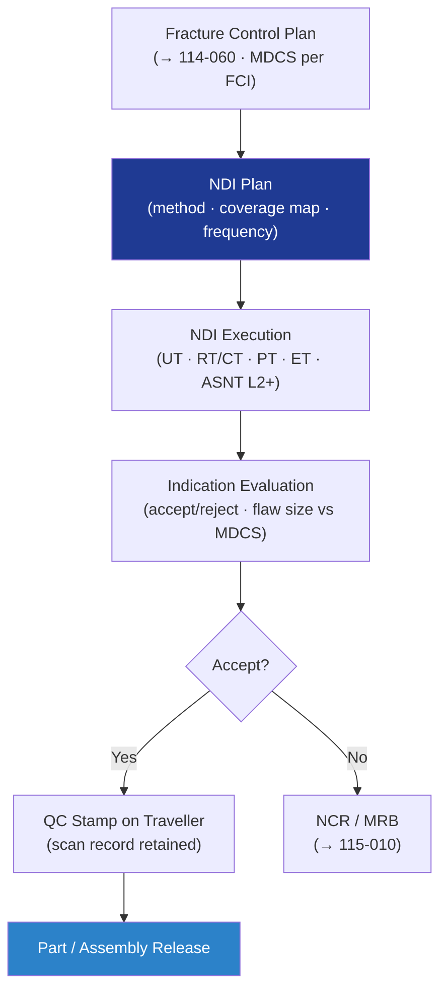

# STA 110-119 · 115-060 — Non-Destructive Inspection and Quality Control

## 1. Purpose

Defines the **non-destructive inspection (NDI) and quality control requirements** for Q+ATLANTIDE STA-band spacecraft structural components, covering NDI method selection, NDI plan, inspector qualification, and acceptance criteria per NASA-STD-5009[^nasastd5009] and ECSS-E-ST-32-01C[^ecsse3201].

## 2. Scope

- Covers the *Non-Destructive Inspection and Quality Control* subsubject (`060`) of subsection `115`.
- Inherits Q-Division authority from the parent row in [`../../README.md` §3](../../README.md#3-architecture-table)[^archtable].
- Concepts in scope:
  - **NDI method selection** — ultrasonic testing (UT: pulse-echo, through-transmission, phased-array), X-ray (RT), computed tomography (CT), dye-penetrant (PT), magnetic particle (MT), eddy-current (ET); selection by material, geometry, flaw type, and sensitivity requirement.
  - **NDI plan** — derived from fracture control plan (→ `114-060`); minimum detectable crack size (MDCS); coverage map; inspection frequency (incoming, in-process, final).
  - **FCI NDI protocol** — enhanced protocol per NASA-STD-5009[^nasastd5009]: 100% UT coverage, minimum reportable flaw size on drawing; two independent inspection records.
  - **Inspector qualification** — ASNT Level II minimum; ASNT Level III supervision; qualification records in QMS.
  - **Acceptance criteria** — allowable flaw sizes per material spec and fracture mechanics analysis; no rejectable indications on FCI.
  - **Quality records** — NDI scan files (UT C-scan, CT volume) retained for hardware life; traceable to part serial number; QC stamp on traveller.

## 3. Diagram — NDI Plan and Execution Flow

## 4. Footprint

| Metric | Value |
|---|---|
| Architecture | `STA` |
| Subsection | `115` — Fabricación, Ensamblaje e Integración Estructural |
| Subsubject | `060` — Non-Destructive Inspection and Quality Control |
| Primary Q-Division | Q-SPACE[^qdiv] |
| Governance class | `baseline`[^gov] |
| Document | `115-060-Non-Destructive-Inspection-and-Quality-Control.md` |
| Parent subsection | [`README.md`](./README.md) · [`115-000-General.md`](./115-000-General.md) |

## References & Citations

[^baseline]: **Q+ATLANTIDE controlled baseline (v1.0.0)** — [`organization/Q+ATLANTIDE.md`](../../../../organization/Q+ATLANTIDE.md).
[^archtable]: **STA §3 Architecture Table** — [`../../README.md` §3](../../README.md#3-architecture-table).
[^qdiv]: **Q-Division authority** — Q-Divisions provide technical authority over an architecture row.
[^gov]: **Governance class** — `baseline`.
[^nasastd5009]: **NASA-STD-5009** — NDE Requirements for Fracture-Critical Metallic Components.
[^ecsse3201]: **ECSS-E-ST-32-01C** — Space Engineering: Structural General Requirements.
[^nasastd6016]: **NASA-STD-6016** — Standard Materials and Processes Requirements for Spacecraft.
[^cmh17]: **CMH-17** — Composite Materials Handbook.
[^ecssq7039]: **ECSS-Q-ST-70-39C** — Welding of Metallic Materials for Flight Hardware.
[^ecssq7001]: **ECSS-Q-ST-70-01C** — Cleanliness and Contamination Control.
[^iso9001]: **ISO 9001:2015** — Quality Management Systems.
