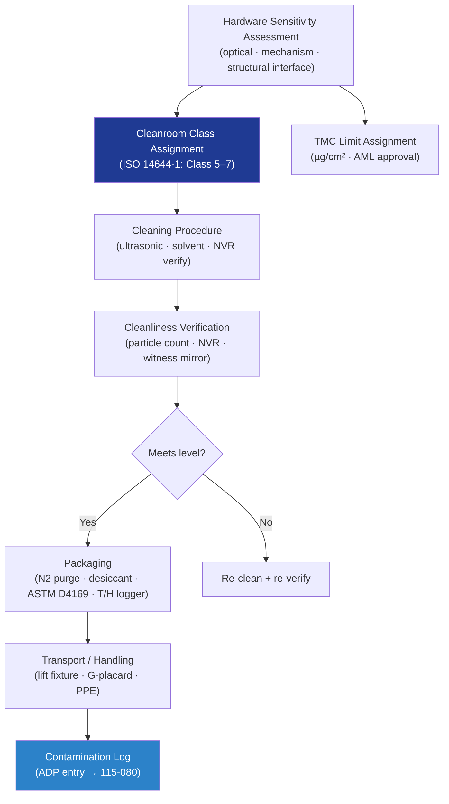

# STA 110-119 · 115-070 — Cleanliness Contamination Control and Handling

## 1. Purpose

Defines the **cleanliness, contamination control, and hardware handling requirements** for Q+ATLANTIDE STA-band spacecraft structures, covering cleanroom classification, particulate and molecular contamination limits, handling procedures, packaging, and transport per ECSS-Q-ST-70-01C[^ecssq7001].

## 2. Scope

- Covers the *Cleanliness, Contamination Control and Handling* subsubject (`070`) of subsection `115`.
- Inherits Q-Division authority from the parent row in [`../../README.md` §3](../../README.md#3-architecture-table)[^archtable].
- Concepts in scope:
  - **Cleanliness levels** — ISO 14644-1 cleanroom classes by hardware sensitivity: ISO Class 7 minimum for structural assemblies; ISO Class 5 for optical and precision mechanism interfaces; particulate levels per SAE ARP 1176.
  - **Molecular contamination limits** — TMC limits in µg/cm² per hardware category; allowed materials list (AML) for contamination-sensitive environments; solvent and lubricant approval.
  - **Cleaning procedures** — ultrasonic cleaning, solvent wipe, vapour degreasing; approved cleaning agent list; NVR test or particle count for cleanliness verification.
  - **Handling and lifting** — load-rated lifting fixtures for assemblies > 5 kg; G-limit placards (typically ±3g); cleanroom PPE; no bare-hand contact on faying surfaces.
  - **Contamination monitoring** — in-process particle counts; witness mirrors or white-cloth wipe tests; contamination incident log; roll-up report in ADP.
  - **Packaging and transport** — nitrogen purge or desiccant; hermetically sealed bags; shock/vibration isolation per ASTM D4169; temperature and humidity logging during transport.

## 3. Diagram — Cleanliness and Handling Control Flow

## 4. Footprint

| Metric | Value |
|---|---|
| Architecture | `STA` |
| Subsection | `115` — Fabricación, Ensamblaje e Integración Estructural |
| Subsubject | `070` — Cleanliness Contamination Control and Handling |
| Primary Q-Division | Q-SPACE[^qdiv] |
| Governance class | `baseline`[^gov] |
| Document | `115-070-Cleanliness-Contamination-Control-and-Handling.md` |
| Parent subsection | [`README.md`](./README.md) · [`115-000-General.md`](./115-000-General.md) |

## References & Citations

[^baseline]: **Q+ATLANTIDE controlled baseline (v1.0.0)** — [`organization/Q+ATLANTIDE.md`](../../../../organization/Q+ATLANTIDE.md).
[^archtable]: **STA §3 Architecture Table** — [`../../README.md` §3](../../README.md#3-architecture-table).
[^qdiv]: **Q-Division authority** — Q-Divisions provide technical authority over an architecture row.
[^gov]: **Governance class** — `baseline`.
[^ecssq7001]: **ECSS-Q-ST-70-01C** — Cleanliness and Contamination Control.
[^nasastd6016]: **NASA-STD-6016** — Standard Materials and Processes Requirements for Spacecraft.
[^ecsse3201]: **ECSS-E-ST-32-01C** — Space Engineering: Structural General Requirements.
[^cmh17]: **CMH-17** — Composite Materials Handbook.
[^ecssq7039]: **ECSS-Q-ST-70-39C** — Welding of Metallic Materials for Flight Hardware.
[^nasastd5009]: **NASA-STD-5009** — NDE Requirements for Fracture-Critical Metallic Components.
[^iso9001]: **ISO 9001:2015** — Quality Management Systems.
