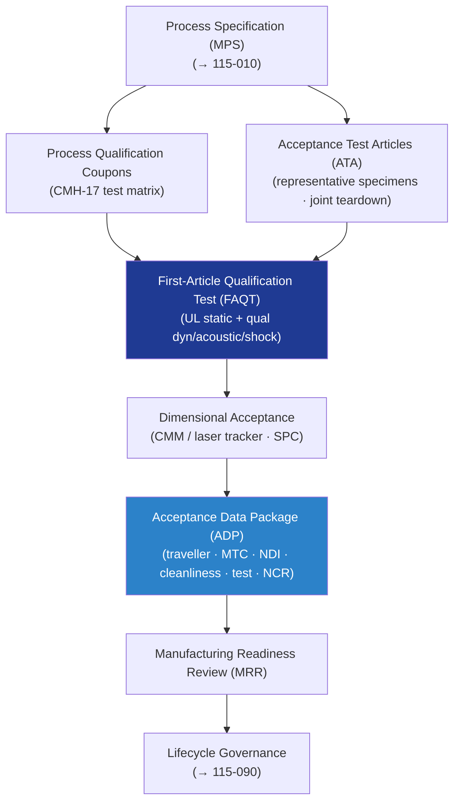

# STA 110-119 · 115-080 — Manufacturing Qualification and Acceptance Programme

## 1. Purpose

Defines the **structural manufacturing qualification and acceptance programme** for Q+ATLANTIDE STA-band spacecraft structures, covering qualification witness coupon programmes, acceptance test article (ATA) requirements, first-article qualification test (FAQT), and manufacturing evidence package per NASA-STD-6016[^nasastd6016] and ECSS-E-ST-32-01C[^ecsse3201].

## 2. Scope

- Covers the *Manufacturing Qualification and Acceptance Programme* subsubject (`080`) of subsection `115`.
- Inherits Q-Division authority from the parent row in [`../../README.md` §3](../../README.md#3-architecture-table)[^archtable].
- Concepts in scope:
  - **Process qualification coupons** — QC coupons from each approved material-process combination; test matrix: tensile, compression, shear (ILSS), open-hole, filled-hole, bearing at ambient + extreme temperatures; minimum 5 specimens per condition per CMH-17[^cmh17].
  - **Acceptance test articles (ATA)** — representative specimens or sub-assemblies tested at acceptance load levels; ATA scope driven by structural analysis risk; bonded joint ATA includes destructive tear-down.
  - **First-article qualification test (FAQT)** — first flight-like article tested to qualification levels (UL static, qual vibration/acoustic/shock per `114-080`); defines manufacturing-to-test compliance.
  - **Dimensional acceptance** — 100% CMM/laser tracker verification of alignment-critical interfaces on each flight unit; SPC on critical dimensions; out-of-tolerance NCR threshold.
  - **Acceptance data package (ADP)** — minimum content: manufacturing traveller, material certs (MTC), NDI records, dimensional inspection records, cleanliness records, test results (coupons + ATA), NCR/MRB dispositions.
  - **Manufacturing readiness gates** — PDR: MPS released, tooling design approved; CDR: PQRs complete, FAI scope agreed, ADP template approved; MRR: FAIs closed, travellers released.

## 3. Diagram — Manufacturing Qualification and Acceptance Flow

## 4. Footprint

| Metric | Value |
|---|---|
| Architecture | `STA` |
| Subsection | `115` — Fabricación, Ensamblaje e Integración Estructural |
| Subsubject | `080` — Manufacturing Qualification and Acceptance Programme |
| Primary Q-Division | Q-SPACE[^qdiv] |
| Governance class | `baseline`[^gov] |
| Document | `115-080-Manufacturing-Qualification-and-Acceptance-Programme.md` |
| Parent subsection | [`README.md`](./README.md) · [`115-000-General.md`](./115-000-General.md) |

## References & Citations

[^baseline]: **Q+ATLANTIDE controlled baseline (v1.0.0)** — [`organization/Q+ATLANTIDE.md`](../../../../organization/Q+ATLANTIDE.md).
[^archtable]: **STA §3 Architecture Table** — [`../../README.md` §3](../../README.md#3-architecture-table).
[^qdiv]: **Q-Division authority** — Q-Divisions provide technical authority over an architecture row.
[^gov]: **Governance class** — `baseline`.
[^nasastd6016]: **NASA-STD-6016** — Standard Materials and Processes Requirements for Spacecraft.
[^ecsse3201]: **ECSS-E-ST-32-01C** — Space Engineering: Structural General Requirements.
[^cmh17]: **CMH-17** — Composite Materials Handbook.
[^ecssq7039]: **ECSS-Q-ST-70-39C** — Welding of Metallic Materials for Flight Hardware.
[^nasastd5009]: **NASA-STD-5009** — NDE Requirements for Fracture-Critical Metallic Components.
[^ecssq7001]: **ECSS-Q-ST-70-01C** — Cleanliness and Contamination Control.
[^iso9001]: **ISO 9001:2015** — Quality Management Systems.
