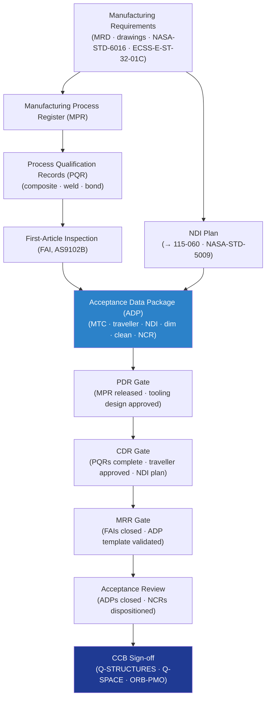

# STA 110-119 · 115-090 — Traceability Evidence and Lifecycle Governance

## 1. Purpose

Provides the **manufacturing compliance traceability, evidence-package structure, and lifecycle governance rules** for subsection `115` *Fabricación, Ensamblaje e Integración Estructural* — declaring the controlled document hierarchy, change authority levels, DRB/MRB sign-off requirements, and manufacturing assurance evidence package for this structural-manufacturing-critical subsystem.

## 2. Scope

- Covers the *Traceability, Evidence and Lifecycle Governance* subsubject (`090`) of subsection `115`.
- Inherits Q-Division authority from the parent row in [`../../README.md` §3](../../README.md#3-architecture-table)[^archtable].
- Concepts in scope:
  - **Manufacturing evidence package** — minimum set: manufacturing process register (MPR), process qualification records (PQR), weld procedure records (WPS/PQR), FAI reports, acceptance data packages (ADP), NDI records, dimensional inspection records, cleanliness/contamination logs, material traceability certs (MTC), NCR/MRB closure records.
  - **Manufacturing compliance traceability matrix** — maps each `115` requirement to governing standard, verification method (T/I/A/D/R), responsible Q-Division, and closure evidence; traceable to MRD and engineering drawings.
  - **Change authority matrix** — FCI manufacturing changes: Q-STRUCTURES + Q-SPACE + ORB-PMO via DRB; non-FCI structural manufacturing changes: Q-STRUCTURES + Q-INDUSTRY; all via DMS revision control.
  - **Design and manufacturing review gates** — PDR: MPS register released, tooling design complete; CDR: PQRs and FAI scope agreed, NDI plan complete; MRR: FAIs closed, ADP templates validated; Acceptance Review: ADPs closed, NCRs dispositioned.
  - **Linked nodes** — `110_Estructuras-Orbitales`, `111_Materiales-Espaciales`, `112_Proteccion-Termica-y-Radiacion`, `113_Mecanismos-Espaciales-y-Desplegables`, `114_Cargas-Mecanicas-Vibracion-y-Choque` per node YAML.
  - **No-AAA Rule compliance** — no manufacturing module uses "AAA" as an identifier per Q+ATLANTIDE Note N-004.

## 3. Diagram — Manufacturing Evidence and Lifecycle Governance Flow

## 4. Footprint

| Metric | Value |
|---|---|
| Architecture | `STA` |
| Subsection | `115` — Fabricación, Ensamblaje e Integración Estructural |
| Subsubject | `090` — Traceability Evidence and Lifecycle Governance |
| Primary Q-Division | Q-SPACE[^qdiv] |
| Governance class | `baseline`[^gov] |
| Document | `115-090-Traceability-Evidence-and-Lifecycle-Governance.md` |
| Parent subsection | [`README.md`](./README.md) · [`115-000-General.md`](./115-000-General.md) |

## References & Citations

[^baseline]: **Q+ATLANTIDE controlled baseline (v1.0.0)** — [`organization/Q+ATLANTIDE.md`](../../../../organization/Q+ATLANTIDE.md).
[^archtable]: **STA §3 Architecture Table** — [`../../README.md` §3](../../README.md#3-architecture-table).
[^qdiv]: **Q-Division authority** — Q-Divisions provide technical authority over an architecture row.
[^gov]: **Governance class** — `baseline`.
[^ecsse3201]: **ECSS-E-ST-32-01C** — Space Engineering: Structural General Requirements.
[^nasastd6016]: **NASA-STD-6016** — Standard Materials and Processes Requirements for Spacecraft.
[^cmh17]: **CMH-17** — Composite Materials Handbook.
[^ecssq7039]: **ECSS-Q-ST-70-39C** — Welding of Metallic Materials for Flight Hardware.
[^nasastd5009]: **NASA-STD-5009** — NDE Requirements for Fracture-Critical Metallic Components.
[^ecssq7001]: **ECSS-Q-ST-70-01C** — Cleanliness and Contamination Control.
[^iso9001]: **ISO 9001:2015** — Quality Management Systems.
