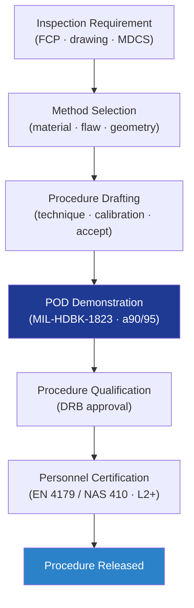

# STA 110-119 · 116-010 — NDT Methods Selection and Qualification

## 1. Purpose

Defines the **NDT method selection and qualification process** for Q+ATLANTIDE STA-band structures, covering the method-vs-flaw matrix, probability-of-detection (POD) demonstration per MIL-HDBK-1823[^milhdbk1823], procedure qualification, and personnel certification per EN 4179[^en4179] / ISO 9712[^iso9712] and NASA-STD-5009[^nasastd5009].

## 2. Scope

- Covers the *NDT Methods Selection and Qualification* subsubject (`010`) of subsection `116`.
- Inherits Q-Division authority from the parent row in [`../../README.md` §3](../../README.md#3-architecture-table)[^archtable].
- Concepts in scope:
  - **Method matrix** — UT, PAUT, RT/CT, PT, MT, ET, IRT, shearography, AE; selection driven by material (Al/Ti/CFRP/honeycomb), geometry (plate, weld, joint), flaw type (crack, void, disbond, inclusion), and required sensitivity.
  - **POD demonstration** — `a90/95` minimum detectable flaw size; specimen sets with seeded flaws; statistical analysis per MIL-HDBK-1823[^milhdbk1823].
  - **Procedure qualification** — written procedure (technique sheet, calibration, acceptance limits) qualified by demonstration; revision under DRB control.
  - **Personnel certification** — Level I/II/III per EN 4179[^en4179] / NAS 410 / ISO 9712[^iso9712]; vision exam; annual recertification; audit records in QMS.
  - **Equipment qualification** — calibration cycle, reference standards (IIW, ASME, custom), traceability to national standards.
  - **FCI scope** — fracture-critical items require enhanced procedure with two independent records per NASA-STD-5009[^nasastd5009].

## 3. Diagram

## 4. Footprint

| Metric | Value |
|---|---|
| Architecture | `STA` |
| Subsection | `116` — Inspección NDT y Salud Estructural |
| Subsubject | `010` — NDT Methods Selection and Qualification |
| Primary Q-Division | Q-SPACE[^qdiv] |
| Governance class | `baseline`[^gov] |
| Document | `116-010-NDT-Methods-Selection-and-Qualification.md` |
| Parent subsection | [`README.md`](./README.md) · [`116-000-General.md`](./116-000-General.md) |

## References & Citations

[^baseline]: **Q+ATLANTIDE controlled baseline (v1.0.0)** — [`organization/Q+ATLANTIDE.md`](../../../../organization/Q+ATLANTIDE.md).
[^archtable]: **STA §3 Architecture Table** — [`../../README.md` §3](../../README.md#3-architecture-table).
[^qdiv]: **Q-Division authority** — Q-Divisions provide technical authority over an architecture row.
[^gov]: **Governance class** — `baseline`.
[^nasastd5009]: **NASA-STD-5009** — NDE Requirements for Fracture-Critical Metallic Components.
[^ecsse3201]: **ECSS-E-ST-32-01C** — Space Engineering: Structural General Requirements.
[^milhdbk1823]: **MIL-HDBK-1823A** — Nondestructive Evaluation System Reliability Assessment (POD).
[^en4179]: **EN 4179 / NAS 410** — Qualification and Approval of Personnel for NDT.
[^iso9712]: **ISO 9712** — NDT: Qualification and Certification of NDT Personnel.
[^astme2491]: **ASTM E2491** — Phased-Array UT Performance.
[^astme1742]: **ASTM E1742 / E2698** — Radiographic / Digital Radiographic Examination.
[^astme1417]: **ASTM E1417** — Liquid Penetrant Testing.
[^astme1444]: **ASTM E1444** — Magnetic Particle Testing.
[^cmh17]: **CMH-17** — Composite Materials Handbook.
[^arp6461]: **SAE ARP6461** — Guidelines for Implementation of SHM on Fixed-Wing Aircraft.
[^iso9001]: **ISO 9001:2015** — Quality Management Systems.
