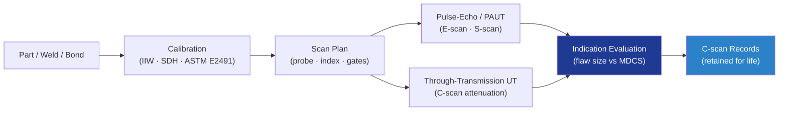

# STA 110-119 · 116-020 — Ultrasonic and Phased-Array Inspection

## 1. Purpose

Defines the **ultrasonic (UT) and phased-array ultrasonic testing (PAUT)** requirements for Q+ATLANTIDE STA-band structures, covering pulse-echo, through-transmission, PAUT and TFM/FMC techniques, calibration per ASTM E2491[^astme2491], and acceptance criteria aligned with NASA-STD-5009[^nasastd5009].

## 2. Scope

- Covers the *Ultrasonic and Phased-Array Inspection* subsubject (`020`) of subsection `116`.
- Inherits Q-Division authority from the parent row in [`../../README.md` §3](../../README.md#3-architecture-table)[^archtable].
- Concepts in scope:
  - **Pulse-echo UT** — contact and immersion; longitudinal/shear waves; calibration block per IIW V1/V2 or custom; reference reflector `Ø1.2 mm SDH` minimum.
  - **Through-transmission UT** — for laminates, sandwich panels and bond lines; attenuation mapping; C-scan deliverable.
  - **PAUT** — 16/32/64-element probes; electronic scanning (E-scan), sectorial (S-scan); focal law verification; performance per ASTM E2491[^astme2491].
  - **TFM / FMC** — full matrix capture and total focusing method for complex geometry and small flaws; resolution down to `Ø0.5 mm` in Al, `Ø1.0 mm` in Ti.
  - **Coverage and scan plan** — overlap ≥ 10%; scan-plan drawing with probe positions, indices, gates; C-scan retention for hardware life.
  - **Acceptance** — flaw indications below MDCS reported; FCI 100% UT coverage with two independent records per NASA-STD-5009[^nasastd5009].

## 3. Diagram

## 4. Footprint

| Metric | Value |
|---|---|
| Architecture | `STA` |
| Subsection | `116` — Inspección NDT y Salud Estructural |
| Subsubject | `020` — Ultrasonic and Phased-Array Inspection |
| Primary Q-Division | Q-SPACE[^qdiv] |
| Governance class | `baseline`[^gov] |
| Document | `116-020-Ultrasonic-and-Phased-Array-Inspection.md` |
| Parent subsection | [`README.md`](./README.md) · [`116-000-General.md`](./116-000-General.md) |

## References & Citations

[^baseline]: **Q+ATLANTIDE controlled baseline (v1.0.0)** — [`organization/Q+ATLANTIDE.md`](../../../../organization/Q+ATLANTIDE.md).
[^archtable]: **STA §3 Architecture Table** — [`../../README.md` §3](../../README.md#3-architecture-table).
[^qdiv]: **Q-Division authority** — Q-Divisions provide technical authority over an architecture row.
[^gov]: **Governance class** — `baseline`.
[^nasastd5009]: **NASA-STD-5009** — NDE Requirements for Fracture-Critical Metallic Components.
[^ecsse3201]: **ECSS-E-ST-32-01C** — Space Engineering: Structural General Requirements.
[^milhdbk1823]: **MIL-HDBK-1823A** — Nondestructive Evaluation System Reliability Assessment (POD).
[^en4179]: **EN 4179 / NAS 410** — Qualification and Approval of Personnel for NDT.
[^iso9712]: **ISO 9712** — NDT: Qualification and Certification of NDT Personnel.
[^astme2491]: **ASTM E2491** — Phased-Array UT Performance.
[^astme1742]: **ASTM E1742 / E2698** — Radiographic / Digital Radiographic Examination.
[^astme1417]: **ASTM E1417** — Liquid Penetrant Testing.
[^astme1444]: **ASTM E1444** — Magnetic Particle Testing.
[^cmh17]: **CMH-17** — Composite Materials Handbook.
[^arp6461]: **SAE ARP6461** — Guidelines for Implementation of SHM on Fixed-Wing Aircraft.
[^iso9001]: **ISO 9001:2015** — Quality Management Systems.
