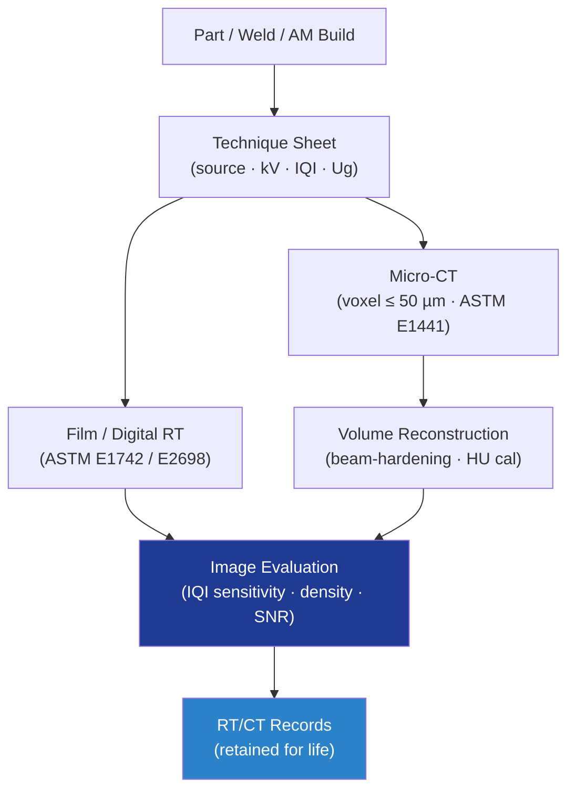

# STA 110-119 · 116-030 — Radiographic and Computed-Tomography Inspection

## 1. Purpose

Defines the **radiographic testing (RT) and computed tomography (CT)** requirements for Q+ATLANTIDE STA-band structures, covering film and digital RT per ASTM E1742[^astme1742], micro-CT volumetric inspection, IQI sensitivity, and acceptance criteria per ECSS-E-ST-32-01C[^ecsse3201] and NASA-STD-5009[^nasastd5009].

## 2. Scope

- Covers the *Radiographic and Computed-Tomography Inspection* subsubject (`030`) of subsection `116`.
- Inherits Q-Division authority from the parent row in [`../../README.md` §3](../../README.md#3-architecture-table)[^archtable].
- Concepts in scope:
  - **Film RT** — X-ray and gamma (Ir-192, Se-75) sources; Class I film; `≥ 2-2T` IQI sensitivity per ASTM E1742[^astme1742]; density 2.0–4.0.
  - **Digital RT (DR)** — flat-panel detectors or CR plates per ASTM E2698; SNR and basic spatial resolution (SR_b) requirements.
  - **Micro-CT** — voxel `≤ 50 µm` for additively manufactured and small parts; reconstruction QA (HU calibration, beam-hardening correction); ASTM E1441 guidance.
  - **Source/detector geometry** — geometric unsharpness `Ug ≤ 0.5 mm`; SOD/SDD calculated per technique sheet.
  - **Radiation safety** — controlled area per local regulations; dosimetry; survey records.
  - **Acceptance** — porosity, inclusions, lack of fusion below allowable per drawing; volumetric flaws sized via CT histogram.

## 3. Diagram

## 4. Footprint

| Metric | Value |
|---|---|
| Architecture | `STA` |
| Subsection | `116` — Inspección NDT y Salud Estructural |
| Subsubject | `030` — Radiographic and Computed-Tomography Inspection |
| Primary Q-Division | Q-SPACE[^qdiv] |
| Governance class | `baseline`[^gov] |
| Document | `116-030-Radiographic-and-Computed-Tomography-Inspection.md` |
| Parent subsection | [`README.md`](./README.md) · [`116-000-General.md`](./116-000-General.md) |

## References & Citations

[^baseline]: **Q+ATLANTIDE controlled baseline (v1.0.0)** — [`organization/Q+ATLANTIDE.md`](../../../../organization/Q+ATLANTIDE.md).
[^archtable]: **STA §3 Architecture Table** — [`../../README.md` §3](../../README.md#3-architecture-table).
[^qdiv]: **Q-Division authority** — Q-Divisions provide technical authority over an architecture row.
[^gov]: **Governance class** — `baseline`.
[^nasastd5009]: **NASA-STD-5009** — NDE Requirements for Fracture-Critical Metallic Components.
[^ecsse3201]: **ECSS-E-ST-32-01C** — Space Engineering: Structural General Requirements.
[^milhdbk1823]: **MIL-HDBK-1823A** — Nondestructive Evaluation System Reliability Assessment (POD).
[^en4179]: **EN 4179 / NAS 410** — Qualification and Approval of Personnel for NDT.
[^iso9712]: **ISO 9712** — NDT: Qualification and Certification of NDT Personnel.
[^astme2491]: **ASTM E2491** — Phased-Array UT Performance.
[^astme1742]: **ASTM E1742 / E2698** — Radiographic / Digital Radiographic Examination.
[^astme1417]: **ASTM E1417** — Liquid Penetrant Testing.
[^astme1444]: **ASTM E1444** — Magnetic Particle Testing.
[^cmh17]: **CMH-17** — Composite Materials Handbook.
[^arp6461]: **SAE ARP6461** — Guidelines for Implementation of SHM on Fixed-Wing Aircraft.
[^iso9001]: **ISO 9001:2015** — Quality Management Systems.
