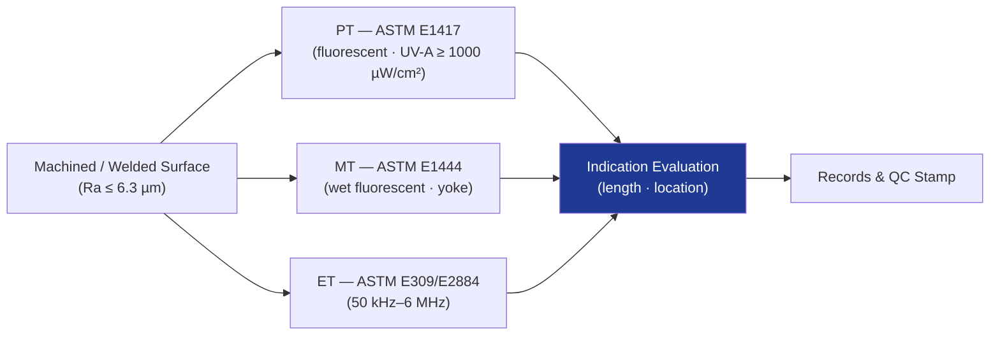

# STA 110-119 · 116-040 — Surface and Electromagnetic NDT Methods

## 1. Purpose

Defines the **surface and electromagnetic NDT methods** — penetrant testing (PT), magnetic particle testing (MT) and eddy-current testing (ET) — for Q+ATLANTIDE STA-band structures, per ASTM E1417[^astme1417], ASTM E1444[^astme1444] and ASTM E309/E2884, with acceptance criteria from NASA-STD-5009[^nasastd5009].

## 2. Scope

- Covers the *Surface and Electromagnetic NDT Methods* subsubject (`040`) of subsection `116`.
- Inherits Q-Division authority from the parent row in [`../../README.md` §3](../../README.md#3-architecture-table)[^archtable].
- Concepts in scope:
  - **Penetrant testing (PT)** — fluorescent Type I, Method C/D; sensitivity Level 3/4; dwell ≥ 10 min; UV-A irradiance ≥ 1000 µW/cm² per ASTM E1417[^astme1417].
  - **Magnetic particle testing (MT)** — wet fluorescent; AC/DC yoke or coil; field strength verified by pie gauge and gauss-meter; demagnetisation post-inspection per ASTM E1444[^astme1444].
  - **Eddy-current testing (ET)** — surface and sub-surface; probe frequency selection (50 kHz–6 MHz) by skin depth; reference EDM notches; bolt-hole and weld toe scans.
  - **Surface preparation** — Sa 2½ / Ra ≤ 6.3 µm typical; rinse and dry cycles controlled.
  - **Personnel and procedure** — Level II minimum per EN 4179[^en4179]; procedure qualified per §010.
  - **Acceptance** — linear indication length thresholds per drawing; FCI: no rejectable indications.

## 3. Diagram

## 4. Footprint

| Metric | Value |
|---|---|
| Architecture | `STA` |
| Subsection | `116` — Inspección NDT y Salud Estructural |
| Subsubject | `040` — Surface and Electromagnetic NDT Methods |
| Primary Q-Division | Q-SPACE[^qdiv] |
| Governance class | `baseline`[^gov] |
| Document | `116-040-Surface-and-Electromagnetic-NDT-Methods.md` |
| Parent subsection | [`README.md`](./README.md) · [`116-000-General.md`](./116-000-General.md) |

## References & Citations

[^baseline]: **Q+ATLANTIDE controlled baseline (v1.0.0)** — [`organization/Q+ATLANTIDE.md`](../../../../organization/Q+ATLANTIDE.md).
[^archtable]: **STA §3 Architecture Table** — [`../../README.md` §3](../../README.md#3-architecture-table).
[^qdiv]: **Q-Division authority** — Q-Divisions provide technical authority over an architecture row.
[^gov]: **Governance class** — `baseline`.
[^nasastd5009]: **NASA-STD-5009** — NDE Requirements for Fracture-Critical Metallic Components.
[^ecsse3201]: **ECSS-E-ST-32-01C** — Space Engineering: Structural General Requirements.
[^milhdbk1823]: **MIL-HDBK-1823A** — Nondestructive Evaluation System Reliability Assessment (POD).
[^en4179]: **EN 4179 / NAS 410** — Qualification and Approval of Personnel for NDT.
[^iso9712]: **ISO 9712** — NDT: Qualification and Certification of NDT Personnel.
[^astme2491]: **ASTM E2491** — Phased-Array UT Performance.
[^astme1742]: **ASTM E1742 / E2698** — Radiographic / Digital Radiographic Examination.
[^astme1417]: **ASTM E1417** — Liquid Penetrant Testing.
[^astme1444]: **ASTM E1444** — Magnetic Particle Testing.
[^cmh17]: **CMH-17** — Composite Materials Handbook.
[^arp6461]: **SAE ARP6461** — Guidelines for Implementation of SHM on Fixed-Wing Aircraft.
[^iso9001]: **ISO 9001:2015** — Quality Management Systems.
