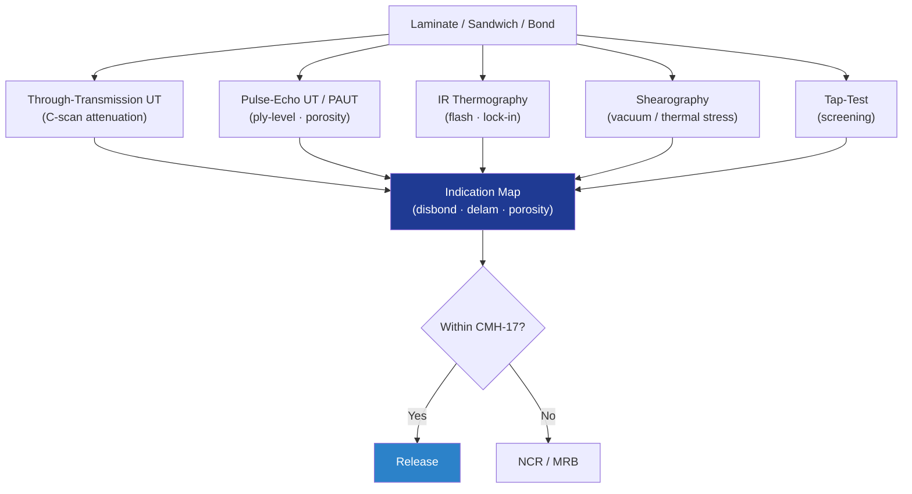

# STA 110-119 · 116-050 — Composite and Bonded-Joint NDI

## 1. Purpose

Defines the **composite and bonded-joint NDI** requirements for Q+ATLANTIDE STA-band structures, covering through-transmission UT, pulse-echo UT, infrared thermography (IRT), shearography and tap-test for laminates, sandwich panels and bonded joints, per CMH-17[^cmh17] Vol. 3 and ECSS-E-ST-32-01C[^ecsse3201].

## 2. Scope

- Covers the *Composite and Bonded-Joint NDI* subsubject (`050`) of subsection `116`.
- Inherits Q-Division authority from the parent row in [`../../README.md` §3](../../README.md#3-architecture-table)[^archtable].
- Concepts in scope:
  - **Through-transmission UT** — for sandwich panels and thick laminates; attenuation map; reference `Ø6.3 mm` flat-bottom hole or FBH equivalent.
  - **Pulse-echo UT / PAUT** — front/back-wall and ply-level inspection; delamination and porosity quantification.
  - **Infrared thermography (IRT)** — flash and lock-in; disbond and water-ingress detection on sandwich panels; sensitivity to `Ø10 mm` disbond at `≤ 5 mm` depth.
  - **Shearography** — vacuum/thermal stress; skin-to-core disbond on honeycomb sandwich.
  - **Tap-test (manual / automated)** — first-line screening for honeycomb; correlated with UT/IRT findings.
  - **Bond verification** — destructive bond witness coupons per §115-020; in-process bondline NDI before structural release.

## 3. Diagram

## 4. Footprint

| Metric | Value |
|---|---|
| Architecture | `STA` |
| Subsection | `116` — Inspección NDT y Salud Estructural |
| Subsubject | `050` — Composite and Bonded-Joint NDI |
| Primary Q-Division | Q-SPACE[^qdiv] |
| Governance class | `baseline`[^gov] |
| Document | `116-050-Composite-and-Bonded-Joint-NDI.md` |
| Parent subsection | [`README.md`](./README.md) · [`116-000-General.md`](./116-000-General.md) |

## References & Citations

[^baseline]: **Q+ATLANTIDE controlled baseline (v1.0.0)** — [`organization/Q+ATLANTIDE.md`](../../../../organization/Q+ATLANTIDE.md).
[^archtable]: **STA §3 Architecture Table** — [`../../README.md` §3](../../README.md#3-architecture-table).
[^qdiv]: **Q-Division authority** — Q-Divisions provide technical authority over an architecture row.
[^gov]: **Governance class** — `baseline`.
[^nasastd5009]: **NASA-STD-5009** — NDE Requirements for Fracture-Critical Metallic Components.
[^ecsse3201]: **ECSS-E-ST-32-01C** — Space Engineering: Structural General Requirements.
[^milhdbk1823]: **MIL-HDBK-1823A** — Nondestructive Evaluation System Reliability Assessment (POD).
[^en4179]: **EN 4179 / NAS 410** — Qualification and Approval of Personnel for NDT.
[^iso9712]: **ISO 9712** — NDT: Qualification and Certification of NDT Personnel.
[^astme2491]: **ASTM E2491** — Phased-Array UT Performance.
[^astme1742]: **ASTM E1742 / E2698** — Radiographic / Digital Radiographic Examination.
[^astme1417]: **ASTM E1417** — Liquid Penetrant Testing.
[^astme1444]: **ASTM E1444** — Magnetic Particle Testing.
[^cmh17]: **CMH-17** — Composite Materials Handbook.
[^arp6461]: **SAE ARP6461** — Guidelines for Implementation of SHM on Fixed-Wing Aircraft.
[^iso9001]: **ISO 9001:2015** — Quality Management Systems.
