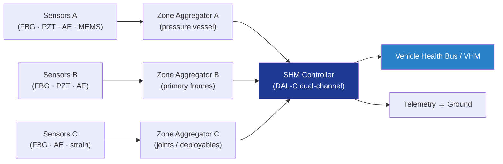

# STA 110-119 · 116-060 — Structural Health Monitoring Architecture

## 1. Purpose

Defines the **onboard structural health monitoring (SHM) architecture** for Q+ATLANTIDE STA-band spacecraft, covering SHM topology, zone segmentation, vehicle-health-bus integration, redundancy, and concept-of-operations guided by SAE ARP6461[^arp6461].

## 2. Scope

- Covers the *Structural Health Monitoring Architecture* subsubject (`060`) of subsection `116`.
- Inherits Q-Division authority from the parent row in [`../../README.md` §3](../../README.md#3-architecture-table)[^archtable].
- Concepts in scope:
  - **SHM topology** — distributed sensor nodes (FBG, PZT, AE, MEMS) → zone aggregators → SHM controller → vehicle health bus.
  - **Zone segmentation** — by primary structure (pressure vessel, primary frames, joints, deployables); independent fault containment per zone.
  - **SHM controller** — DAL-C dual-channel; deterministic scheduling; storage of features and events; downlink to ground via telemetry.
  - **Operating modes** — passive (AE listening), active (guided-wave interrogation), event-triggered (impact, overload).
  - **Redundancy** — N+1 sensor coverage on fracture-critical paths; cross-zone consistency checks.
  - **Integration** — feeds vehicle health management (VHM); links to fracture-control plan inspection intervals (→ `114-060`, `116-080`).

## 3. Diagram

## 4. Footprint

| Metric | Value |
|---|---|
| Architecture | `STA` |
| Subsection | `116` — Inspección NDT y Salud Estructural |
| Subsubject | `060` — Structural Health Monitoring Architecture |
| Primary Q-Division | Q-SPACE[^qdiv] |
| Governance class | `baseline`[^gov] |
| Document | `116-060-Structural-Health-Monitoring-Architecture.md` |
| Parent subsection | [`README.md`](./README.md) · [`116-000-General.md`](./116-000-General.md) |

## References & Citations

[^baseline]: **Q+ATLANTIDE controlled baseline (v1.0.0)** — [`organization/Q+ATLANTIDE.md`](../../../../organization/Q+ATLANTIDE.md).
[^archtable]: **STA §3 Architecture Table** — [`../../README.md` §3](../../README.md#3-architecture-table).
[^qdiv]: **Q-Division authority** — Q-Divisions provide technical authority over an architecture row.
[^gov]: **Governance class** — `baseline`.
[^nasastd5009]: **NASA-STD-5009** — NDE Requirements for Fracture-Critical Metallic Components.
[^ecsse3201]: **ECSS-E-ST-32-01C** — Space Engineering: Structural General Requirements.
[^milhdbk1823]: **MIL-HDBK-1823A** — Nondestructive Evaluation System Reliability Assessment (POD).
[^en4179]: **EN 4179 / NAS 410** — Qualification and Approval of Personnel for NDT.
[^iso9712]: **ISO 9712** — NDT: Qualification and Certification of NDT Personnel.
[^astme2491]: **ASTM E2491** — Phased-Array UT Performance.
[^astme1742]: **ASTM E1742 / E2698** — Radiographic / Digital Radiographic Examination.
[^astme1417]: **ASTM E1417** — Liquid Penetrant Testing.
[^astme1444]: **ASTM E1444** — Magnetic Particle Testing.
[^cmh17]: **CMH-17** — Composite Materials Handbook.
[^arp6461]: **SAE ARP6461** — Guidelines for Implementation of SHM on Fixed-Wing Aircraft.
[^iso9001]: **ISO 9001:2015** — Quality Management Systems.
