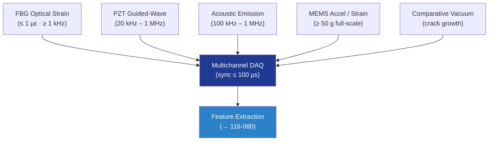

# STA 110-119 · 116-070 — SHM Sensors and Data Acquisition

## 1. Purpose

Defines the **SHM sensors and data acquisition (DAQ) requirements** for Q+ATLANTIDE STA-band spacecraft, covering FBG optical strain, PZT/AE patches, MEMS accelerometers, comparative vacuum monitoring (CVM), and DAQ sampling/synchronisation budgets aligned with SAE ARP6461[^arp6461].

## 2. Scope

- Covers the *SHM Sensors and Data Acquisition* subsubject (`070`) of subsection `116`.
- Inherits Q-Division authority from the parent row in [`../../README.md` §3](../../README.md#3-architecture-table)[^archtable].
- Concepts in scope:
  - **Fibre Bragg Grating (FBG)** — distributed strain and temperature; resolution `≤ 1 µε`; arrays up to `64 sensors/fibre`; interrogator at `≥ 1 kHz`.
  - **PZT / piezoelectric patches** — guided-wave excitation and reception; bandwidth `20 kHz – 1 MHz`; bonded with controlled adhesive (cure window logged).
  - **Acoustic emission (AE)** — broadband 100 kHz – 1 MHz; threshold-triggered hit recording; hit rate, energy, frequency centroid features.
  - **MEMS accelerometers / strain gauges** — low-frequency dynamics, deployment events; full-scale ≥ 50 g qualified.
  - **Comparative vacuum monitoring (CVM)** — crack growth sensing on accessible structure.
  - **DAQ** — synchronised multichannel; time-stamp accuracy `≤ 100 µs`; sampling per Nyquist with ≥ 5× margin; lossless onboard storage of events.

## 3. Diagram

## 4. Footprint

| Metric | Value |
|---|---|
| Architecture | `STA` |
| Subsection | `116` — Inspección NDT y Salud Estructural |
| Subsubject | `070` — SHM Sensors and Data Acquisition |
| Primary Q-Division | Q-SPACE[^qdiv] |
| Governance class | `baseline`[^gov] |
| Document | `116-070-SHM-Sensors-and-Data-Acquisition.md` |
| Parent subsection | [`README.md`](./README.md) · [`116-000-General.md`](./116-000-General.md) |

## References & Citations

[^baseline]: **Q+ATLANTIDE controlled baseline (v1.0.0)** — [`organization/Q+ATLANTIDE.md`](../../../../organization/Q+ATLANTIDE.md).
[^archtable]: **STA §3 Architecture Table** — [`../../README.md` §3](../../README.md#3-architecture-table).
[^qdiv]: **Q-Division authority** — Q-Divisions provide technical authority over an architecture row.
[^gov]: **Governance class** — `baseline`.
[^nasastd5009]: **NASA-STD-5009** — NDE Requirements for Fracture-Critical Metallic Components.
[^ecsse3201]: **ECSS-E-ST-32-01C** — Space Engineering: Structural General Requirements.
[^milhdbk1823]: **MIL-HDBK-1823A** — Nondestructive Evaluation System Reliability Assessment (POD).
[^en4179]: **EN 4179 / NAS 410** — Qualification and Approval of Personnel for NDT.
[^iso9712]: **ISO 9712** — NDT: Qualification and Certification of NDT Personnel.
[^astme2491]: **ASTM E2491** — Phased-Array UT Performance.
[^astme1742]: **ASTM E1742 / E2698** — Radiographic / Digital Radiographic Examination.
[^astme1417]: **ASTM E1417** — Liquid Penetrant Testing.
[^astme1444]: **ASTM E1444** — Magnetic Particle Testing.
[^cmh17]: **CMH-17** — Composite Materials Handbook.
[^arp6461]: **SAE ARP6461** — Guidelines for Implementation of SHM on Fixed-Wing Aircraft.
[^iso9001]: **ISO 9001:2015** — Quality Management Systems.
