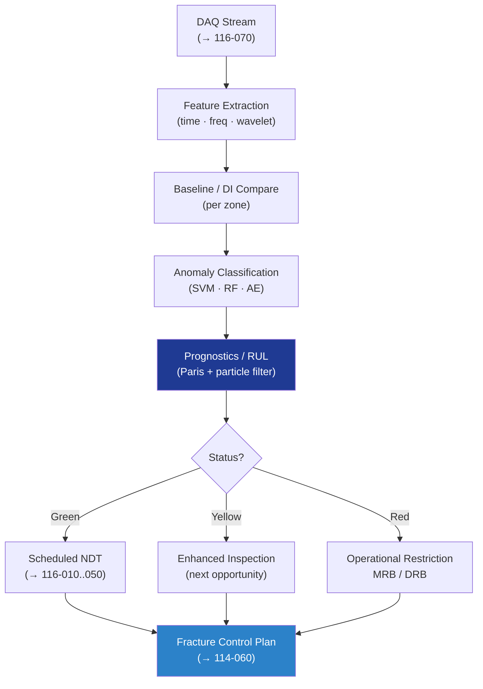

# STA 110-119 · 116-080 — Diagnostics Prognostics and Damage-Tolerance Integration

## 1. Purpose

Defines the **diagnostics, prognostics and damage-tolerance integration** requirements for Q+ATLANTIDE STA-band SHM, covering feature extraction, anomaly detection, remaining-useful-life (RUL) estimation, and integration with the fracture-control plan (→ `114-060`) per NASA-STD-5009[^nasastd5009] and ECSS-E-ST-32-01C[^ecsse3201].

## 2. Scope

- Covers the *Diagnostics Prognostics and Damage-Tolerance Integration* subsubject (`080`) of subsection `116`.
- Inherits Q-Division authority from the parent row in [`../../README.md` §3](../../README.md#3-architecture-table)[^archtable].
- Concepts in scope:
  - **Feature extraction** — time-domain (peak, RMS), frequency-domain (FFT bands), wavelet, statistical moments; guided-wave time-of-flight and amplitude.
  - **Baseline and damage indices** — reference baselines per zone; damage index (DI) thresholds with hysteresis to avoid chatter.
  - **Anomaly detection / classification** — supervised (SVM, RF) and unsupervised (PCA, autoencoder) classifiers; validation against seeded-damage coupons.
  - **Prognostics (RUL)** — physics-of-failure plus data-driven hybrid (Paris-law + particle filter); confidence intervals reported.
  - **Damage-tolerance integration** — SHM evidence shortens or lengthens inspection intervals only under fracture-control plan change authority; never bypasses scheduled NDT for FCI.
  - **Alert / response** — green/yellow/red zoning; yellow → enhanced inspection at next opportunity; red → operational restriction and MRB.
  - **Verification** — model validation per QML/AI-Hooks governance (→ ATLAS 089) where ML models are used.

## 3. Diagram

## 4. Footprint

| Metric | Value |
|---|---|
| Architecture | `STA` |
| Subsection | `116` — Inspección NDT y Salud Estructural |
| Subsubject | `080` — Diagnostics Prognostics and Damage-Tolerance Integration |
| Primary Q-Division | Q-SPACE[^qdiv] |
| Governance class | `baseline`[^gov] |
| Document | `116-080-Diagnostics-Prognostics-and-Damage-Tolerance-Integration.md` |
| Parent subsection | [`README.md`](./README.md) · [`116-000-General.md`](./116-000-General.md) |

## References & Citations

[^baseline]: **Q+ATLANTIDE controlled baseline (v1.0.0)** — [`organization/Q+ATLANTIDE.md`](../../../../organization/Q+ATLANTIDE.md).
[^archtable]: **STA §3 Architecture Table** — [`../../README.md` §3](../../README.md#3-architecture-table).
[^qdiv]: **Q-Division authority** — Q-Divisions provide technical authority over an architecture row.
[^gov]: **Governance class** — `baseline`.
[^nasastd5009]: **NASA-STD-5009** — NDE Requirements for Fracture-Critical Metallic Components.
[^ecsse3201]: **ECSS-E-ST-32-01C** — Space Engineering: Structural General Requirements.
[^milhdbk1823]: **MIL-HDBK-1823A** — Nondestructive Evaluation System Reliability Assessment (POD).
[^en4179]: **EN 4179 / NAS 410** — Qualification and Approval of Personnel for NDT.
[^iso9712]: **ISO 9712** — NDT: Qualification and Certification of NDT Personnel.
[^astme2491]: **ASTM E2491** — Phased-Array UT Performance.
[^astme1742]: **ASTM E1742 / E2698** — Radiographic / Digital Radiographic Examination.
[^astme1417]: **ASTM E1417** — Liquid Penetrant Testing.
[^astme1444]: **ASTM E1444** — Magnetic Particle Testing.
[^cmh17]: **CMH-17** — Composite Materials Handbook.
[^arp6461]: **SAE ARP6461** — Guidelines for Implementation of SHM on Fixed-Wing Aircraft.
[^iso9001]: **ISO 9001:2015** — Quality Management Systems.
