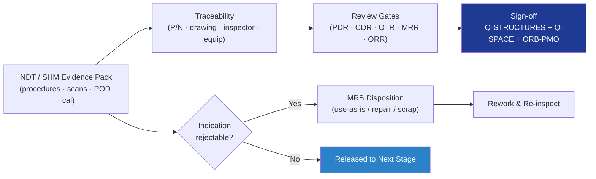

# STA 110-119 · 116-090 — Traceability Evidence and Lifecycle Governance

## 1. Purpose

Defines the **traceability, evidence and lifecycle governance** requirements for Q+ATLANTIDE STA-band NDT and SHM activities, covering the NDT/SHM evidence package, DRB/MRB authority, change control, and review-gate sign-offs aligned with ECSS-E-ST-32-01C[^ecsse3201], NASA-STD-5009[^nasastd5009] and ISO 9001:2015[^iso9001].

## 2. Scope

- Covers the *Traceability Evidence and Lifecycle Governance* subsubject (`090`) of subsection `116`.
- Inherits Q-Division authority from the parent row in [`../../README.md` §3](../../README.md#3-architecture-table)[^archtable].
- Concepts in scope:
  - **Evidence package** — NDT procedures, POD reports, scan files (UT C-scan, RT/CT volumes), SHM baselines, calibration certificates, personnel certifications; retained for hardware operational life + 10 years.
  - **Traceability** — every inspection record linked to part serial number, drawing revision, procedure revision, inspector ID, equipment ID and calibration date.
  - **Change control** — NDT procedure or SHM algorithm change authority: **Q-STRUCTURES + Q-SPACE + ORB-PMO**; FCI changes require fracture-control board (FCB) endorsement.
  - **Review gates** — PDR (NDT/SHM plan), CDR (qualified procedures + sensor layout), QTR (qualification evidence), MRR (acceptance NDT records), Operational Readiness (SHM baseline frozen).
  - **Non-conformance** — NCR raised on rejectable indications; MRB disposition (use-as-is / repair / scrap); rework re-inspected to original criteria.
  - **Independent oversight** — annual QMS audit per ISO 9001[^iso9001]; customer/agency witness on FCI inspections as required.

## 3. Diagram

## 4. Footprint

| Metric | Value |
|---|---|
| Architecture | `STA` |
| Subsection | `116` — Inspección NDT y Salud Estructural |
| Subsubject | `090` — Traceability Evidence and Lifecycle Governance |
| Primary Q-Division | Q-SPACE[^qdiv] |
| Governance class | `baseline`[^gov] |
| Document | `116-090-Traceability-Evidence-and-Lifecycle-Governance.md` |
| Parent subsection | [`README.md`](./README.md) · [`116-000-General.md`](./116-000-General.md) |

## References & Citations

[^baseline]: **Q+ATLANTIDE controlled baseline (v1.0.0)** — [`organization/Q+ATLANTIDE.md`](../../../../organization/Q+ATLANTIDE.md).
[^archtable]: **STA §3 Architecture Table** — [`../../README.md` §3](../../README.md#3-architecture-table).
[^qdiv]: **Q-Division authority** — Q-Divisions provide technical authority over an architecture row.
[^gov]: **Governance class** — `baseline`.
[^nasastd5009]: **NASA-STD-5009** — NDE Requirements for Fracture-Critical Metallic Components.
[^ecsse3201]: **ECSS-E-ST-32-01C** — Space Engineering: Structural General Requirements.
[^milhdbk1823]: **MIL-HDBK-1823A** — Nondestructive Evaluation System Reliability Assessment (POD).
[^en4179]: **EN 4179 / NAS 410** — Qualification and Approval of Personnel for NDT.
[^iso9712]: **ISO 9712** — NDT: Qualification and Certification of NDT Personnel.
[^astme2491]: **ASTM E2491** — Phased-Array UT Performance.
[^astme1742]: **ASTM E1742 / E2698** — Radiographic / Digital Radiographic Examination.
[^astme1417]: **ASTM E1417** — Liquid Penetrant Testing.
[^astme1444]: **ASTM E1444** — Magnetic Particle Testing.
[^cmh17]: **CMH-17** — Composite Materials Handbook.
[^arp6461]: **SAE ARP6461** — Guidelines for Implementation of SHM on Fixed-Wing Aircraft.
[^iso9001]: **ISO 9001:2015** — Quality Management Systems.
