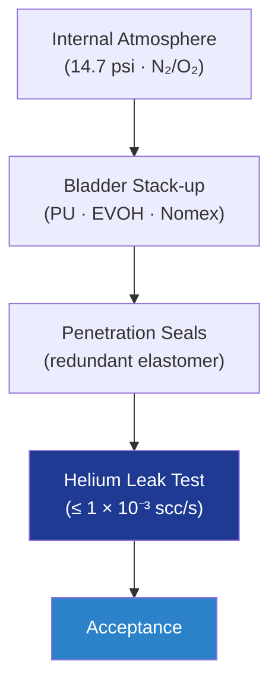

# STA 110-119 · 117-020 — Bladder Pressure-Containment and Leak Control

## 1. Purpose

Defines the **bladder subsystem** providing pressure containment and atmosphere retention for inflatable / expandable habitats: multi-layer urethane / EVOH / Nomex laminate, target leak rate ≤ 1 × 10⁻³ scc/s helium equivalent, leak-test methodology per ASTM E499 and ECSS-Q-ST-70-15C[^ecssqst7015], and qualification under ECSS-E-ST-32-01C[^ecsseSt3201].

## 2. Scope

- Covers the *Bladder Pressure-Containment and Leak Control* subsubject (`020`) of subsection `117`.
- Inherits Q-Division authority from the parent row in [`../../README.md` §3](../../README.md#3-architecture-table)[^archtable].
- Concepts in scope:
  - **Bladder stack-up** — multi-layer polyurethane (PU) / EVOH gas-barrier / Nomex protective film; thickness budget 1.5–3.0 mm.
  - **Leak rate target** — ≤ 1 × 10⁻³ scc/s helium equivalent at MEOP; degradation budget × 5 over service life.
  - **Atmosphere retention** — verifies daily make-up gas budget (N₂/O₂) at MEOP 14.7 psi; consistent with ECLSS sizing in 117-070.
  - **Helium leak test** — mass-spectrometer leak detection per ASTM E499; acceptance threshold and re-test criteria.
  - **Penetration sealing** — feedthroughs, vents, and hatches sealed with redundant elastomer barriers (primary + secondary) per ECSS-E-ST-32-01C[^ecsseSt3201].
  - **Aging and ozone resistance** — pre-launch storage limits, ozone-conditioning per ASTM standards, AO LEO derating.

## 3. Diagram

## 4. Footprint

| Metric | Value |
|---|---|
| Architecture | `STA` |
| Subsection | `117` — Estructuras Inflables, Expandibles y Habitables |
| Subsubject | `020` — Bladder Pressure-Containment and Leak Control |
| Primary Q-Division | Q-SPACE[^qdiv] |
| Governance class | `baseline`[^gov] |
| Document | `117-020-Bladder-Pressure-Containment-and-Leak-Control.md` |
| Parent subsection | [`README.md`](./README.md) · [`117-000-General.md`](./117-000-General.md) |

## References & Citations

[^baseline]: **Q+ATLANTIDE controlled baseline (v1.0.0)** — [`organization/Q+ATLANTIDE.md`](../../../../organization/Q+ATLANTIDE.md).
[^archtable]: **STA §3 Architecture Table** — [`../../README.md` §3](../../README.md#3-architecture-table).
[^qdiv]: **Q-Division authority** — Q-Divisions provide technical authority over an architecture row.
[^gov]: **Governance class** — `baseline`.
[^ecsseSt3201]: **ECSS-E-ST-32-01C** — Space Engineering: Structural General Requirements.
[^ecsseSt3301]: **ECSS-E-ST-33-01C** — Space Engineering: Mechanisms.
[^ecsseSt31]: **ECSS-E-ST-31C** — Space Engineering: Thermal Control General Requirements.
[^ecssqst7015]: **ECSS-Q-ST-70-15C** — Space product assurance: Non-destructive testing.
[^nasastd3001]: **NASA-STD-3001 Vol. 1 & 2** — Space Flight Human-System Standard.
[^nasastd5012]: **NASA-STD-5012** — Strength and Life Assessment Requirements.
[^nasahdbk6003]: **NASA-HDBK-6003** — MMOD design reference.
[^astmf3208]: **ASTM F3208** — Standard Practice for Conditioning and Testing of Soft Goods.
[^cmh17]: **CMH-17** — Composite Materials Handbook.
[^iso9001]: **ISO 9001:2015** — Quality Management Systems.
