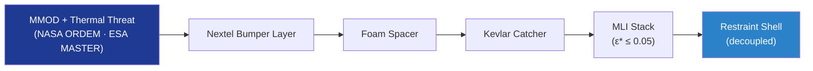

# STA 110-119 · 117-030 — MMOD and Thermal Multi-Layer Protection

## 1. Purpose

Defines the **outer multi-layer protection** stack of inflatable / expandable habitats: Nextel + Kevlar + foam-spacer Whipple-type architecture per NASA-HDBK-6003[^nasahdbk6003], MLI per ECSS-E-ST-31C[^ecsseSt31], and AO / UV barriers for LEO and cislunar duty cycles.

## 2. Scope

- Covers the *MMOD and Thermal Multi-Layer Protection* subsubject (`030`) of subsection `117`.
- Inherits Q-Division authority from the parent row in [`../../README.md` §3](../../README.md#3-architecture-table)[^archtable].
- Concepts in scope:
  - **Whipple-stack** — Nextel bumper + intermediate spacer + Kevlar/aramid catcher layers; ballistic-limit equation calibrated per NASA-HDBK-6003[^nasahdbk6003].
  - **MMOD performance** — ≥ 95 % no-penetration probability over service life; threat model from NASA ORDEM and ESA MASTER.
  - **Thermal MLI** — Kapton / aluminised Mylar layers per ECSS-E-ST-31C[^ecsseSt31]; effective emissivity ε* ≤ 0.05 nominal.
  - **AO and UV barrier** — outer SiO₂-coated layer for LEO AO flux; UV-stable polymer choice for cislunar.
  - **Interaction with restraint shell** — protection stack mechanically decoupled from primary load path (117-010) to avoid load redistribution.
  - **Inspection** — periodic SHM and visual inspection (link to 116-060 SHM Architecture).

## 3. Diagram

## 4. Footprint

| Metric | Value |
|---|---|
| Architecture | `STA` |
| Subsection | `117` — Estructuras Inflables, Expandibles y Habitables |
| Subsubject | `030` — MMOD and Thermal Multi-Layer Protection |
| Primary Q-Division | Q-SPACE[^qdiv] |
| Governance class | `baseline`[^gov] |
| Document | `117-030-MMOD-and-Thermal-Multi-Layer-Protection.md` |
| Parent subsection | [`README.md`](./README.md) · [`117-000-General.md`](./117-000-General.md) |

## References & Citations

[^baseline]: **Q+ATLANTIDE controlled baseline (v1.0.0)** — [`organization/Q+ATLANTIDE.md`](../../../../organization/Q+ATLANTIDE.md).
[^archtable]: **STA §3 Architecture Table** — [`../../README.md` §3](../../README.md#3-architecture-table).
[^qdiv]: **Q-Division authority** — Q-Divisions provide technical authority over an architecture row.
[^gov]: **Governance class** — `baseline`.
[^ecsseSt3201]: **ECSS-E-ST-32-01C** — Space Engineering: Structural General Requirements.
[^ecsseSt3301]: **ECSS-E-ST-33-01C** — Space Engineering: Mechanisms.
[^ecsseSt31]: **ECSS-E-ST-31C** — Space Engineering: Thermal Control General Requirements.
[^ecssqst7015]: **ECSS-Q-ST-70-15C** — Space product assurance: Non-destructive testing.
[^nasastd3001]: **NASA-STD-3001 Vol. 1 & 2** — Space Flight Human-System Standard.
[^nasastd5012]: **NASA-STD-5012** — Strength and Life Assessment Requirements.
[^nasahdbk6003]: **NASA-HDBK-6003** — MMOD design reference.
[^astmf3208]: **ASTM F3208** — Standard Practice for Conditioning and Testing of Soft Goods.
[^cmh17]: **CMH-17** — Composite Materials Handbook.
[^iso9001]: **ISO 9001:2015** — Quality Management Systems.
