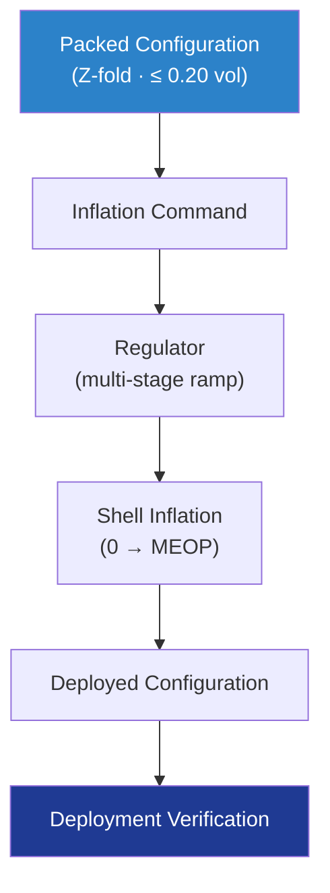

# STA 110-119 · 117-040 — Packing Deployment and Inflation Subsystem

## 1. Purpose

Defines **packing**, **deployment kinematics** and the **inflation gas subsystem** for inflatable / expandable habitats, including stowage volume fraction targets, controlled pressure ramp, redundant inflation tanks, and deployment qualification per ECSS-E-ST-33-01C[^ecsseSt3301].

## 2. Scope

- Covers the *Packing Deployment and Inflation Subsystem* subsubject (`040`) of subsection `117`.
- Inherits Q-Division authority from the parent row in [`../../README.md` §3](../../README.md#3-architecture-table)[^archtable].
- Concepts in scope:
  - **Packing geometry** — Z-fold / origami pack pattern; stowage volume fraction ≤ 0.20 of deployed volume.
  - **Inflation gas storage** — high-pressure N₂ tanks (or N₂/O₂ blend), redundant 2 × 100 % capacity, isolation valves per ECSS-E-ST-33-01C[^ecsseSt3301].
  - **Pressure ramp** — controlled multi-stage inflation 0 → MEOP over ≥ 1 hour; rate-limited regulator to avoid restraint shock loads.
  - **Deployment kinematics** — predicted shape evolution validated by 1-g + sub-scale + thermal-vacuum tests; dynamics within structural margin per ECSS-E-ST-32-01C[^ecsseSt3201].
  - **Abort modes** — depressurisation, controlled venting, and stow-revert procedures.
  - **Sensors** — pressure, temperature, strain (link to 117-070 ECLSS and 116-070 SHM sensors).

## 3. Diagram

## 4. Footprint

| Metric | Value |
|---|---|
| Architecture | `STA` |
| Subsection | `117` — Estructuras Inflables, Expandibles y Habitables |
| Subsubject | `040` — Packing Deployment and Inflation Subsystem |
| Primary Q-Division | Q-SPACE[^qdiv] |
| Governance class | `baseline`[^gov] |
| Document | `117-040-Packing-Deployment-and-Inflation-Subsystem.md` |
| Parent subsection | [`README.md`](./README.md) · [`117-000-General.md`](./117-000-General.md) |

## References & Citations

[^baseline]: **Q+ATLANTIDE controlled baseline (v1.0.0)** — [`organization/Q+ATLANTIDE.md`](../../../../organization/Q+ATLANTIDE.md).
[^archtable]: **STA §3 Architecture Table** — [`../../README.md` §3](../../README.md#3-architecture-table).
[^qdiv]: **Q-Division authority** — Q-Divisions provide technical authority over an architecture row.
[^gov]: **Governance class** — `baseline`.
[^ecsseSt3201]: **ECSS-E-ST-32-01C** — Space Engineering: Structural General Requirements.
[^ecsseSt3301]: **ECSS-E-ST-33-01C** — Space Engineering: Mechanisms.
[^ecsseSt31]: **ECSS-E-ST-31C** — Space Engineering: Thermal Control General Requirements.
[^ecssqst7015]: **ECSS-Q-ST-70-15C** — Space product assurance: Non-destructive testing.
[^nasastd3001]: **NASA-STD-3001 Vol. 1 & 2** — Space Flight Human-System Standard.
[^nasastd5012]: **NASA-STD-5012** — Strength and Life Assessment Requirements.
[^nasahdbk6003]: **NASA-HDBK-6003** — MMOD design reference.
[^astmf3208]: **ASTM F3208** — Standard Practice for Conditioning and Testing of Soft Goods.
[^cmh17]: **CMH-17** — Composite Materials Handbook.
[^iso9001]: **ISO 9001:2015** — Quality Management Systems.
