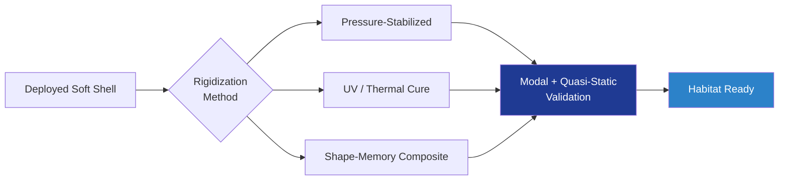

# STA 110-119 · 117-050 — Rigidization and Post-Deployment Stiffness

## 1. Purpose

Defines **rigidization strategies** (pressure-stabilized, UV-cure resin, sub-Tg thermoset, shape-memory composite) used to obtain **post-deployment structural stiffness**, with modal and quasi-static validation per ECSS-E-ST-32-01C[^ecsseSt3201] and NASA-STD-5012[^nasastd5012].

## 2. Scope

- Covers the *Rigidization and Post-Deployment Stiffness* subsubject (`050`) of subsection `117`.
- Inherits Q-Division authority from the parent row in [`../../README.md` §3](../../README.md#3-architecture-table)[^archtable].
- Concepts in scope:
  - **Architecture trade** — pressure-stabilized (always-pressurised) vs UV-cured resin vs sub-Tg thermoset vs shape-memory composite (SMC).
  - **Pressure-stabilized** — relies on continuous MEOP; stiffness governed by membrane tension; loss-of-pressure abort modes considered.
  - **UV / thermal cure** — one-shot rigidization on-orbit; cure verification by sensor strip (DSC equivalent) before crewed entry.
  - **Shape-memory composites** — Tg above operational range; activation via embedded heater; verified by modal hammer test.
  - **Modal verification** — first bending mode ≥ specified frequency; damping ≥ minimum after rigidization.
  - **Quasi-static loads** — survival under attitude-control inputs, docking loads, and crewed-translation reactions per ECSS-E-ST-32-01C[^ecsseSt3201].

## 3. Diagram

## 4. Footprint

| Metric | Value |
|---|---|
| Architecture | `STA` |
| Subsection | `117` — Estructuras Inflables, Expandibles y Habitables |
| Subsubject | `050` — Rigidization and Post-Deployment Stiffness |
| Primary Q-Division | Q-SPACE[^qdiv] |
| Governance class | `baseline`[^gov] |
| Document | `117-050-Rigidization-and-Post-Deployment-Stiffness.md` |
| Parent subsection | [`README.md`](./README.md) · [`117-000-General.md`](./117-000-General.md) |

## References & Citations

[^baseline]: **Q+ATLANTIDE controlled baseline (v1.0.0)** — [`organization/Q+ATLANTIDE.md`](../../../../organization/Q+ATLANTIDE.md).
[^archtable]: **STA §3 Architecture Table** — [`../../README.md` §3](../../README.md#3-architecture-table).
[^qdiv]: **Q-Division authority** — Q-Divisions provide technical authority over an architecture row.
[^gov]: **Governance class** — `baseline`.
[^ecsseSt3201]: **ECSS-E-ST-32-01C** — Space Engineering: Structural General Requirements.
[^ecsseSt3301]: **ECSS-E-ST-33-01C** — Space Engineering: Mechanisms.
[^ecsseSt31]: **ECSS-E-ST-31C** — Space Engineering: Thermal Control General Requirements.
[^ecssqst7015]: **ECSS-Q-ST-70-15C** — Space product assurance: Non-destructive testing.
[^nasastd3001]: **NASA-STD-3001 Vol. 1 & 2** — Space Flight Human-System Standard.
[^nasastd5012]: **NASA-STD-5012** — Strength and Life Assessment Requirements.
[^nasahdbk6003]: **NASA-HDBK-6003** — MMOD design reference.
[^astmf3208]: **ASTM F3208** — Standard Practice for Conditioning and Testing of Soft Goods.
[^cmh17]: **CMH-17** — Composite Materials Handbook.
[^iso9001]: **ISO 9001:2015** — Quality Management Systems.
