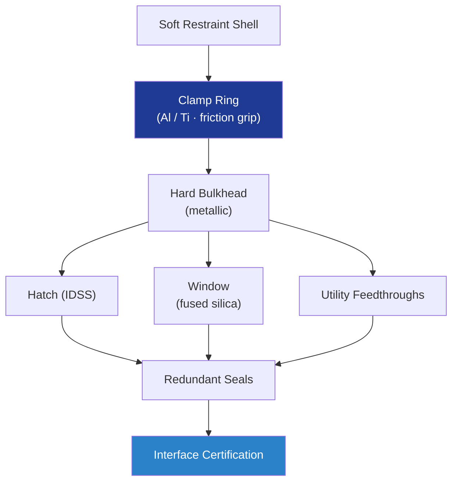

# STA 110-119 · 117-060 — Hard-Soft Interface and Penetration Management

## 1. Purpose

Defines **hard-to-soft interfaces** between rigid metallic bulkheads and the soft-goods restraint shell, including hatch / window / utility feedthroughs, clamp-ring fatigue management, and sealing redundancy per ECSS-E-ST-32-01C[^ecsseSt3201] and NASA-STD-5012[^nasastd5012].

## 2. Scope

- Covers the *Hard-Soft Interface and Penetration Management* subsubject (`060`) of subsection `117`.
- Inherits Q-Division authority from the parent row in [`../../README.md` §3](../../README.md#3-architecture-table)[^archtable].
- Concepts in scope:
  - **Clamp-ring interface** — metallic ring (Al / Ti) gripping the restraint webbings via friction + mechanical bite; pull-test ≥ 90 % web strength.
  - **Hatch interface** — IDSS-compatible docking ring (link to 113-040 Docking Mechanisms) mounted on hard bulkhead; preserves soft-goods load symmetry.
  - **Window penetrations** — multi-pane fused-silica window with metallic frame, redundant elastomer seals; sized for MMOD impact attenuation.
  - **Utility feedthroughs** — power, data, fluid feedthroughs sealed with primary + secondary elastomer; leak test individually.
  - **Fatigue** — interface ring stress-concentration analysis; SHM strain sensors per 116-070 monitor ring fatigue life.
  - **Inspection** — bonded / sealed regions inspected per 116-050 composite-NDI and 116-040 surface methods.

## 3. Diagram

## 4. Footprint

| Metric | Value |
|---|---|
| Architecture | `STA` |
| Subsection | `117` — Estructuras Inflables, Expandibles y Habitables |
| Subsubject | `060` — Hard-Soft Interface and Penetration Management |
| Primary Q-Division | Q-SPACE[^qdiv] |
| Governance class | `baseline`[^gov] |
| Document | `117-060-Hard-Soft-Interface-and-Penetration-Management.md` |
| Parent subsection | [`README.md`](./README.md) · [`117-000-General.md`](./117-000-General.md) |

## References & Citations

[^baseline]: **Q+ATLANTIDE controlled baseline (v1.0.0)** — [`organization/Q+ATLANTIDE.md`](../../../../organization/Q+ATLANTIDE.md).
[^archtable]: **STA §3 Architecture Table** — [`../../README.md` §3](../../README.md#3-architecture-table).
[^qdiv]: **Q-Division authority** — Q-Divisions provide technical authority over an architecture row.
[^gov]: **Governance class** — `baseline`.
[^ecsseSt3201]: **ECSS-E-ST-32-01C** — Space Engineering: Structural General Requirements.
[^ecsseSt3301]: **ECSS-E-ST-33-01C** — Space Engineering: Mechanisms.
[^ecsseSt31]: **ECSS-E-ST-31C** — Space Engineering: Thermal Control General Requirements.
[^ecssqst7015]: **ECSS-Q-ST-70-15C** — Space product assurance: Non-destructive testing.
[^nasastd3001]: **NASA-STD-3001 Vol. 1 & 2** — Space Flight Human-System Standard.
[^nasastd5012]: **NASA-STD-5012** — Strength and Life Assessment Requirements.
[^nasahdbk6003]: **NASA-HDBK-6003** — MMOD design reference.
[^astmf3208]: **ASTM F3208** — Standard Practice for Conditioning and Testing of Soft Goods.
[^cmh17]: **CMH-17** — Composite Materials Handbook.
[^iso9001]: **ISO 9001:2015** — Quality Management Systems.
