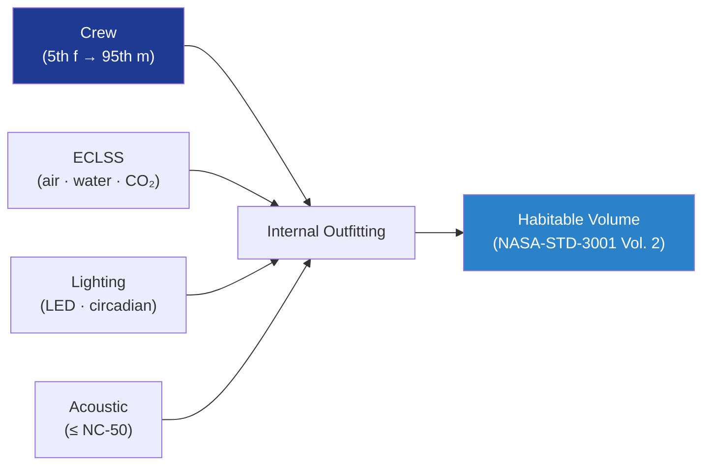

# STA 110-119 · 117-070 — Habitability ECLSS Acoustic and Human-Factors Integration

## 1. Purpose

Defines **habitability integration** of inflatable habitats with ECLSS, acoustic, lighting and human-factors requirements per NASA-STD-3001 Vol. 2[^nasastd3001] and ISS habitability heritage, including internal outfitting and crew translation paths.

## 2. Scope

- Covers the *Habitability ECLSS Acoustic and Human-Factors Integration* subsubject (`070`) of subsection `117`.
- Inherits Q-Division authority from the parent row in [`../../README.md` §3](../../README.md#3-architecture-table)[^archtable].
- Concepts in scope:
  - **ECLSS interfaces** — atmosphere supply, CO₂ removal, humidity control, ventilation tied to ECLSS bus per NASA-STD-3001 Vol. 2[^nasastd3001].
  - **Acoustic environment** — internal noise ≤ NC-50 24-hour habitable; impulse noise ≤ 140 dB peak; treated panels on soft shell interior.
  - **Lighting and circadian** — full-spectrum LED arrays; illuminance 108–323 lux task; circadian shift programmability.
  - **Internal outfitting** — modular soft-mounted racks; restraints for microgravity translation; window viewports.
  - **Human-factors** — anthropometric envelopes (5th f → 95th m); reach / clearance / visibility per NASA-STD-3001 Vol. 2[^nasastd3001].
  - **Acoustic decoupling** — ECLSS fans / pumps mounted on isolators to soft shell; SHM-monitored attachments (link to 116-070).

## 3. Diagram

## 4. Footprint

| Metric | Value |
|---|---|
| Architecture | `STA` |
| Subsection | `117` — Estructuras Inflables, Expandibles y Habitables |
| Subsubject | `070` — Habitability ECLSS Acoustic and Human-Factors Integration |
| Primary Q-Division | Q-SPACE[^qdiv] |
| Governance class | `baseline`[^gov] |
| Document | `117-070-Habitability-ECLSS-Acoustic-and-Human-Factors-Integration.md` |
| Parent subsection | [`README.md`](./README.md) · [`117-000-General.md`](./117-000-General.md) |

## References & Citations

[^baseline]: **Q+ATLANTIDE controlled baseline (v1.0.0)** — [`organization/Q+ATLANTIDE.md`](../../../../organization/Q+ATLANTIDE.md).
[^archtable]: **STA §3 Architecture Table** — [`../../README.md` §3](../../README.md#3-architecture-table).
[^qdiv]: **Q-Division authority** — Q-Divisions provide technical authority over an architecture row.
[^gov]: **Governance class** — `baseline`.
[^ecsseSt3201]: **ECSS-E-ST-32-01C** — Space Engineering: Structural General Requirements.
[^ecsseSt3301]: **ECSS-E-ST-33-01C** — Space Engineering: Mechanisms.
[^ecsseSt31]: **ECSS-E-ST-31C** — Space Engineering: Thermal Control General Requirements.
[^ecssqst7015]: **ECSS-Q-ST-70-15C** — Space product assurance: Non-destructive testing.
[^nasastd3001]: **NASA-STD-3001 Vol. 1 & 2** — Space Flight Human-System Standard.
[^nasastd5012]: **NASA-STD-5012** — Strength and Life Assessment Requirements.
[^nasahdbk6003]: **NASA-HDBK-6003** — MMOD design reference.
[^astmf3208]: **ASTM F3208** — Standard Practice for Conditioning and Testing of Soft Goods.
[^cmh17]: **CMH-17** — Composite Materials Handbook.
[^iso9001]: **ISO 9001:2015** — Quality Management Systems.
