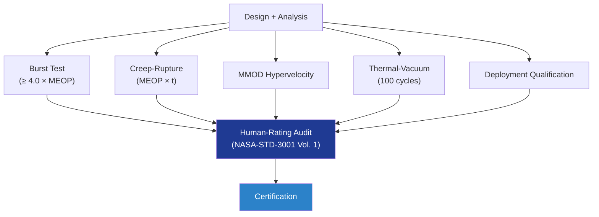

# STA 110-119 · 117-080 — Qualification Acceptance and Human-Rating Programme

## 1. Purpose

Defines the **qualification, acceptance and human-rating programme** for inflatable / expandable habitable structures, including burst, creep-rupture, MMOD impact, thermal-vacuum cycling, deployment, and human-rating per ECSS-E-ST-32-01C[^ecsseSt3201], NASA-STD-5012[^nasastd5012] and NASA-STD-3001 Vol. 1[^nasastd3001].

## 2. Scope

- Covers the *Qualification Acceptance and Human-Rating Programme* subsubject (`080`) of subsection `117`.
- Inherits Q-Division authority from the parent row in [`../../README.md` §3](../../README.md#3-architecture-table)[^archtable].
- Concepts in scope:
  - **Burst pressure** — qualification burst factor ≥ 4.0 × MEOP per human-rated pressure-vessel practice; demonstrated on full-scale or scaled article.
  - **Creep-rupture** — long-duration sustained-load test ≥ 30 days at MEOP × design factor; extrapolation to 30-year mission.
  - **MMOD impact** — hypervelocity testing of representative Whipple stack; no penetration at design threat level.
  - **Thermal-vacuum cycling** — ≥ 100 cycles representative orbital temperature range; leak rate retained.
  - **Deployment qualification** — 1-g + thermal-vacuum chamber deployment; deployment success in ≥ 3 independent campaigns.
  - **Human-rating** — design and process audited against NASA-STD-3001 Vol. 1[^nasastd3001]; two-fault tolerance for catastrophic hazards.
  - **Acceptance** — proof pressure + helium leak + functional acceptance per ECSS-Q-ST-70-15C[^ecssqst7015].

## 3. Diagram

## 4. Footprint

| Metric | Value |
|---|---|
| Architecture | `STA` |
| Subsection | `117` — Estructuras Inflables, Expandibles y Habitables |
| Subsubject | `080` — Qualification Acceptance and Human-Rating Programme |
| Primary Q-Division | Q-SPACE[^qdiv] |
| Governance class | `baseline`[^gov] |
| Document | `117-080-Qualification-Acceptance-and-Human-Rating-Programme.md` |
| Parent subsection | [`README.md`](./README.md) · [`117-000-General.md`](./117-000-General.md) |

## References & Citations

[^baseline]: **Q+ATLANTIDE controlled baseline (v1.0.0)** — [`organization/Q+ATLANTIDE.md`](../../../../organization/Q+ATLANTIDE.md).
[^archtable]: **STA §3 Architecture Table** — [`../../README.md` §3](../../README.md#3-architecture-table).
[^qdiv]: **Q-Division authority** — Q-Divisions provide technical authority over an architecture row.
[^gov]: **Governance class** — `baseline`.
[^ecsseSt3201]: **ECSS-E-ST-32-01C** — Space Engineering: Structural General Requirements.
[^ecsseSt3301]: **ECSS-E-ST-33-01C** — Space Engineering: Mechanisms.
[^ecsseSt31]: **ECSS-E-ST-31C** — Space Engineering: Thermal Control General Requirements.
[^ecssqst7015]: **ECSS-Q-ST-70-15C** — Space product assurance: Non-destructive testing.
[^nasastd3001]: **NASA-STD-3001 Vol. 1 & 2** — Space Flight Human-System Standard.
[^nasastd5012]: **NASA-STD-5012** — Strength and Life Assessment Requirements.
[^nasahdbk6003]: **NASA-HDBK-6003** — MMOD design reference.
[^astmf3208]: **ASTM F3208** — Standard Practice for Conditioning and Testing of Soft Goods.
[^cmh17]: **CMH-17** — Composite Materials Handbook.
[^iso9001]: **ISO 9001:2015** — Quality Management Systems.
