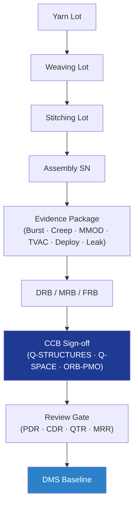

# STA 110-119 · 117-090 — Traceability Evidence and Lifecycle Governance

## 1. Purpose

Defines the **traceability and lifecycle-governance** framework for *Estructuras Inflables, Expandibles y Habitables* (`117`): soft-goods lot traceability from yarn through stitched assembly, burst / leak / MMOD / deployment evidence packages, DRB/MRB authority, configuration management, and PDR/CDR/QTR/MRR review-gate evidence under Q+ATLANTIDE baseline control[^baseline] and ECSS-M-ST-40C / ECSS-Q-ST-10C governance.

## 2. Scope

- Covers the *Traceability Evidence and Lifecycle Governance* subsubject (`090`) of subsection `117`.
- Concepts in scope:
  - **Soft-goods lot traceability** — yarn lot → weaving lot → stitching lot → assembly serial; recorded per ECSS-Q-ST-70-15C[^ecssqst7015] and ASTM F3208[^astmf3208] sample identification.
  - **Evidence package** — burst test (factor ≥ 4.0 × MEOP), creep-rupture, MMOD hypervelocity, thermal-vacuum cycling, deployment qualification, helium leak (≤ 1 × 10⁻³ scc/s), and acceptance proof-pressure records.
  - **DRB / MRB / FRB authority** — Design Review Board, Material Review Board, Failure Review Board chaired by Q-STRUCTURES, with Q-SPACE concurrence and Q-MECHANICS (deployment) participation.
  - **Change authority matrix** — habitable pressure-vessel critical changes: Q-STRUCTURES + Q-SPACE + ORB-PMO via DRB; non-FCI structural changes: Q-STRUCTURES + Q-INDUSTRY; all via DMS revision control.
  - **Review gates** — PDR, CDR, QTR, MRR; each gate releases artefacts indexed in the Q+ATLANTIDE DMS.
  - **Human-rating evidence** — NASA-STD-3001 Vol. 1[^nasastd3001] audit findings, two-fault-tolerance demonstration, hazard reports closure.
  - **Configuration management** — baseline drawings, ICDs, qualified procedures, certificates of conformance per ECSS-M-ST-40C and ISO 9001[^iso9001].

## 3. Diagram

## 4. Footprint

| Metric | Value |
|---|---|
| Architecture | `STA` |
| Subsection | `117` — Estructuras Inflables, Expandibles y Habitables |
| Subsubject | `090` — Traceability Evidence and Lifecycle Governance |
| Primary Q-Division | Q-SPACE[^qdiv] |
| Governance class | `baseline`[^gov] |
| Document | `117-090-Traceability-Evidence-and-Lifecycle-Governance.md` |
| Parent subsection | [`README.md`](./README.md) · [`117-000-General.md`](./117-000-General.md) |

## References & Citations

[^baseline]: **Q+ATLANTIDE controlled baseline (v1.0.0)** — [`organization/Q+ATLANTIDE.md`](../../../../organization/Q+ATLANTIDE.md).
[^archtable]: **STA §3 Architecture Table** — [`../../README.md` §3](../../README.md#3-architecture-table).
[^qdiv]: **Q-Division authority** — Q-Divisions provide technical authority over an architecture row.
[^gov]: **Governance class** — `baseline`.
[^ecssqst7015]: **ECSS-Q-ST-70-15C** — Space product assurance: Non-destructive testing.
[^nasastd3001]: **NASA-STD-3001 Vol. 1** — Space Flight Human-System Standard, Crew Health.
[^astmf3208]: **ASTM F3208** — Standard Practice for Conditioning and Testing of Soft Goods.
[^iso9001]: **ISO 9001:2015** — Quality Management Systems.
