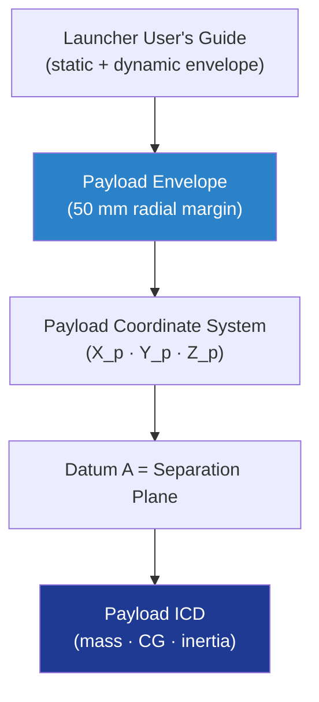

# STA 110-119 · 118-010 — Payload Mechanical Envelope and Coordinate System

## 1. Purpose

Defines the **payload static and dynamic envelope** inside the launch-vehicle fairing and the **payload coordinate system** (origin, axes, sign convention) used for all Q+ATLANTIDE payload-to-bus and payload-to-launcher interface data. Compliance with the launcher User's Guide envelope and with ECSS-E-ST-32-01C[^ecsseSt3201] clearance and tolerancing requirements is mandatory.

## 2. Scope

- Covers the *Payload Mechanical Envelope and Coordinate System* subsubject (`010`) of subsection `118`.
- Inherits Q-Division authority from the parent row in [`../../README.md` §3](../../README.md#3-architecture-table)[^archtable].
- Concepts in scope:
  - **Static envelope** — geometric volume bounded by fairing internal surface minus tolerance allocations; payload solid model offset ≥ 50 mm radial unless waived.
  - **Dynamic envelope** — adds fairing and payload elastic deflection under quasi-static, sine and acoustic load cases per NASA-STD-5002[^nasastd5002]; analysed at limit load with safety factor ≥ 1.5 on clearance.
  - **Coordinate system** — payload `X_p` axis aligned with launch-vehicle longitudinal axis (positive nose-up); `Y_p`, `Z_p` right-handed; origin at separation-plane geometric centre.
  - **Mass properties** — total mass, CG offsets and inertia tensor declared in the Payload ICD; tolerance on CG ≤ ±5 mm radial; balancing per ISO 1940 G1.0 where rotating elements apply.
  - **Tolerance flow-down** — datum scheme per ASME Y14.5[^asmeY145] flowed from payload datum A (sep-plane) to instrument optical bench.
  - **Interfaces** — feeds 118-020 (mechanical I/F), 118-060 (alignment) and 118-070 (thermal I/F geometry).

## 3. Diagram

## 4. Footprint

| Metric | Value |
|---|---|
| Architecture | `STA` |
| Subsection | `118` — Estructuras de Carga Útil y Mission Interfaces |
| Subsubject | `010` — Payload Mechanical Envelope and Coordinate System |
| Primary Q-Division | Q-SPACE[^qdiv] |
| Governance class | `baseline`[^gov] |
| Document | `118-010-Payload-Mechanical-Envelope-and-Coordinate-System.md` |
| Parent subsection | [`README.md`](./README.md) · [`118-000-General.md`](./118-000-General.md) |

## References & Citations

[^baseline]: **Q+ATLANTIDE controlled baseline (v1.0.0)** — [`organization/Q+ATLANTIDE.md`](../../../../organization/Q+ATLANTIDE.md).
[^archtable]: **STA §3 Architecture Table** — [`../../README.md` §3](../../README.md#3-architecture-table).
[^qdiv]: **Q-Division authority** — Q-Divisions provide technical authority over an architecture row.
[^gov]: **Governance class** — `baseline`.
[^ecsseSt3201]: **ECSS-E-ST-32-01C** — Space Engineering: Structural General Requirements.
[^nasastd5002]: **NASA-STD-5002** — Load Analyses of Spacecraft and Payloads.
[^asmeY145]: **ASME Y14.5** — Dimensioning and Tolerancing.
