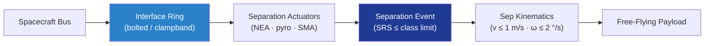

# STA 110-119 · 118-020 — Payload-to-Bus Mechanical Interface and Separation System

## 1. Purpose

Defines the **payload-to-bus mechanical interface** (bolted ring, clampband or low-shock separation system) and the **separation event** characterisation for Q+ATLANTIDE payloads. Mechanism qualification per ECSS-E-ST-33-01C[^ecsseSt3301] and shock environment per NASA-STD-5002[^nasastd5002], with verified tip-off rates and collision-free separation kinematics.

## 2. Scope

- Covers the *Payload-to-Bus Mechanical Interface and Separation System* subsubject (`020`) of subsection `118`.
- Concepts in scope:
  - **Interface ring** — bolted flange (8/12/15/24-bolt patterns) with controlled stiffness and through-bolt preload per ECSS-E-ST-32-01C[^ecsseSt3201]; or clampband (Marman) with controlled tension.
  - **Separation actuators** — pyrotechnic bolt cutters, non-explosive actuators (NEA), shape-memory release, or pin-pullers, with full redundancy (no single point of failure on release).
  - **Shock environment** — separation SRS limited per Q+ATLANTIDE payload class (typ. ≤ 1000 g at the interface plane, ≤ 300 g at instrument); attenuation per ECSS-E-ST-32-11C[^ecsseSt3211] shock management.
  - **Separation kinematics** — separation velocity 0.3–1.0 m/s; tip-off rate ≤ 2 °/s about each axis; clearance ≥ 0.5 m at +5 s; verified by 6-DOF dispersion analysis.
  - **Springs and indicators** — matched separation springs, sep-detect microswitches and breakwires, lanyard-pulled signal.
  - **Interfaces** — feeds 118-030 (umbilical disconnects), 118-080 (separation-shock testing).

## 3. Diagram

## 4. Footprint

| Metric | Value |
|---|---|
| Architecture | `STA` |
| Subsection | `118` — Estructuras de Carga Útil y Mission Interfaces |
| Subsubject | `020` — Payload-to-Bus Mechanical Interface and Separation System |
| Primary Q-Division | Q-SPACE[^qdiv] |
| Governance class | `baseline`[^gov] |
| Document | `118-020-Payload-to-Bus-Mechanical-Interface-and-Separation-System.md` |
| Parent subsection | [`README.md`](./README.md) · [`118-000-General.md`](./118-000-General.md) |

## References & Citations

[^baseline]: **Q+ATLANTIDE controlled baseline (v1.0.0)** — [`organization/Q+ATLANTIDE.md`](../../../../organization/Q+ATLANTIDE.md).
[^archtable]: **STA §3 Architecture Table** — [`../../README.md` §3](../../README.md#3-architecture-table).
[^qdiv]: **Q-Division authority** — Q-Divisions provide technical authority over an architecture row.
[^gov]: **Governance class** — `baseline`.
[^ecsseSt3201]: **ECSS-E-ST-32-01C** — Space Engineering: Structural General Requirements.
[^ecsseSt3301]: **ECSS-E-ST-33-01C** — Space Engineering: Mechanisms.
[^ecsseSt3211]: **ECSS-E-ST-32-11C** — Modal Survey Assessment / shock management.
[^nasastd5002]: **NASA-STD-5002** — Load Analyses of Spacecraft and Payloads.
