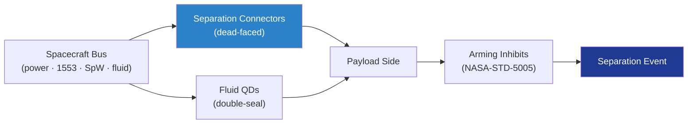

# STA 110-119 · 118-030 — Payload Electrical Data and Fluid Umbilicals

## 1. Purpose

Defines the **payload umbilical architecture**: electrical power, command/telemetry data buses, and fluid (propellant, pressurant, coolant) lines crossing the payload-to-bus and payload-to-ground interfaces, including separation connectors, dead-face logic and lanyard-pulled disconnects. Compliance with ECSS-E-ST-50-12C[^ecsseSt5012] for SpaceWire and with ECSS-E-ST-32-08C[^ecsseSt3208] for fluid systems is mandatory.

## 2. Scope

- Covers the *Payload Electrical Data and Fluid Umbilicals* subsubject (`030`) of subsection `118`.
- Concepts in scope:
  - **Electrical umbilicals** — separation connectors (e.g., Deutsch ASL / NSI styles), power conductors sized to ≤ 50 % current rating, twisted-shielded data pairs.
  - **Data buses** — SpaceWire per ECSS-E-ST-50-12C[^ecsseSt5012], MIL-STD-1553B[^mil1553] redundant dual-bus, and Gb Ethernet payload links; insertion-loss budget at the separation connector ≤ 1.5 dB.
  - **Dead-face logic** — bus voltages commanded to zero ≥ 100 ms before separation; arming inhibits per NASA-STD-5005[^nasastd5005] pyrotechnic safety; verified by stim/response telemetry.
  - **Fluid disconnects** — quick-disconnects with double-seal and check-valve closure on both halves; leak rate ≤ 1 × 10⁻⁴ scc/s He at MEOP.
  - **Lanyard-pulled connectors** — used at GSE/T-0 interface and at vehicle-to-payload feed-through; pull force 30–80 N envelope; verified with mass simulator.
  - **Grounding and bonding** — single-point ground reference at the interface plane per ECSS-E-ST-20C[^ecsseSt20] electrical engineering; chassis bond impedance ≤ 2.5 mΩ.
  - **Interfaces** — feeds 118-020 (separation event timing) and 118-080 (electrical interface testing).

## 3. Diagram

## 4. Footprint

| Metric | Value |
|---|---|
| Architecture | `STA` |
| Subsection | `118` — Estructuras de Carga Útil y Mission Interfaces |
| Subsubject | `030` — Payload Electrical Data and Fluid Umbilicals |
| Primary Q-Division | Q-SPACE[^qdiv] |
| Governance class | `baseline`[^gov] |
| Document | `118-030-Payload-Electrical-Data-and-Fluid-Umbilicals.md` |
| Parent subsection | [`README.md`](./README.md) · [`118-000-General.md`](./118-000-General.md) |

## References & Citations

[^baseline]: **Q+ATLANTIDE controlled baseline (v1.0.0)** — [`organization/Q+ATLANTIDE.md`](../../../../organization/Q+ATLANTIDE.md).
[^archtable]: **STA §3 Architecture Table** — [`../../README.md` §3](../../README.md#3-architecture-table).
[^qdiv]: **Q-Division authority** — Q-Divisions provide technical authority over an architecture row.
[^gov]: **Governance class** — `baseline`.
[^ecsseSt20]: **ECSS-E-ST-20C** — Space Engineering: Electrical and Electronic.
[^ecsseSt3208]: **ECSS-E-ST-32-08C** — Space Engineering: Materials / fluid systems guidance.
[^ecsseSt5012]: **ECSS-E-ST-50-12C** — SpaceWire — Links, Nodes, Routers and Networks.
[^mil1553]: **MIL-STD-1553B** — Digital Time-Division Command/Response Multiplex Data Bus.
[^nasastd5005]: **NASA-STD-5005** — Standard for the Design and Fabrication of Ground Support Equipment / pyrotechnic safety inhibits.
