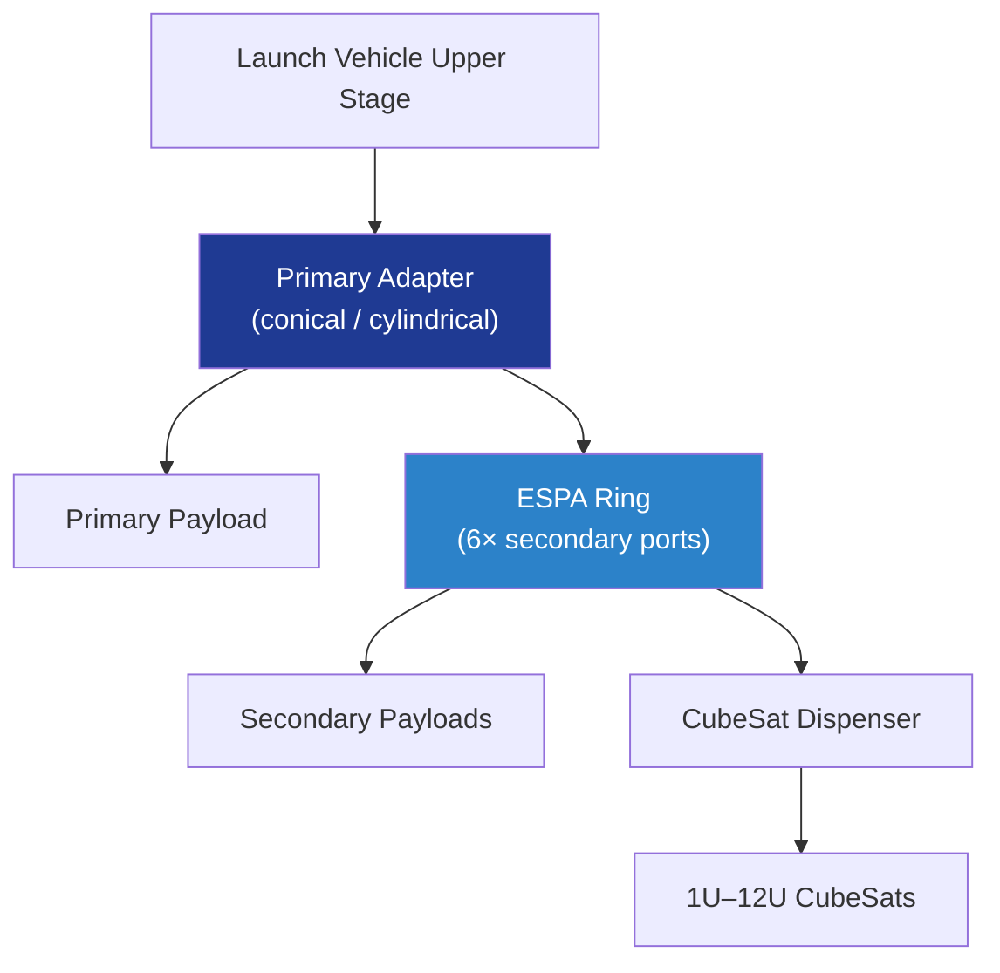

# STA 110-119 · 118-040 — Mission-Adapter and Dispenser Architecture

## 1. Purpose

Defines the **mission-adapter and dispenser** structural architecture between the launch vehicle and one or more Q+ATLANTIDE payloads: conical / cylindrical adapters, ESPA-class secondary rings, CubeSat dispensers and stacked configurations. Load-path strategy and stiffness coupling shall meet ECSS-E-ST-32-01C[^ecsseSt3201] and ISO 15389[^iso15389] launch-vehicle/spacecraft ICD practice.

## 2. Scope

- Covers the *Mission-Adapter and Dispenser Architecture* subsubject (`040`) of subsection `118`.
- Concepts in scope:
  - **Primary adapters** — conical / cylindrical CFRP or aluminium adapters; first axial mode ≥ 35 Hz, first lateral mode ≥ 15 Hz at the payload interface.
  - **ESPA-class secondary rings** — six-port rings carrying secondary payloads ≤ 180 kg with independent separation systems.
  - **CubeSat dispensers** — Poly-Picosatellite Orbital Deployer (P-POD) / canisterised dispensers for 1U–12U classes; spring-loaded release with shock attenuation.
  - **Stacked configurations** — multi-payload stacks (e.g., constellation deployments) with sequencing logic and inter-payload clearance ≥ 0.5 m at +5 s.
  - **Load-path strategy** — adapter sized for max(primary payload limit load, sum of secondary limit loads) with FOSU ≥ 1.5; primary load path independent of secondary release.
  - **Materials and joints** — adhesive bonded inserts per ECSS-E-HB-32-21A[^ecsseHb3221]; bolted joints per ECSS-E-HB-32-23A[^ecsseHb3223].
  - **Interfaces** — feeds 118-020 (separation system), 118-050 (rideshare slot envelope), 118-080 (qualification).

## 3. Diagram

## 4. Footprint

| Metric | Value |
|---|---|
| Architecture | `STA` |
| Subsection | `118` — Estructuras de Carga Útil y Mission Interfaces |
| Subsubject | `040` — Mission-Adapter and Dispenser Architecture |
| Primary Q-Division | Q-SPACE[^qdiv] |
| Governance class | `baseline`[^gov] |
| Document | `118-040-Mission-Adapter-and-Dispenser-Architecture.md` |
| Parent subsection | [`README.md`](./README.md) · [`118-000-General.md`](./118-000-General.md) |

## References & Citations

[^baseline]: **Q+ATLANTIDE controlled baseline (v1.0.0)** — [`organization/Q+ATLANTIDE.md`](../../../../organization/Q+ATLANTIDE.md).
[^archtable]: **STA §3 Architecture Table** — [`../../README.md` §3](../../README.md#3-architecture-table).
[^qdiv]: **Q-Division authority** — Q-Divisions provide technical authority over an architecture row.
[^gov]: **Governance class** — `baseline`.
[^ecsseSt3201]: **ECSS-E-ST-32-01C** — Space Engineering: Structural General Requirements.
[^ecsseHb3221]: **ECSS-E-HB-32-21A** — Adhesive Bonding Handbook.
[^ecsseHb3223]: **ECSS-E-HB-32-23A** — Threaded Fasteners Handbook.
[^iso15389]: **ISO 15389** — Space systems — Launch-vehicle to spacecraft ICD.
