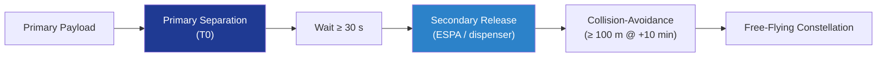

# STA 110-119 · 118-050 — Secondary-Payload and Rideshare Accommodation

## 1. Purpose

Defines the **secondary-payload and rideshare accommodation** rules for Q+ATLANTIDE missions: auxiliary slot envelope, mass / CG limits, separation sequencing, collision-avoidance fences and primary-mission do-no-harm requirements. Implementation follows ESPA-class adapter conventions, ECSS-E-ST-32-01C[^ecsseSt3201] structural margin and ISO 15389[^iso15389] ICD practice.

## 2. Scope

- Covers the *Secondary-Payload and Rideshare Accommodation* subsubject (`050`) of subsection `118`.
- Concepts in scope:
  - **Slot envelope** — ESPA-class secondary slot 24″ × 28″ × 38″ envelope (≤ 180 kg) or microsat slot 12″ × 16″ × 24″ (≤ 65 kg); CubeSat slots per dispenser ICD.
  - **Mass and CG limits** — per-slot mass cap and CG offset ≤ ±50 mm from the slot interface centroid; rebalancing ballast if required.
  - **Separation sequencing** — primary payload separates first; ≥ 30 s wait before any secondary release; release vectors directed away from primary trajectory.
  - **Collision-avoidance fences** — analytic safety fences with ≥ 100 m separation at +10 min and ≥ 1 km at +1 orbit; verified by 6-DOF Monte-Carlo.
  - **Do-no-harm clauses** — secondary payload outgassing ≤ TML 1.0 % / CVCM 0.1 % per ECSS-Q-ST-70-02C[^ecssqst7002]; RF transmit inhibits during primary payload commissioning.
  - **Customer documentation** — rideshare User's Guide, customer payload ICD template, qualification credit policy.
  - **Interfaces** — feeds 118-040 (adapter / dispenser), 118-080 (verification), 118-090 (rideshare evidence).

## 3. Diagram

## 4. Footprint

| Metric | Value |
|---|---|
| Architecture | `STA` |
| Subsection | `118` — Estructuras de Carga Útil y Mission Interfaces |
| Subsubject | `050` — Secondary-Payload and Rideshare Accommodation |
| Primary Q-Division | Q-SPACE[^qdiv] |
| Governance class | `baseline`[^gov] |
| Document | `118-050-Secondary-Payload-and-Rideshare-Accommodation.md` |
| Parent subsection | [`README.md`](./README.md) · [`118-000-General.md`](./118-000-General.md) |

## References & Citations

[^baseline]: **Q+ATLANTIDE controlled baseline (v1.0.0)** — [`organization/Q+ATLANTIDE.md`](../../../../organization/Q+ATLANTIDE.md).
[^archtable]: **STA §3 Architecture Table** — [`../../README.md` §3](../../README.md#3-architecture-table).
[^qdiv]: **Q-Division authority** — Q-Divisions provide technical authority over an architecture row.
[^gov]: **Governance class** — `baseline`.
[^ecsseSt3201]: **ECSS-E-ST-32-01C** — Space Engineering: Structural General Requirements.
[^ecssqst7002]: **ECSS-Q-ST-70-02C** — Thermal Vacuum Outgassing Test for the Screening of Space Materials.
[^iso15389]: **ISO 15389** — Space systems — Launch-vehicle to spacecraft ICD.
