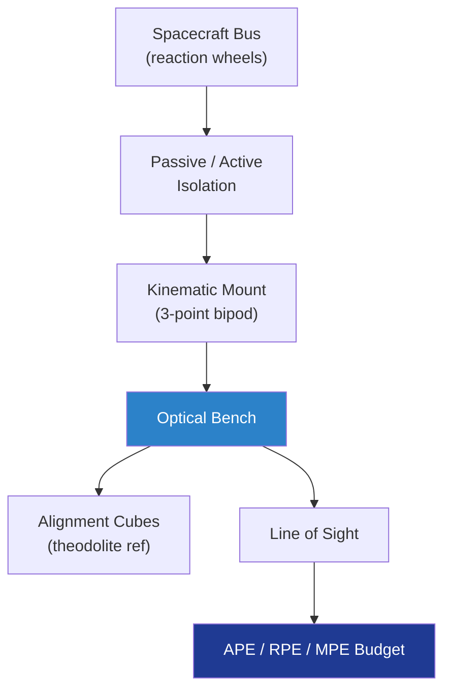

# STA 110-119 · 118-060 — Pointing Stability and Alignment Interfaces

## 1. Purpose

Defines the **pointing-stability and alignment interface** budgets between Q+ATLANTIDE payload structures and the spacecraft bus: line-of-sight (LoS) error allocation, optical-bench mounting, thermo-elastic distortion (TED) under on-orbit thermal gradients per ECSS-E-HB-31-01[^ecsseHb3101], and pointing stability classes (jitter / drift / bias) per ECSS-E-ST-60-10C[^ecsseSt6010].

## 2. Scope

- Covers the *Pointing Stability and Alignment Interfaces* subsubject (`060`) of subsection `118`.
- Concepts in scope:
  - **Pointing error budget** — Absolute Pointing Error (APE), Relative Pointing Error (RPE), and Mean Pointing Error (MPE) allocated per ECSS-E-ST-60-10C[^ecsseSt6010] error definitions; root-sum-square aggregation.
  - **Alignment interface** — kinematic three-point mount (ball-V-flat) or six-strut bipod isolating optical bench from bus distortions; alignment cubes at the optical bench reference.
  - **Thermo-elastic distortion** — predicted by coupled FEM thermal + structural per ECSS-E-HB-31-01[^ecsseHb3101]; ground-to-flight transfer via theodolite + autocollimator before vibration and after thermal-vacuum.
  - **Jitter / drift / bias** — jitter (≤ 1 s bandwidth) ≤ 1 µrad, drift (1 s–1 orbit) ≤ 10 µrad, bias (> 1 orbit) ≤ 50 µrad — class-dependent.
  - **Reaction-wheel and CMG isolation** — passive D-strut or active isolation reduces 5–500 Hz microvibration ≥ 20 dB at the optical bench.
  - **Alignment maintenance** — on-orbit calibration via star tracker correlation and image-quality feedback.
  - **Interfaces** — feeds 118-010 (datum), 118-070 (thermal), 118-080 (alignment verification).

## 3. Diagram

## 4. Footprint

| Metric | Value |
|---|---|
| Architecture | `STA` |
| Subsection | `118` — Estructuras de Carga Útil y Mission Interfaces |
| Subsubject | `060` — Pointing Stability and Alignment Interfaces |
| Primary Q-Division | Q-SPACE[^qdiv] |
| Governance class | `baseline`[^gov] |
| Document | `118-060-Pointing-Stability-and-Alignment-Interfaces.md` |
| Parent subsection | [`README.md`](./README.md) · [`118-000-General.md`](./118-000-General.md) |

## References & Citations

[^baseline]: **Q+ATLANTIDE controlled baseline (v1.0.0)** — [`organization/Q+ATLANTIDE.md`](../../../../organization/Q+ATLANTIDE.md).
[^archtable]: **STA §3 Architecture Table** — [`../../README.md` §3](../../README.md#3-architecture-table).
[^qdiv]: **Q-Division authority** — Q-Divisions provide technical authority over an architecture row.
[^gov]: **Governance class** — `baseline`.
[^ecsseHb3101]: **ECSS-E-HB-31-01** — Thermal Design Handbook (thermo-elastic distortion guidance).
[^ecsseSt6010]: **ECSS-E-ST-60-10C** — Control performance: Pointing error definitions and budgeting.
