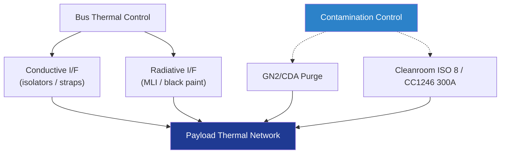

# STA 110-119 · 118-070 — Payload Thermal and Contamination Interfaces

## 1. Purpose

Defines the **thermal and contamination interfaces** between Q+ATLANTIDE payload structures and the spacecraft bus: conductive and radiative heat transfer at the interface plane, MLI termination, particulate / molecular contamination control per IEST-STD-CC1246[^iestcc1246] and outgassing screening per ECSS-Q-ST-70-02C[^ecssqst7002].

## 2. Scope

- Covers the *Payload Thermal and Contamination Interfaces* subsubject (`070`) of subsection `118`.
- Concepts in scope:
  - **Conductive interface** — controlled bolted joint conductance per ECSS-E-HB-31-01[^ecsseHb3101]; thermal isolators (Ti / Vespel / GFRP washers) or thermal straps (Cu OFE / pyrolytic graphite) as required by the heat budget.
  - **Radiative interface** — black-painted (Z306/Aeroglaze) versus MLI-blanketed surfaces; view-factor control to avoid solar entrapment.
  - **MLI termination** — Velcro / button-stitched terminations at the interface ring; effective emissivity ε* ≤ 0.03 verified per ECSS-Q-ST-70-09C[^ecssqst7009].
  - **Heat-flux budget** — interface conductive flux ≤ 0.5 W declared in the ICD; radiative net flux ≤ 5 W; values negotiated case-by-case.
  - **Particulate contamination** — payload-facing surfaces controlled to ISO 14644 Class 8[^iso14644] cleanroom assembly; deposited particulate ≤ IEST-STD-CC1246 Level 300A.
  - **Molecular contamination** — outgassing screening ECSS-Q-ST-70-02C TML ≤ 1.0 %, CVCM ≤ 0.1 %; bake-out per ECSS-Q-ST-70-04C[^ecssqst7004] before final integration.
  - **Purge interface** — N₂ / dry air purge during ground operations; flow rate, dew point, and class declared in the ICD.
  - **Interfaces** — feeds 118-010 (envelope geometry), 118-060 (thermo-elastic distortion).

## 3. Diagram

## 4. Footprint

| Metric | Value |
|---|---|
| Architecture | `STA` |
| Subsection | `118` — Estructuras de Carga Útil y Mission Interfaces |
| Subsubject | `070` — Payload Thermal and Contamination Interfaces |
| Primary Q-Division | Q-SPACE[^qdiv] |
| Governance class | `baseline`[^gov] |
| Document | `118-070-Payload-Thermal-and-Contamination-Interfaces.md` |
| Parent subsection | [`README.md`](./README.md) · [`118-000-General.md`](./118-000-General.md) |

## References & Citations

[^baseline]: **Q+ATLANTIDE controlled baseline (v1.0.0)** — [`organization/Q+ATLANTIDE.md`](../../../../organization/Q+ATLANTIDE.md).
[^archtable]: **STA §3 Architecture Table** — [`../../README.md` §3](../../README.md#3-architecture-table).
[^qdiv]: **Q-Division authority** — Q-Divisions provide technical authority over an architecture row.
[^gov]: **Governance class** — `baseline`.
[^ecsseHb3101]: **ECSS-E-HB-31-01** — Thermal Design Handbook.
[^ecssqst7002]: **ECSS-Q-ST-70-02C** — Thermal Vacuum Outgassing Test for the Screening of Space Materials.
[^ecssqst7004]: **ECSS-Q-ST-70-04C** — Thermal Cycling Test for the Screening of Space Materials and Processes.
[^ecssqst7009]: **ECSS-Q-ST-70-09C** — Measurements of Thermo-Optical Properties of Thermal Control Materials.
[^iestcc1246]: **IEST-STD-CC1246** — Product Cleanliness Levels.
[^iso14644]: **ISO 14644** — Cleanrooms and Associated Controlled Environments.
