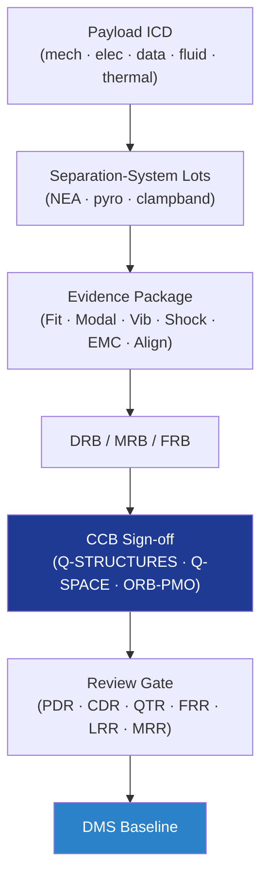

# STA 110-119 · 118-090 — Traceability Evidence and Lifecycle Governance

## 1. Purpose

Defines the **traceability and lifecycle-governance** framework for *Estructuras de Carga Útil y Mission Interfaces* (`118`): payload ICD baselining, separation-system lot traceability, fit-check and verification evidence packages, DRB/MRB authority, configuration management and PDR/CDR/QTR/FRR/MRR review-gate evidence under Q+ATLANTIDE baseline control[^baseline] and ECSS-M-ST-40C[^ecssmSt40] / ECSS-Q-ST-10C[^ecssqSt10] governance.

## 2. Scope

- Covers the *Traceability Evidence and Lifecycle Governance* subsubject (`090`) of subsection `118`.
- Concepts in scope:
  - **Payload / Mission ICD** — interface control document baselining mechanical, electrical, data, fluid, thermal and contamination interfaces; signed and version-controlled in DMS.
  - **Separation-system lot traceability** — NEA / pyro / clampband lot, batch, manufacturing record and acceptance fire-record; per ECSS-Q-ST-70-15C[^ecssqst7015] sample identification.
  - **Evidence package** — fit-check records, modal-survey reports, vibration / shock / EMC test reports, separation-shock SRS, alignment certificates, cleanliness logs.
  - **DRB / MRB / FRB authority** — Design Review Board, Material Review Board, Failure Review Board chaired by Q-STRUCTURES, with Q-SPACE concurrence and Q-MECHANICS (separation) participation.
  - **Change authority matrix** — mission-critical interface changes: Q-STRUCTURES + Q-SPACE + ORB-PMO via DRB; non-FCI structural changes: Q-STRUCTURES + Q-INDUSTRY; all via DMS revision control.
  - **Review gates** — PDR, CDR, QTR, FRR, LRR, MRR; each gate releases artefacts indexed in the Q+ATLANTIDE DMS.
  - **Configuration management** — baseline drawings, ICDs, qualified procedures, certificates of conformance per ECSS-M-ST-40C and ISO 9001[^iso9001].

## 3. Diagram

## 4. Footprint

| Metric | Value |
|---|---|
| Architecture | `STA` |
| Subsection | `118` — Estructuras de Carga Útil y Mission Interfaces |
| Subsubject | `090` — Traceability Evidence and Lifecycle Governance |
| Primary Q-Division | Q-SPACE[^qdiv] |
| Governance class | `baseline`[^gov] |
| Document | `118-090-Traceability-Evidence-and-Lifecycle-Governance.md` |
| Parent subsection | [`README.md`](./README.md) · [`118-000-General.md`](./118-000-General.md) |

## References & Citations

[^baseline]: **Q+ATLANTIDE controlled baseline (v1.0.0)** — [`organization/Q+ATLANTIDE.md`](../../../../organization/Q+ATLANTIDE.md).
[^archtable]: **STA §3 Architecture Table** — [`../../README.md` §3](../../README.md#3-architecture-table).
[^qdiv]: **Q-Division authority** — Q-Divisions provide technical authority over an architecture row.
[^gov]: **Governance class** — `baseline`.
[^ecssmSt40]: **ECSS-M-ST-40C** — Space Project Management: Configuration and Information Management.
[^ecssqSt10]: **ECSS-Q-ST-10C** — Space Product Assurance: Product Assurance Management.
[^ecssqst7015]: **ECSS-Q-ST-70-15C** — Space product assurance: Non-destructive testing.
[^iso9001]: **ISO 9001:2015** — Quality Management Systems.
