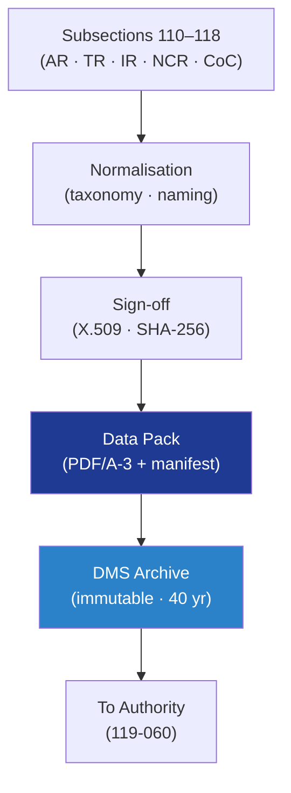

# STA 110-119 · 119-010 — Structural Evidence Framework and Data Pack

## 1. Purpose

Defines the **structural evidence framework** and the **certification data-pack** structure for the Q+ATLANTIDE STA section: evidence taxonomy, naming, immutability, electronic signing, DMS archival and integrity validation, providing a single normative container that consumes outputs from sister subsections `110`–`118` and presents them to certification authorities.

## 2. Scope

- Covers the *Structural Evidence Framework and Data Pack* subsubject (`010`) of subsection `119`.
- Concepts in scope:
  - **Evidence taxonomy** — analysis report (AR), test report (TR), inspection report (IR), certificate of conformance (CoC), material certificate (MC), as-built record (ABR), non-conformance record (NCR), waiver / deviation (WV/DV).
  - **Naming convention** — `QATL-EVID-<SUBSECTION>-<TYPE>-<SERIAL>-vNNN` (e.g., `QATL-EVID-114-TR-00012-v003`).
  - **Immutability and signing** — evidence stored read-only after sign-off; signed with X.509 certificate by responsible engineer and DRB chair; SHA-256 hash recorded in DMS index per ECSS-M-ST-40C[^ecssmSt40].
  - **Data-pack structure** — `00_Cover`, `01_Compliance-Matrix`, `02_Analyses`, `03_Tests`, `04_Inspections`, `05_NCRs-Waivers`, `06_Config-Baseline`, `07_References`; ZIP/PDF/A-3 archive with manifest.
  - **Integrity validation** — periodic re-hash verification; orphan-evidence detection (no requirement linked) and uncovered-requirement detection.
  - **Retention** — minimum 30 years on-orbit lifetime plus 10 years per ECSS-Q-ST-10C[^ecssqSt10] retention policy.
  - **Interfaces** — feeds 119-020 (V&V matrix), 119-060 (authority liaison), 119-090 (governance).

## 3. Diagram

## 4. Footprint

| Metric | Value |
|---|---|
| Architecture | `STA` |
| Subsection | `119` — Evidencia Estructural, Certificación y Gobernanza |
| Subsubject | `010` — Structural Evidence Framework and Data Pack |
| Primary Q-Division | Q-SPACE[^qdiv] |
| Governance class | `baseline`[^gov] |
| Document | `119-010-Structural-Evidence-Framework-and-Data-Pack.md` |
| Parent subsection | [`README.md`](./README.md) · [`119-000-General.md`](./119-000-General.md) |

## References & Citations

[^baseline]: **Q+ATLANTIDE controlled baseline (v1.0.0)** — [`organization/Q+ATLANTIDE.md`](../../../../organization/Q+ATLANTIDE.md).
[^archtable]: **STA §3 Architecture Table** — [`../../README.md` §3](../../README.md#3-architecture-table).
[^qdiv]: **Q-Division authority** — Q-Divisions provide technical authority over an architecture row.
[^gov]: **Governance class** — `baseline`.
[^ecssmSt40]: **ECSS-M-ST-40C** — Configuration and Information Management.
[^ecssqSt10]: **ECSS-Q-ST-10C** — Product Assurance Management.
