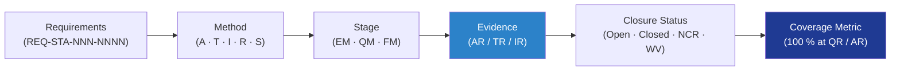

# STA 110-119 · 119-020 — Verification and Validation Matrix

## 1. Purpose

Defines the **verification and validation (V&V) matrix** for the Q+ATLANTIDE STA structural baseline: requirement → method → evidence cross-reference applied to every structural requirement flowed from system-level specifications and from ECSS / NASA standards. Process follows ECSS-E-ST-10-02C[^ecsseSt1002] verification framework.

## 2. Scope

- Covers the *Verification and Validation Matrix* subsubject (`020`) of subsection `119`.
- Concepts in scope:
  - **Requirement identification** — each verifiable requirement assigned a unique `REQ-STA-NNN-NNNN` ID; verbiage in shall-form per ECSS-E-ST-10-06C[^ecsseSt1006].
  - **Verification methods** — `A` Analysis, `T` Test, `I` Inspection, `R` Review-of-Design, `S` Similarity (or combinations such as `A/T`).
  - **Verification stages** — Engineering Model (EM), Qualification Model (QM), Flight Model (FM), in-service.
  - **Evidence linkage** — every requirement row links to ≥ 1 AR/TR/IR identifier from 119-010 data pack.
  - **Closure status** — Open / Closed / Closed-with-NCR / Closed-with-Waiver; closure requires DRB concurrence.
  - **Coverage metrics** — 100 % closure required at QR (Qualification Review) and AR (Acceptance Review); deferred items tracked in 119-070 baseline note.
  - **Tooling** — DMS-hosted requirement-management database (DOORS-equivalent) with bi-directional links to evidence index.
  - **Interfaces** — feeds 119-030 (analyses), 119-040 (tests), 119-060 (compliance matrix).

## 3. Diagram

## 4. Footprint

| Metric | Value |
|---|---|
| Architecture | `STA` |
| Subsection | `119` — Evidencia Estructural, Certificación y Gobernanza |
| Subsubject | `020` — Verification and Validation Matrix |
| Primary Q-Division | Q-SPACE[^qdiv] |
| Governance class | `baseline`[^gov] |
| Document | `119-020-Verification-and-Validation-Matrix.md` |
| Parent subsection | [`README.md`](./README.md) · [`119-000-General.md`](./119-000-General.md) |

## References & Citations

[^baseline]: **Q+ATLANTIDE controlled baseline (v1.0.0)** — [`organization/Q+ATLANTIDE.md`](../../../../organization/Q+ATLANTIDE.md).
[^archtable]: **STA §3 Architecture Table** — [`../../README.md` §3](../../README.md#3-architecture-table).
[^qdiv]: **Q-Division authority** — Q-Divisions provide technical authority over an architecture row.
[^gov]: **Governance class** — `baseline`.
[^ecsseSt1002]: **ECSS-E-ST-10-02C** — Verification.
[^ecsseSt1006]: **ECSS-E-ST-10-06C** — Technical Requirements Specification.
