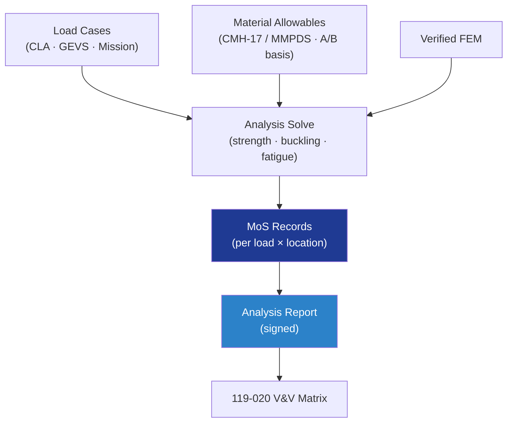

# STA 110-119 · 119-030 — Analysis Reports and Margin-of-Safety Records

## 1. Purpose

Defines the **analysis-report (AR)** content and the **margin-of-safety (MoS)** recording format for the Q+ATLANTIDE STA structural baseline: strength, stability, fatigue, fracture, modal, thermo-elastic and coupled loads analyses, with verified MoS ≥ 0 against ultimate, yield, buckling and fatigue allowables per ECSS-E-ST-32-01C[^ecsseSt3201], NASA-STD-5009[^nasastd5009] and NASA-STD-5019A[^nasastd5019].

## 2. Scope

- Covers the *Analysis Reports and Margin-of-Safety Records* subsubject (`030`) of subsection `119`.
- Concepts in scope:
  - **Analysis classes** — static strength, linear / nonlinear buckling, fatigue (S-N and ε-N), damage-tolerance / fracture mechanics, modal / sine / random / acoustic, shock, thermo-elastic distortion, coupled-loads analysis (CLA).
  - **Safety factors** — ultimate ≥ 1.4 (1.25 if test-supported) per ECSS-E-ST-32-10C[^ecsseSt3210]; yield ≥ 1.1; buckling ≥ 1.4; fatigue scatter factor ≥ 4 on life.
  - **Margin of safety** — `MoS = (allowable / (FoS × applied)) − 1`, recorded per load case and per critical location with sign-off by analyst, checker, and Q-STRUCTURES authority.
  - **Allowables provenance** — material allowables from CMH-17 / MMPDS / qualified test campaign with A- or B-basis statement.
  - **Model verification** — FEM check (mass, CG, eigenvalues, free-free modes, single-element patch tests) per ECSS-E-ST-32-03C[^ecsseSt3203].
  - **Model validation** — correlation with modal-survey results within 5 % per ECSS-E-ST-32-11C[^ecsseSt3211].
  - **Report content** — assumptions, model description, load cases, results table, MoS summary, critical-item list, conclusions.
  - **Interfaces** — feeds 119-020 (V&V matrix), 119-070 (baseline FEM under CM control).

## 3. Diagram

## 4. Footprint

| Metric | Value |
|---|---|
| Architecture | `STA` |
| Subsection | `119` — Evidencia Estructural, Certificación y Gobernanza |
| Subsubject | `030` — Analysis Reports and Margin-of-Safety Records |
| Primary Q-Division | Q-SPACE[^qdiv] |
| Governance class | `baseline`[^gov] |
| Document | `119-030-Analysis-Reports-and-Margin-of-Safety-Records.md` |
| Parent subsection | [`README.md`](./README.md) · [`119-000-General.md`](./119-000-General.md) |

## References & Citations

[^baseline]: **Q+ATLANTIDE controlled baseline (v1.0.0)** — [`organization/Q+ATLANTIDE.md`](../../../../organization/Q+ATLANTIDE.md).
[^archtable]: **STA §3 Architecture Table** — [`../../README.md` §3](../../README.md#3-architecture-table).
[^qdiv]: **Q-Division authority** — Q-Divisions provide technical authority over an architecture row.
[^gov]: **Governance class** — `baseline`.
[^ecsseSt3201]: **ECSS-E-ST-32-01C** — Space Engineering: Structural General Requirements.
[^ecsseSt3203]: **ECSS-E-ST-32-03C** — Structural Finite Element Models.
[^ecsseSt3210]: **ECSS-E-ST-32-10C** — Structural Factors of Safety for Spaceflight Hardware.
[^ecsseSt3211]: **ECSS-E-ST-32-11C** — Modal Survey Assessment.
[^nasastd5009]: **NASA-STD-5009** — NDE Requirements for Fracture-Critical Metallic Components.
[^nasastd5019]: **NASA-STD-5019A** — Fracture Control Requirements for Spaceflight Hardware.
