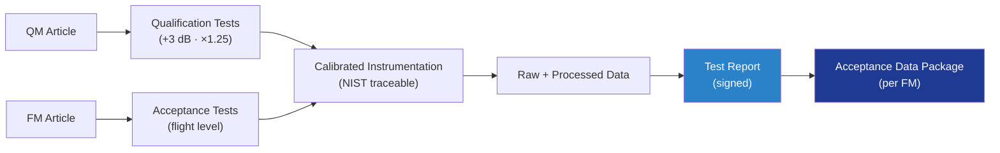

# STA 110-119 · 119-040 — Test Evidence and Acceptance Data Packages

## 1. Purpose

Defines the **structural test-evidence** and **acceptance data package (ADP)** content for the Q+ATLANTIDE STA baseline: qualification and acceptance tests across static, sine, random, acoustic, shock, thermal-vacuum, life-cycle and proof-pressure regimes, with traceable instrumentation, signed reports and ADP delivered with each flight article. Programme follows ECSS-E-ST-10-03C[^ecsseSt1003] and GSFC-STD-7000 GEVS[^gevs].

## 2. Scope

- Covers the *Test Evidence and Acceptance Data Packages* subsubject (`040`) of subsection `119`.
- Concepts in scope:
  - **Qualification tests (QT)** — performed on QM with margin (+3 dB / × 1.25 duration vs acceptance) per GEVS[^gevs]; results retained for the type life.
  - **Acceptance tests (AT)** — performed on each FM at flight level; sine, random, TVAC, proof-pressure as applicable.
  - **Proof-pressure** — pressure vessels and lines tested per ECSS-E-ST-32-02C[^ecsseSt3202] at 1.5 × MEOP minimum, with leak check.
  - **Instrumentation** — calibrated transducers (strain, accel, temp, displacement) with NIST-traceable cal certificates ≤ 12 months old.
  - **Data quality** — sample rate ≥ 5 × max frequency of interest; coherence ≥ 0.9 in primary band; noise floor < signal − 30 dB.
  - **Report content** — test article configuration, test setup photos, instrumentation map, calibration records, raw data archive, processed data, anomalies and dispositions, pass/fail statement.
  - **Acceptance Data Package** — bound deliverable per flight item: CoC, ATP summary, as-built drawings, NCR/waiver list, test data, retention 30+ years.
  - **Interfaces** — feeds 119-020 (closure), 119-050 (NCR linkage), 119-060 (authority concurrence).

## 3. Diagram

## 4. Footprint

| Metric | Value |
|---|---|
| Architecture | `STA` |
| Subsection | `119` — Evidencia Estructural, Certificación y Gobernanza |
| Subsubject | `040` — Test Evidence and Acceptance Data Packages |
| Primary Q-Division | Q-SPACE[^qdiv] |
| Governance class | `baseline`[^gov] |
| Document | `119-040-Test-Evidence-and-Acceptance-Data-Packages.md` |
| Parent subsection | [`README.md`](./README.md) · [`119-000-General.md`](./119-000-General.md) |

## References & Citations

[^baseline]: **Q+ATLANTIDE controlled baseline (v1.0.0)** — [`organization/Q+ATLANTIDE.md`](../../../../organization/Q+ATLANTIDE.md).
[^archtable]: **STA §3 Architecture Table** — [`../../README.md` §3](../../README.md#3-architecture-table).
[^qdiv]: **Q-Division authority** — Q-Divisions provide technical authority over an architecture row.
[^gov]: **Governance class** — `baseline`.
[^ecsseSt1003]: **ECSS-E-ST-10-03C** — Testing.
[^ecsseSt3202]: **ECSS-E-ST-32-02C** — Structural Design and Verification of Pressurised Hardware.
[^gevs]: **GSFC-STD-7000 (GEVS)** — General Environmental Verification Standard.
