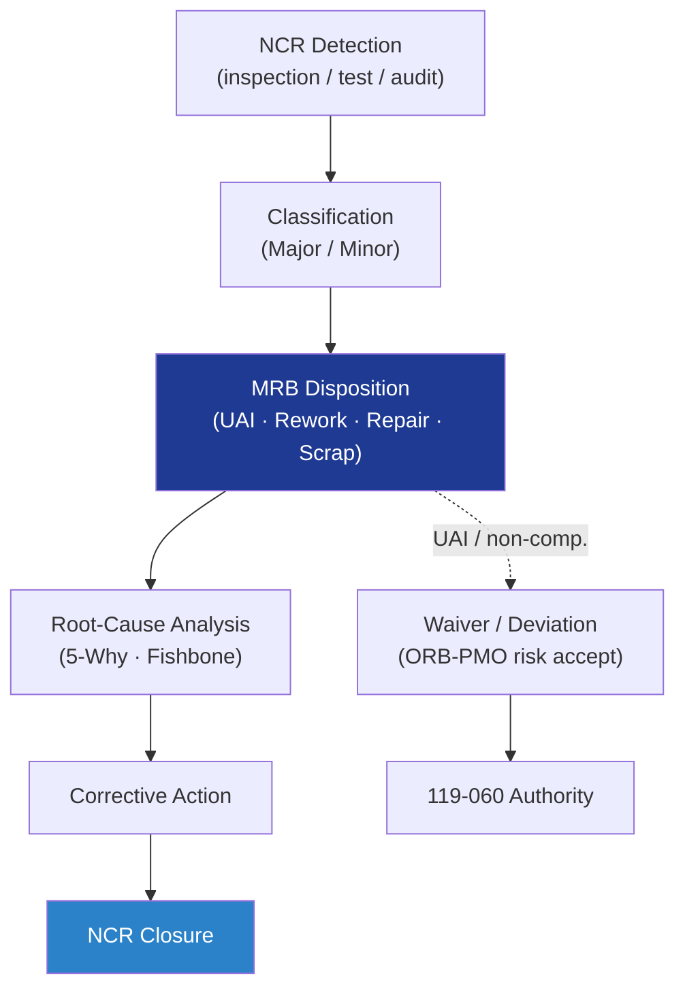

# STA 110-119 · 119-050 — Non-Conformance MRB and Waivers

## 1. Purpose

Defines the **non-conformance (NCR)** lifecycle, **Material Review Board (MRB)** authority and **waiver / deviation** processing for the Q+ATLANTIDE STA baseline: detection, classification, disposition (use-as-is / rework / repair / scrap), risk assessment, root-cause analysis and corrective-action close-out per ECSS-Q-ST-10-09C[^ecssqSt1009] and ECSS-Q-ST-10-08C[^ecssqSt1008] critical-item control.

## 2. Scope

- Covers the *Non-Conformance MRB and Waivers* subsubject (`050`) of subsection `119`.
- Concepts in scope:
  - **NCR detection** — inspection, NDT (per 116), test (per 119-040), audit, supplier surveillance.
  - **Classification** — Major (affects FCI/safety/performance/interface) vs Minor (cosmetic / non-functional); critical-item NCRs always Major.
  - **MRB authority** — chaired by Q-STRUCTURES; voting members include Q-SPACE (design), Q-INDUSTRY (manufacturing), Q-DATAGOV (records); customer/authority observer for Major.
  - **Dispositions** — Use-As-Is (UAI) with rationale + analysis, Rework to drawing, Repair per qualified procedure, Scrap.
  - **Waivers / Deviations** — Waiver = accept non-compliant condition after the fact; Deviation = pre-approved relaxation; both require risk acceptance from ORB-PMO above defined thresholds.
  - **Root-cause analysis** — 5-Why and Fishbone documented; corrective actions tracked to closure with effectiveness check.
  - **Trending** — recurring-NCR detection over 90-day rolling window; pareto reported at CCB.
  - **Interfaces** — feeds 119-020 (V&V closure with NCR/Waiver), 119-060 (authority concurrence on waivers), 119-080 (corrective-action surveillance).

## 3. Diagram

## 4. Footprint

| Metric | Value |
|---|---|
| Architecture | `STA` |
| Subsection | `119` — Evidencia Estructural, Certificación y Gobernanza |
| Subsubject | `050` — Non-Conformance MRB and Waivers |
| Primary Q-Division | Q-SPACE[^qdiv] |
| Governance class | `baseline`[^gov] |
| Document | `119-050-Non-Conformance-MRB-and-Waivers.md` |
| Parent subsection | [`README.md`](./README.md) · [`119-000-General.md`](./119-000-General.md) |

## References & Citations

[^baseline]: **Q+ATLANTIDE controlled baseline (v1.0.0)** — [`organization/Q+ATLANTIDE.md`](../../../../organization/Q+ATLANTIDE.md).
[^archtable]: **STA §3 Architecture Table** — [`../../README.md` §3](../../README.md#3-architecture-table).
[^qdiv]: **Q-Division authority** — Q-Divisions provide technical authority over an architecture row.
[^gov]: **Governance class** — `baseline`.
[^ecssqSt1008]: **ECSS-Q-ST-10-08C** — Critical-Item Control.
[^ecssqSt1009]: **ECSS-Q-ST-10-09C** — Non-Conformance Control System.
