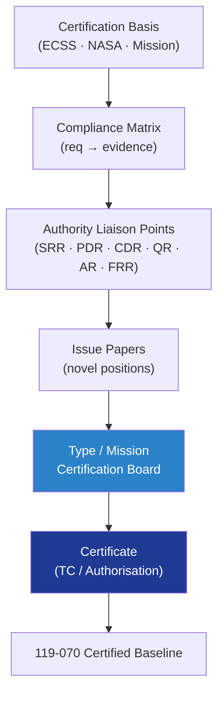

# STA 110-119 · 119-060 — Certification Compliance and Authority Liaison

## 1. Purpose

Defines the **certification compliance** strategy and the **authority-liaison** process for the Q+ATLANTIDE STA structural baseline: certification basis, compliance matrix against applicable standards / regulations, agency interactions (ESA / NASA / FAA / EASA where applicable) and concurrence records leading to type / mission certification.

## 2. Scope

- Covers the *Certification Compliance and Authority Liaison* subsubject (`060`) of subsection `119`.
- Concepts in scope:
  - **Certification basis** — applicable ECSS standards (ECSS-E-ST-32 series, ECSS-Q series), NASA standards (NASA-STD-5001, 5002, 5009, 5012, 5019A, 6016, 3001 where habitable), launcher User's Guide, mission-specific requirements.
  - **Compliance matrix** — each requirement of the certification basis mapped to evidence (AR/TR/IR) and to V&V matrix row; status Compliant / Compliant-by-Waiver / Open.
  - **Authority liaison points (ALPs)** — pre-defined milestones for authority concurrence: SRR, PDR, CDR, TRR, QR, AR, FRR.
  - **Issue papers** — formal documents for novel / non-precedent positions agreed with the authority; tracked in DMS with disposition.
  - **Certification reviews** — Type-Certification Board (TCB) or Programme Certification Board sessions; minutes signed by Authority delegate and Programme.
  - **Continued compliance** — surveillance audits, in-service occurrences, design changes feed back via 119-080.
  - **Records** — certificates (TC, mission authorisation), concurrence letters, agency correspondence; retained per 119-010 retention policy.
  - **Interfaces** — feeds 119-070 (frozen certified baseline) and 119-090 (governance trace).

## 3. Diagram

## 4. Footprint

| Metric | Value |
|---|---|
| Architecture | `STA` |
| Subsection | `119` — Evidencia Estructural, Certificación y Gobernanza |
| Subsubject | `060` — Certification Compliance and Authority Liaison |
| Primary Q-Division | Q-SPACE[^qdiv] |
| Governance class | `baseline`[^gov] |
| Document | `119-060-Certification-Compliance-and-Authority-Liaison.md` |
| Parent subsection | [`README.md`](./README.md) · [`119-000-General.md`](./119-000-General.md) |

## References & Citations

[^baseline]: **Q+ATLANTIDE controlled baseline (v1.0.0)** — [`organization/Q+ATLANTIDE.md`](../../../../organization/Q+ATLANTIDE.md).
[^archtable]: **STA §3 Architecture Table** — [`../../README.md` §3](../../README.md#3-architecture-table).
[^qdiv]: **Q-Division authority** — Q-Divisions provide technical authority over an architecture row.
[^gov]: **Governance class** — `baseline`.
[^ecsseSt3201]: **ECSS-E-ST-32-01C** — Space Engineering: Structural General Requirements.
[^nasastd5001]: **NASA-STD-5001** — Structural Design and Test Factors of Safety for Spaceflight Hardware.
