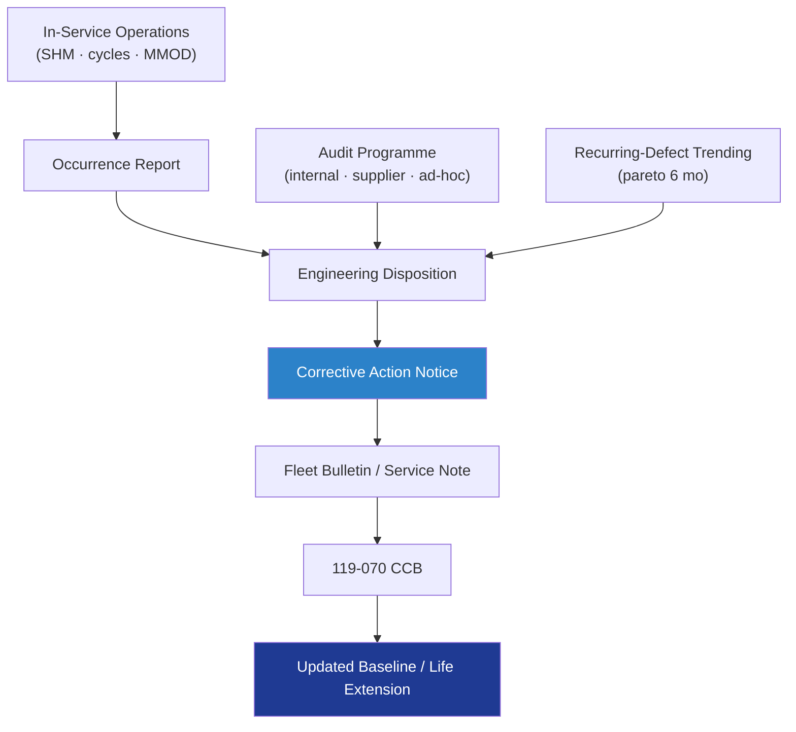

# STA 110-119 · 119-080 — Lifecycle Audit Surveillance and Continued Airworthiness

## 1. Purpose

Defines the **lifecycle audit, surveillance and continued-airworthiness** framework for the Q+ATLANTIDE STA structural baseline: internal and supplier audits, in-service monitoring fed by 116 SHM evidence, recurring-defect trending, fleet bulletins / service notes and the closed-loop feedback from operations to engineering authority per ECSS-Q-ST-10C[^ecssqSt10] and ISO 19011[^iso19011] audit guidelines.

## 2. Scope

- Covers the *Lifecycle Audit Surveillance and Continued Airworthiness* subsubject (`080`) of subsection `119`.
- Concepts in scope:
  - **Audit programme** — annual internal Q-DATAGOV-led audit of CM, V&V closure and NCR processing; biennial supplier audits; ad-hoc audits triggered by incidents.
  - **Surveillance** — quarterly review of in-service SHM data (from 116), thermal cycles, micro-meteoroid events, anomaly reports.
  - **In-service occurrence handling** — Occurrence Report (OR) → Engineering Disposition (ED) → Corrective-Action Notice (CAN) → Fleet Bulletin or Service Note if applicable to other articles.
  - **Recurring-defect trending** — pareto on ORs over rolling 6-month window; threshold-triggered Root-Cause investigation.
  - **Fleet bulletins / service notes** — mandatory (compliance window defined), recommended (best practice); broadcast to all operators.
  - **Continued airworthiness / continued mission assurance** — periodic re-baselining of analyses with as-flown environments; life-extension package required prior to type-life exceedance.
  - **End-of-life / disposal** — controlled passivation, decommissioning per ECSS-U-ST-10C[^ecssuSt10] space-debris mitigation.
  - **Interfaces** — feeds 119-070 (configuration update), 119-090 (governance), and SHM 116 (in-service evidence source).

## 3. Diagram

## 4. Footprint

| Metric | Value |
|---|---|
| Architecture | `STA` |
| Subsection | `119` — Evidencia Estructural, Certificación y Gobernanza |
| Subsubject | `080` — Lifecycle Audit Surveillance and Continued Airworthiness |
| Primary Q-Division | Q-SPACE[^qdiv] |
| Governance class | `baseline`[^gov] |
| Document | `119-080-Lifecycle-Audit-Surveillance-and-Continued-Airworthiness.md` |
| Parent subsection | [`README.md`](./README.md) · [`119-000-General.md`](./119-000-General.md) |

## References & Citations

[^baseline]: **Q+ATLANTIDE controlled baseline (v1.0.0)** — [`organization/Q+ATLANTIDE.md`](../../../../organization/Q+ATLANTIDE.md).
[^archtable]: **STA §3 Architecture Table** — [`../../README.md` §3](../../README.md#3-architecture-table).
[^qdiv]: **Q-Division authority** — Q-Divisions provide technical authority over an architecture row.
[^gov]: **Governance class** — `baseline`.
[^ecssqSt10]: **ECSS-Q-ST-10C** — Product Assurance Management.
[^ecssuSt10]: **ECSS-U-ST-10C** — Space Sustainability: Adoption Notice of ISO 24113 — Space Debris Mitigation Requirements.
[^iso19011]: **ISO 19011:2018** — Guidelines for Auditing Management Systems.
