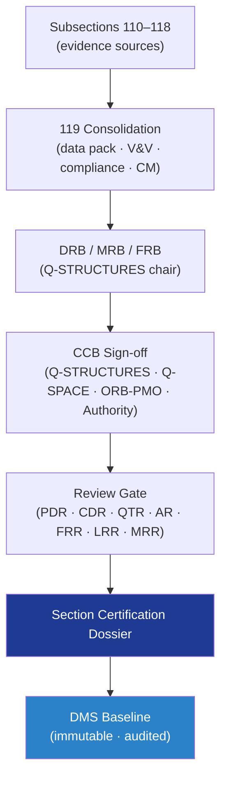

# STA 110-119 · 119-090 — Traceability Evidence and Lifecycle Governance

## 1. Purpose

Defines the **traceability and lifecycle-governance** framework for *Evidencia Estructural, Certificación y Gobernanza* (`119`) — the meta-governance node that closes the STA `110-119` section: section-level DRB/MRB/FRB chair, change-authority matrix for cross-subsection changes, and PDR/CDR/QTR/AR/FRR/MRR review-gate consolidated evidence under Q+ATLANTIDE baseline control[^baseline] and ECSS-M-ST-40C[^ecssmSt40] / ECSS-Q-ST-10C[^ecssqSt10] governance.

## 2. Scope

- Covers the *Traceability Evidence and Lifecycle Governance* subsubject (`090`) of subsection `119`.
- Concepts in scope:
  - **Section-level governance** — `119` is the consolidating node for STA `110-119`; produces the certified structural baseline manifest indexing all subsection evidence.
  - **DRB / MRB / FRB authority** — chaired by Q-STRUCTURES, with Q-SPACE concurrence (mission), Q-MECHANICS (mechanisms), Q-DATAGOV (records); ORB-PMO and authority observer for certification-impacting decisions.
  - **Change-authority matrix** — fracture-critical / safety-critical / certification-impacting changes: Q-STRUCTURES + Q-SPACE + ORB-PMO + Authority concurrence; structural non-FCI: Q-STRUCTURES + Q-INDUSTRY; minor: Q-STRUCTURES delegated.
  - **Review gates** — section-level consolidation at PDR, CDR, QTR, AR, FRR, LRR, MRR; gate exit criterion = 100 % V&V closure (Closed / Closed-with-NCR / Closed-with-Waiver).
  - **Cross-subsection traceability** — every requirement traces from system-level spec → `110`–`118` evidence → `119` consolidation; every NCR / waiver traces to disposition + close-out.
  - **Audit trail** — immutable DMS log of all sign-offs (X.509), CCB minutes, audit findings; retained per 119-010 retention policy.
  - **Section certification dossier** — single deliverable bundling 119-010 data pack + 119-020 V&V matrix + 119-060 compliance matrix + 119-070 baseline manifest.

## 3. Diagram

## 4. Footprint

| Metric | Value |
|---|---|
| Architecture | `STA` |
| Subsection | `119` — Evidencia Estructural, Certificación y Gobernanza |
| Subsubject | `090` — Traceability Evidence and Lifecycle Governance |
| Primary Q-Division | Q-SPACE[^qdiv] |
| Governance class | `baseline`[^gov] |
| Document | `119-090-Traceability-Evidence-and-Lifecycle-Governance.md` |
| Parent subsection | [`README.md`](./README.md) · [`119-000-General.md`](./119-000-General.md) |

## References & Citations

[^baseline]: **Q+ATLANTIDE controlled baseline (v1.0.0)** — [`organization/Q+ATLANTIDE.md`](../../../../organization/Q+ATLANTIDE.md).
[^archtable]: **STA §3 Architecture Table** — [`../../README.md` §3](../../README.md#3-architecture-table).
[^qdiv]: **Q-Division authority** — Q-Divisions provide technical authority over an architecture row.
[^gov]: **Governance class** — `baseline`.
[^ecssmSt40]: **ECSS-M-ST-40C** — Configuration and Information Management.
[^ecssqSt10]: **ECSS-Q-ST-10C** — Product Assurance Management.
