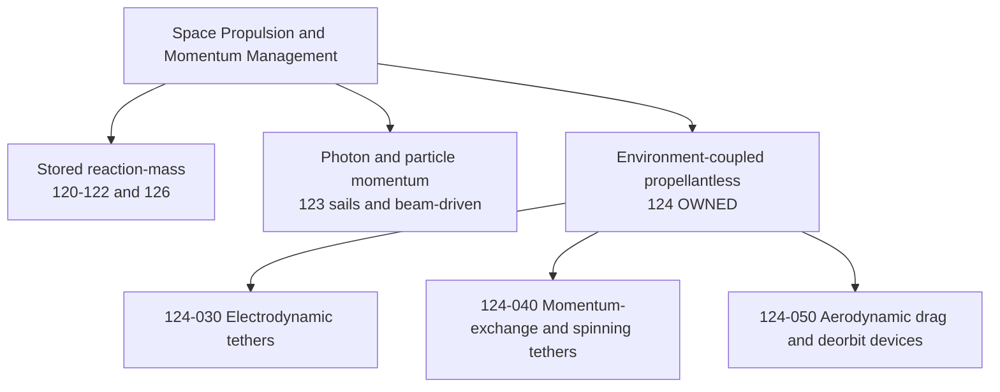
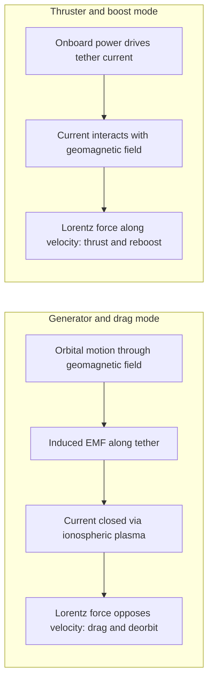
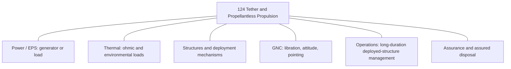

# STA 120-129 · 124-000 — General

## Index

1. [Purpose](#1-purpose)
2. [Scope](#2-scope)
3. [Glossary of Terms and Acronyms](#3-glossary-of-terms-and-acronyms)
4. [Corpus](#4-corpus)
   - [4.1 Functional Definition and Classification](#41-functional-definition-and-classification)
   - [4.2 Subsection Node Map](#42-subsection-node-map)
   - [4.3 Operating Principles](#43-operating-principles)
   - [4.4 Interfaces](#44-interfaces)
   - [4.5 Boundaries, Ownership and Cross-References](#45-boundaries-ownership-and-cross-references)
   - [4.6 Assurance Boundary](#46-assurance-boundary)
5. [Notes](#5-notes)
6. [References](#6-references)
7. [Footprint](#7-footprint)

---

## 1. Purpose

Defines the `000` subsubject for subsection `124` (*Tether and Propellantless Propulsion*) within STA Section `02` (*Propulsión Espacial Tradicional y Avanzada*).

This node is the controlled entry point for the subsection. It fixes the subsection's scope, vocabulary, item map, interface boundaries, and assurance posture so that every downstream item (`124-010` … `124-090`) inherits a single, consistent governance frame. It establishes *what 124 owns*, *what 124 only references*, and *the safety boundary under which all 124 content is read*. It does not itself specify any propellantless system in engineering detail; that responsibility belongs to the item nodes mapped in §4.2.[^subsection]

---

## 2. Scope

- Establishes controlled boundaries, interfaces, and assumptions for **General** as the orienting node of subsection `124`.
- Preserves alignment with subsection governance, the subsection safety boundary, and parent architecture controls (STA Section `02`, ATLAS-1000 register, Q+ATLANTIDE baseline).[^baseline][^archtable]
- Supports mission design, verification planning, and evidence traceability for propellantless and tether-based propulsion decisions.

**In scope for subsection 124.** Space-application propulsion and momentum-management techniques that produce thrust, drag, or momentum exchange **without expending stored reaction mass** as the primary working fluid: electrodynamic tethers, momentum-exchange and spinning tethers, aerodynamic-drag and passive deorbit devices, and the deployment, dynamics, and plasma/geomagnetic-environment coupling these techniques require.

**Out of scope for subsection 124 (owned elsewhere).** Photon- and particle-momentum sails (owned by `123`); stored-reaction-mass micropropulsion and reaction control (owned by `126`); underlying energy and generic propulsion physics (owned by EPTA `400–499`); debris-environment modelling, space sustainability, and orbital-traffic infrastructure (referenced, not owned). The deliberate 123↔124 boundary is recorded in §4.5.[^section]

---

## 3. Glossary of Terms and Acronyms

| Term / Acronym | Expansion | Meaning in this subsection |
|---|---|---|
| **ATLAS-1000** | Architecture Top-Level register | Controlled register that hosts the Q+ATLANTIDE architecture bands. |
| **Δv (Delta-v)** | Change in velocity | Standard measure of propulsive effort; for 124, often realised without expended propellant. |
| **Deorbit** | — | Controlled or assured lowering of orbit toward atmospheric re-entry. |
| **DMC** | Data Module Code | S1000D/CSDB identifier used when a node is implemented in a programme publication. |
| **EDT** | Electrodynamic Tether | Conductive tether that exchanges momentum with the geomagnetic field via current flow. |
| **EMF** | Electromotive Force | Voltage induced along a conductor moving through a magnetic field. |
| **EPS** | Electrical Power Subsystem | Spacecraft power source/interface; couples to 124 as generator or load. |
| **EPTA** | Energy & Propulsion Technology Architecture | Band `400–499`; owns generic energy/propulsion physics referenced by STA. |
| **GNC** | Guidance, Navigation and Control | Subsystem coupled to tether libration, attitude, and thrust/drag pointing. |
| **ISRU** | In-Situ Resource Utilisation | Out-of-scope here; referenced via STA `180–189`. |
| **LEO** | Low Earth Orbit | Primary operating regime for tether and drag-based techniques. |
| **Libration** | — | Pendulum-like oscillation of a deployed tether about local vertical. |
| **Lorentz force** | — | Force on a current-carrying conductor in a magnetic field; basis of EDT thrust/drag. |
| **Momentum exchange** | — | Transfer of orbital momentum between bodies via a rotating/spinning tether. |
| **ORB-LEG** | ORB Legal function | Governance function for legal/regulatory and orbital-traffic constraints. |
| **ORB-PMO** | ORB Programme-Management function | Governance function for programme planning and gating. |
| **Plasma contactor** | — | Device exchanging current with the ionospheric plasma to close the EDT circuit. |
| **Propellantless** | — | Producing thrust/drag without expelling stored reaction mass as the working fluid. |
| **Q-SPACE** | Q-Division (Space) | Primary owning Q-Division for STA and this subsection. |
| **Q-GREENTECH / Q-STRUCTURES / Q-DATAGOV / Q-HPC / Q-HORIZON** | Support Q-Divisions | Sustainability, structures/deployment, data-governance, computation, and horizon-scanning support. |
| **RCS** | Reaction Control System | Stored-propellant attitude/translation control; owned by `126`, referenced here. |
| **Reboost** | — | Raising orbital altitude to counter decay; achievable propellantlessly by EDT thrust mode. |
| **S1000D / CSDB** | Spec 1000D / Common Source Database | Technical-publication standard and source database for programme implementation. |
| **STA** | Space Technology Architecture | Band `100–199`; the parent architecture of this subsection. |
| **VLEO** | Very Low Earth Orbit | Drag-dominant regime; air-breathing techniques are owned by `125`, not 124. |

---

## 4. Corpus

### 4.1 Functional Definition and Classification

Subsection 124 covers techniques whose thrust or drag derives from interaction with the **external environment** — the geomagnetic field, the ionospheric plasma, the residual atmosphere, or an orbital momentum reservoir — rather than from the expulsion of stored propellant. This is the defining boundary of the subsection and the basis for distinguishing 124 from its siblings.

The classification below situates 124 within the broader propulsion taxonomy of Section `02` and fixes the ownership split that §4.5 enforces.[^section]

The principal mission applications are LEO drag compensation, propellantless reboost, controlled and timely deorbit, and momentum-exchange transfer between cooperating bodies. The defining trade is independence from stored reaction mass in exchange for strong dependence on environmental conditions — altitude, geomagnetic state, plasma density, and attitude.

### 4.2 Subsection Node Map

This node (`124-000`) governs the set; each item below is specified in its own controlled file under the standard `000`–`090` item grammar.

| Item | Controlled title | Function |
|---|---|---|
| `124-000` | General *(this node)* | Subsection scope, vocabulary, boundaries, assurance frame. |
| `124-010` | Tether and Propellantless Propulsion — Controlled Definition | Authoritative definition and classification basis. |
| `124-020` | Propellantless Families and Selection Criteria | Family taxonomy and mission-driven selection logic. |
| `124-030` | Electrodynamic Tether Systems | Lorentz-force thrust/drag via current in the geomagnetic field. |
| `124-040` | Momentum-Exchange and Spinning Tethers | Rotating tethers for payload transfer and boost. |
| `124-050` | Aerodynamic Drag and Deorbit Devices | Passive area-augmentation for drag-based deorbit. |
| `124-060` | Conductive Elements, Deployment and Dynamics | Deployment, libration, and structural-dynamic behaviour. |
| `124-070` | Plasma and Geomagnetic Environment Interface | Ionospheric current collection and environment coupling. |
| `124-080` | Performance Bounds and Operational Envelopes | Achievable Δv/drag, duty cycles, and validity envelopes. |
| `124-090` | Safety, Debris and Assurance Boundaries | Severance, collision, disposal, and evidence boundaries. |

### 4.3 Operating Principles

The subsection's defining example is the electrodynamic tether, which is bidirectional: the same conductive element acts as a drag device or as a thruster depending on the direction of current flow relative to the induced EMF.[^edt] The two modes are summarised below; the full treatment is carried by `124-030` and `124-070`.

Momentum-exchange tethers (`124-040`) operate on a different principle: a rotating tether transfers orbital momentum to a captured payload, raising the payload's orbit while lowering the facility's, with no propellant expended in the exchange itself. Aerodynamic-drag devices (`124-050`) are passive: deployed area increases atmospheric drag to accelerate deorbit, trading propellant for a one-way altitude loss.

### 4.4 Interfaces

Every 124 technique is an integration problem before it is a propulsion problem: it couples to power, thermal, structures/deployment, GNC, operations, and assurance. The interface map below is the controlled set; per-item interface detail is carried downstream.

Electrodynamic tethers couple to the EPS as a generator (drag mode) or a load (thrust mode); deployed conductive or large-area elements impose dynamic-stability and pointing demands on GNC that have no equivalent in stored-propellant systems.

### 4.5 Boundaries, Ownership and Cross-References

Per the register's ownership rule, **cross-reference is permitted; cross-containment is not.**[^ownership] Subsection 124 owns the *space-application tether and propellantless* layer and links outward rather than absorbing adjacent content:

- **123 (Propulsión Avanzada) — sibling boundary.** Sails and beam-driven concepts (photon/particle momentum) remain in `123` (`123-030`/`123-040`/`123-050`). Subsection 124 is scoped to tether and drag-based propellantless techniques. Any consolidation of "all propellantless physics" under one node would require a coordinated edit to `123-030`/`123-040` and is **not** assumed here.
- **126 (Micropropulsión) — sibling boundary.** Stored-reaction-mass micro-thrust and RCS are owned by `126`; 124 references it where missions blend propellantless reboost with RCS.
- **EPTA (`400–499`) — upward reference.** Energy sources, power conversion, and generic propulsion physics are referenced from EPTA; STA owns only the space-application overlay.
- **STA `180–189` (Infraestructura y Logística) — lateral reference.** Servicing and orbital-traffic infrastructure are referenced, not owned.
- **Debris / sustainability and disposal.** Drag-based deorbit (`124-050`) and disposal (`124-090`) reference the debris-environment and space-sustainability authorities rather than restating them.

The consolidated link register for the subsection is maintained at the section-assurance node `129-070` (*Cross-Architecture Propulsion References*).[^xref]

### 4.6 Assurance Boundary

This content is baseline-governed and intended for controlled engineering use under the subsection safety boundary:

> deployment and orbital-traffic critical; requires environment coupling controls, dynamic stability margins, debris-safe operation and assured disposal.

Operationally, any 124 item must demonstrate, at the level appropriate to its maturity: (a) controlled deployment and retraction or controlled jettison; (b) bounded dynamic stability (libration/oscillation) across the operational envelope; (c) management of electrical and plasma-interaction hazards where conductive elements are used; and (d) a credible, assured disposal path that does not itself create a long-lived debris or orbital-traffic hazard. The detailed boundary conditions are carried by `124-090`; this node only fixes that the boundary applies to the whole subsection.

---

## 5. Notes

> [!NOTE]
> **N1.** Subsection 124 is environment-coupled by definition; performance figures stated in downstream items are only valid within the altitude, geomagnetic, and plasma-density envelopes declared in `124-080`. Quoting a 124 performance number without its envelope is a governance defect.[^edt]

> [!NOTE]
> **N2.** A deployed tether or drag device is itself a tracked space object and a potential debris source. Its disposal case (`124-090`) must close independently of the host spacecraft's nominal end-of-life.

> [!IMPORTANT]
> **N3.** The 123↔124 boundary (sails vs tethers/drag) is a sibling reference, not a containment. Do not migrate sail content into 124 without the coordinated `123` edit recorded in §4.5.[^section]

---

## 6. References

[^baseline]: **Q+ATLANTIDE controlled baseline (v1.0.0)** — [`organization/Q+ATLANTIDE.md`](../../../../organization/Q+ATLANTIDE.md).
[^subsection]: **Subsection index (124 · Propulsión Sin Propelente y Amarras)** — [`README.md`](./README.md).
[^section]: **Section index (120-129 · Propulsión Espacial Tradicional y Avanzada)** — [`../README.md`](../README.md).
[^archtable]: **STA §3 Architecture Table** — [`../../README.md` §3](../../README.md#3-architecture-table).
[^ownership]: **Register ownership rule (cross-reference allowed, cross-containment not allowed)** — [`../../README.md` ownership rules](../../README.md#ownership-rules).
[^xref]: **Cross-Architecture Propulsion References** — [`129-070`](../129_Aseguramiento-Calificacion-y-Expansion-de-Propulsion/129-070-Cross-Architecture-Propulsion-References.md).
[^edt]: **Operating-principle basis (electrodynamic tether dual mode)** — see `124-030` Electrodynamic Tether Systems and `124-070` Plasma and Geomagnetic Environment Interface.

---

## 7. Footprint

**Document footprint — controlled provenance and evidence anchor.**

| Field | Value |
|---|---|
| Document ID | `QATL-ATLAS-1000-STA-120-129-02-124-000` |
| Register | ATLAS-1000 |
| Path | `Q+ATLANTIDE/100-199_STA/120-129_Propulsion-Espacial-Tradicional-y-Avanzada/124_Propulsion-Sin-Propelente-y-Amarras/124-000-General.md` |
| Governance class | baseline |
| Owning Q-Division | Q-SPACE |
| Support Q-Divisions | Q-GREENTECH, Q-STRUCTURES, Q-DATAGOV, Q-HPC, Q-HORIZON |
| ORB functions | ORB-PMO, ORB-LEG |
| Version | 1.0.0 |
| Status | active |
| Language | en |
| Evidence anchor (IEF) | `<sha256: to-be-stamped-at-commit>` |
| Programme applicability | none at baseline (taxonomy node; programme DMC mapping deferred to impact studies) |

**Change log.**

| Version | Date | Author / Division | Change |
|---|---|---|---|
| 1.0.0 | 2026-05-29 | Q-SPACE | Initial baseline issue of `124-000` General node. |

**Footprint notes.** This node is a controlled taxonomy entry. It carries no programme-specific content; programme implementation occurs through impact studies that map applicable items to `S1000D-CSDB/DMC/` per the canonical hierarchy. The evidence anchor is stamped at commit under the IEF; until stamped, this document is `draft-of-record` for traceability purposes even while `status: active`.
