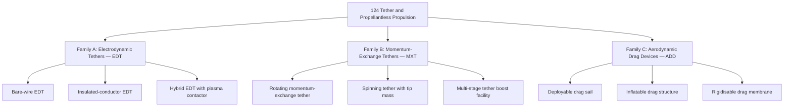
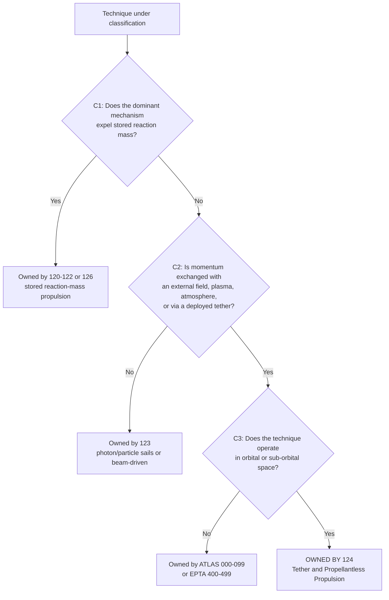
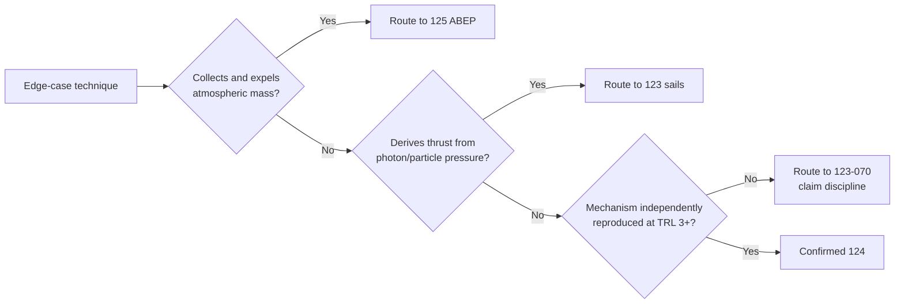

# STA 120-129 · 124-010 — Tether and Propellantless Propulsion Controlled Definition

## Index

1. [Purpose](#1-purpose)
2. [Scope](#2-scope)
3. [Glossary of Terms and Acronyms](#3-glossary-of-terms-and-acronyms)
4. [Corpus](#4-corpus)
   - [4.1 Controlled Definition](#41-controlled-definition)
   - [4.2 Classification Criteria](#42-classification-criteria)
   - [4.3 Propellantless Family Taxonomy](#43-propellantless-family-taxonomy)
   - [4.4 Boundary Tests — Ownership Decision Logic](#44-boundary-tests--ownership-decision-logic)
   - [4.5 Definitional Distinctions and Edge Cases](#45-definitional-distinctions-and-edge-cases)
   - [4.6 Definition Governance](#46-definition-governance)
5. [Notes](#5-notes)
6. [References](#6-references)
7. [Footprint](#7-footprint)

---

## 1. Purpose

Defines the `010` subsubject for subsection `124` (*Tether and Propellantless Propulsion*) within STA Section `02` (*Propulsión Espacial Tradicional y Avanzada*).

This node is the **authoritative definition document** for the subsection. It establishes what *tether and propellantless propulsion* means within the Q+ATLANTIDE register, what the classification criteria are, and what formal tests determine whether a given technique is owned by `124`, by a sibling subsection, or by a parent architecture band. Every downstream item (`124-020` … `124-090`) inherits this definition; no item may expand, narrow, or redefine it without a controlled change to this node.[^general]

---

## 2. Scope

- Establishes the controlled, testable definition for **Tether and Propellantless Propulsion** as used across the register.
- Fixes classification criteria and family taxonomy so that `124-020` (selection) and `124-030` … `124-050` (technique items) have an unambiguous definitional basis.
- Provides the ownership decision logic (boundary tests) that distinguishes `124` from siblings `120`–`123`, `125`–`126`, and from parent bands.
- Preserves alignment with subsection governance, the subsection safety boundary, and parent architecture controls.[^baseline][^archtable]
- Supports mission design, verification planning, and evidence traceability for propulsion decisions by supplying a single, citable definition.

---

## 3. Glossary of Terms and Acronyms

| Term / Acronym | Expansion | Meaning in this node |
|---|---|---|
| **Controlled definition** | — | A register-level definition with version control; changes require a governed baseline update. |
| **Propellantless propulsion** | — | See §4.1 — the formal definition established by this node. |
| **Tether propulsion** | — | Subset of propellantless propulsion employing a deployed conductive or structural tether. See §4.1. |
| **EDT** | Electrodynamic Tether | Conductive tether generating thrust or drag via Lorentz-force interaction with the geomagnetic field. |
| **MXT** | Momentum-Exchange Tether | Rotating tether transferring orbital momentum between a facility and a payload. |
| **ADD** | Aerodynamic Drag Device | Passive area-augmentation device accelerating deorbit via atmospheric drag. |
| **Reaction mass** | — | Mass expelled from a spacecraft to produce thrust by conservation of momentum. |
| **Environment-coupled** | — | Deriving thrust/drag from interaction with an external field, plasma, or atmosphere rather than stored propellant. |
| **Lorentz force** | — | Force on a current-carrying conductor in a magnetic field (F = I L × B). |
| **Photon sail** | — | Propulsion via radiation-pressure momentum transfer; owned by `123`, not `124`. |
| **ABEP** | Atmosphere-Breathing Electric Propulsion | Uses collected atmospheric particles as propellant; owned by `125`, not `124`. |
| **RCS** | Reaction Control System | Stored-propellant attitude/translation control; owned by `126`. |
| **STA** | Space Technology Architecture | Band `100–199`. |
| **EPTA** | Energy & Propulsion Technology Architecture | Band `400–499`. |
| **TRL** | Technology Readiness Level | Maturity scale used in §4.5 to classify edge-case concepts. |

---

## 4. Corpus

### 4.1 Controlled Definition

The following is the register-level controlled definition for subsection `124`. It is authoritative within Q+ATLANTIDE; all downstream items inherit it verbatim.

> **Tether and Propellantless Propulsion** is the domain of space-application propulsion and momentum-management techniques that produce thrust, drag, or momentum exchange **without expending stored reaction mass as the primary working fluid**, through direct, sustained interaction with an external physical environment — specifically the geomagnetic field, the ionospheric plasma, or the residual atmosphere — or through mechanical momentum transfer via a deployed structural or conductive tether.

Three clarifications are embedded in this definition and must be read as part of it:

1. **"Without expending stored reaction mass as the primary working fluid."** A technique qualifies as propellantless if the dominant momentum-exchange mechanism does not consume onboard propellant. Auxiliary use of stored gas (e.g. cold-gas attitude trimming during tether deployment) does not disqualify the technique, provided the primary Δv source is environment-coupled.[^general]

2. **"Direct, sustained interaction with an external physical environment."** The environment is the momentum source or sink. This distinguishes 124 from techniques that carry their own photon or particle source (beam-driven propulsion, `123-050`) and from techniques that collect atmospheric particles and use them as expelled reaction mass (ABEP, `125`).

3. **"Deployed structural or conductive tether."** A tether is a physical element whose length is a defining operational parameter (typically hundreds of metres to tens of kilometres). Momentum-exchange tethers (`124-040`) transfer orbital energy mechanically; electrodynamic tethers (`124-030`) do so electromagnetically. Both require deployment and dynamic-stability management and fall within the subsection's safety boundary.

### 4.2 Classification Criteria

A technique is classified under `124` if and only if it satisfies **all three** of the following criteria:

| Criterion | Test | Fail → owned by |
|---|---|---|
| **C1 — No primary reaction mass** | The dominant thrust/drag mechanism does not expel stored propellant. | `120`–`122` or `126` |
| **C2 — Environment-coupled or tether-mediated** | Momentum is exchanged with an external field/plasma/atmosphere, or transferred via a deployed tether. | `123` (photon/particle sails, beam-driven) |
| **C3 — Space application** | The technique operates in orbital or sub-orbital space, not in atmospheric flight regimes for aircraft. | ATLAS `000–099` or EPTA `400–499` |

These three criteria are the formal ownership gate. §4.4 renders them as a decision flowchart.

### 4.3 Propellantless Family Taxonomy

The subsection recognises three primary families. Each maps to a dedicated technique item (`124-030` … `124-050`); cross-cutting concerns (deployment, environment interface, performance, safety) are carried by items `124-060` … `124-090`.

Each family has a distinct momentum-exchange mechanism: Family A exchanges momentum with the geomagnetic field electromagnetically (Lorentz force on a current-carrying conductor); Family B exchanges momentum mechanically between two or more bodies connected by a rotating structural tether; Family C exchanges momentum with the residual atmosphere aerodynamically (drag on a deployed large-area surface). The families may be combined in a single mission — for example, an EDT for reboost with a drag sail as a backup deorbit device — but each element retains its family identity for classification and assurance purposes.

### 4.4 Boundary Tests — Ownership Decision Logic

The flowchart below implements the three classification criteria from §4.2 as a sequential gate. Any propulsion or momentum-management technique entering the register can be routed to its owning subsection by following this logic.[^section]

Two additional boundary checks are applied after the technique clears the C1–C3 gate, to resolve near-boundary cases:

- **ABEP check.** If the technique *collects* atmospheric particles and *expels* them as reaction mass through an electric thruster, it fails C1 on closer inspection (the atmosphere is the propellant source, but the mechanism is still reaction-mass expulsion). Route to `125`, not `124`.
- **Sail check.** If the technique derives thrust from photon or charged-particle radiation pressure without a physical tether, it fails C2 (no geomagnetic/plasma/atmosphere coupling, no tether). Route to `123`.

### 4.5 Definitional Distinctions and Edge Cases

The controlled definition must be robust against edge cases that arise as technology matures. This section records the governed rulings; each can be updated through a baseline change to this node.

**Distinction 1 — EDT vs ABEP.** An electrodynamic tether collects electrons from the ionosphere to close a circuit and generates thrust via Lorentz force; the collected electrons are not expelled as reaction mass. An atmosphere-breathing electric thruster (ABEP) collects neutral atmospheric particles, ionises them, and expels them through an electric thruster. The EDT is propellantless (124); the ABEP is reaction-mass propulsion with in-situ-collected propellant (125).

**Distinction 2 — Drag sail (124-050) vs solar sail (123-030).** A drag sail operates in the residual atmosphere and derives deceleration from aerodynamic drag; its effective regime is VLEO/LEO where atmospheric density is significant. A solar sail operates in the radiation-pressure domain and derives acceleration from photon momentum; its effective regime extends to deep space. The mechanism (aerodynamic vs photon-pressure) is the classification test, not the physical form of the deployed membrane.

**Distinction 3 — Auxiliary propellant.** A tether system may carry cold-gas thrusters for attitude trimming during deployment. This auxiliary use of stored reaction mass does not reclassify the system out of 124, provided the primary Δv source remains environment-coupled. The auxiliary system's own classification (typically `126`) is noted, and the boundary between the two is documented in the system's interface control.

**Distinction 4 — Low-TRL and speculative concepts.** Techniques below TRL 3 that claim propellantless thrust through mechanisms not yet independently reproduced (e.g. field-effect or inertial-mass claims) are **not** classified under 124. They are routed to `123-070` (*Field Effect and Exotic Propulsion Claim Discipline*), which applies the controlled claim-discipline gate before any technique enters the register's family taxonomy. This prevents premature allocation of assurance resources.

### 4.6 Definition Governance

This controlled definition is versioned and baselined. The following rules govern its lifecycle:

- **Immutability within a baseline.** While version `1.0.0` is active, no downstream item (`124-020` … `124-090`) may narrow, expand, or override the definition or the classification criteria.
- **Change authority.** A change to this definition requires a baseline-change proposal reviewed by Q-SPACE (primary) and Q-DATAGOV (data-governance support), approved through ORB-PMO, and recorded in the footprint change log (§7).
- **Downstream inheritance.** Upon a definition change, all downstream items must be reviewed for consistency. The review is tracked at subsection level and recorded in `124-000` and the subsection `README.md`.[^general]
- **Cross-reference obligation.** Any sibling subsection (`120`–`123`, `125`–`129`) whose boundary with `124` is affected by a definition change must be notified through the section-level link register at `129-070`.[^xref]

---

## 5. Notes

> [!NOTE]
> **N1.** The controlled definition (§4.1) uses the phrase "without expending stored reaction mass *as the primary working fluid*." The qualifier "primary" is deliberate: it permits auxiliary propellant use (§4.5, Distinction 3) without creating an escape hatch that would collapse the entire boundary. If a technique's Δv budget is dominated by expelled propellant, it is not propellantless regardless of what other environment-coupled effects it exploits.

> [!NOTE]
> **N2.** The three classification criteria (§4.2) are conjunctive: a technique must satisfy all three to be owned by 124. Satisfying only C1 and C3 (propellantless, in space) but failing C2 (not environment-coupled or tether-mediated) routes the technique to `123`, which is the correct home for radiation-pressure-based concepts.[^section]

> [!IMPORTANT]
> **N3.** The ABEP boundary (§4.4, §4.5 Distinction 1) is the most common source of misclassification. The test is the mechanism of thrust generation, not the origin of the working fluid. An ABEP system *collects* atmospheric particles but *expels* them — it is reaction-mass propulsion with an in-situ source, not propellantless propulsion. Route to `125`.[^general]

> [!WARNING]
> **N4.** Do not classify low-TRL field-effect or inertial-mass claims under 124. These must pass the claim-discipline gate at `123-070` before entering any family taxonomy. Premature classification consumes assurance resources and creates governance risk.

---

## 6. References

[^baseline]: **Q+ATLANTIDE controlled baseline (v1.0.0)** — [`organization/Q+ATLANTIDE.md`](../../../../organization/Q+ATLANTIDE.md).
[^general]: **Subsection general node (124-000)** — [`124-000-General.md`](./124-000-General.md).
[^subsection]: **Subsection index (124 · Propulsión Sin Propelente y Amarras)** — [`README.md`](./README.md).
[^section]: **Section index (120-129 · Propulsión Espacial Tradicional y Avanzada)** — [`../README.md`](../README.md).
[^archtable]: **STA §3 Architecture Table** — [`../../README.md` §3](../../README.md#3-architecture-table).
[^ownership]: **Register ownership rule (cross-reference allowed, cross-containment not allowed)** — [`../../README.md` ownership rules](../../README.md#ownership-rules).
[^xref]: **Cross-Architecture Propulsion References** — [`129-070`](../129_Aseguramiento-Calificacion-y-Expansion-de-Propulsion/129-070-Cross-Architecture-Propulsion-References.md).

---

## 7. Footprint

**Document footprint — controlled provenance and evidence anchor.**

| Field | Value |
|---|---|
| Document ID | `QATL-ATLAS-1000-STA-120-129-02-124-010` |
| Register | ATLAS-1000 |
| Path | `Q+ATLANTIDE/100-199_STA/120-129_Propulsion-Espacial-Tradicional-y-Avanzada/124_Propulsion-Sin-Propelente-y-Amarras/124-010-Tether-and-Propellantless-Propulsion-Controlled-Definition.md` |
| Governance class | baseline |
| Owning Q-Division | Q-SPACE |
| Support Q-Divisions | Q-GREENTECH, Q-STRUCTURES, Q-DATAGOV, Q-HPC, Q-HORIZON |
| ORB functions | ORB-PMO, ORB-LEG |
| Version | 1.0.0 |
| Status | active |
| Language | en |
| Evidence anchor (IEF) | `<sha256: to-be-stamped-at-commit>` |
| Programme applicability | none at baseline (definition node; programme adoption via impact studies) |

**Change log.**

| Version | Date | Author / Division | Change |
|---|---|---|---|
| 1.0.0 | 2026-05-29 | Q-SPACE | Initial baseline issue of `124-010` Controlled Definition node. |

**Footprint notes.** This node carries the authoritative controlled definition for subsection `124`. A change to this definition triggers a mandatory consistency review of all downstream items (`124-020` … `124-090`) and a notification to affected sibling subsections via `129-070`. The evidence anchor is stamped at commit under the IEF; until stamped, this document is `draft-of-record` for traceability purposes even while `status: active`.
