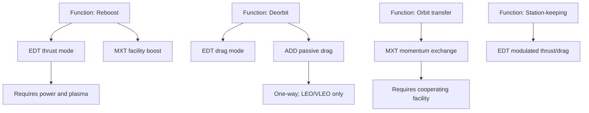
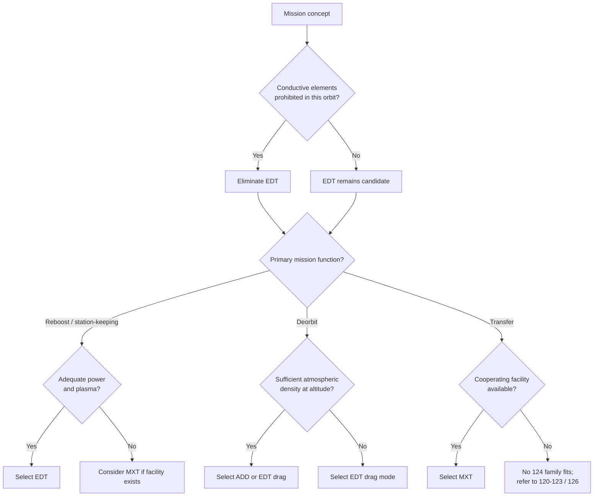

# STA 120-129 · 124-020 — Propellantless Families and Selection Criteria

## Index

1. [Purpose](#1-purpose)
2. [Scope](#2-scope)
3. [Glossary of Terms and Acronyms](#3-glossary-of-terms-and-acronyms)
4. [Corpus](#4-corpus)
   - [4.1 Family Characterisation](#41-family-characterisation)
   - [4.2 Selection Drivers](#42-selection-drivers)
   - [4.3 Mission-Function to Family Mapping](#43-mission-function-to-family-mapping)
   - [4.4 Selection Decision Logic](#44-selection-decision-logic)
   - [4.5 Combination Patterns](#45-combination-patterns)
   - [4.6 Selection Governance and Evidence](#46-selection-governance-and-evidence)
5. [Notes](#5-notes)
6. [References](#6-references)
7. [Footprint](#7-footprint)

---

## 1. Purpose

Defines the `020` subsubject for subsection `124` (*Tether and Propellantless Propulsion*) within STA Section `02` (*Propulsión Espacial Tradicional y Avanzada*).

This node establishes **how a mission designer selects among the propellantless families** defined in `124-010`. It characterises each family by its operational attributes, fixes the mission drivers that govern selection, and provides the decision logic that maps mission function to a candidate family or combination. It does **not** redefine the families (owned by `124-010`), nor does it state quantitative performance envelopes (owned by `124-080`); it provides the selection methodology that sits between them.[^definition][^perf]

---

## 2. Scope

- Establishes the controlled selection methodology for the three propellantless families (EDT, MXT, ADD) defined in `124-010`.
- Fixes the mission drivers and their relative weighting basis so that selection is repeatable and auditable.
- Provides comparative (relative, not absolute) family attributes; absolute performance figures and their validity envelopes are deferred to `124-080`.
- Preserves alignment with subsection governance, the subsection safety boundary, and parent architecture controls.[^baseline][^archtable]
- Supports mission design, verification planning, and evidence traceability for propulsion decisions.

---

## 3. Glossary of Terms and Acronyms

| Term / Acronym | Expansion | Meaning in this node |
|---|---|---|
| **EDT** | Electrodynamic Tether | Family A — Lorentz-force thrust/drag via current in the geomagnetic field. |
| **MXT** | Momentum-Exchange Tether | Family B — mechanical orbital-momentum transfer via a rotating tether. |
| **ADD** | Aerodynamic Drag Device | Family C — passive area-augmentation for atmospheric-drag deorbit. |
| **Mission function** | — | The propulsive task required: reboost, deorbit, transfer, or station-keeping. |
| **Selection driver** | — | A mission parameter that influences family selection (altitude, power, mass, schedule, disposal). |
| **Reboost** | — | Raising orbital altitude to counter decay. |
| **Deorbit** | — | Lowering orbit toward assured re-entry. |
| **Station-keeping** | — | Maintaining a target orbit against perturbations. |
| **Transfer** | — | Moving a payload between orbits. |
| **Reversibility** | — | Whether the technique can both raise and lower orbit (EDT) or acts one-way (ADD). |
| **Duty cycle** | — | Fraction of orbit during which the technique produces useful thrust/drag. |
| **GNC** | Guidance, Navigation and Control | Coupled subsystem; selection affects GNC demand. |
| **TRL** | Technology Readiness Level | Maturity; a selection driver where schedule risk matters. |
| **Δv** | Change in velocity | Propulsive effort metric; quantified in `124-080`, not here. |

---

## 4. Corpus

### 4.1 Family Characterisation

The three families inherited from `124-010` differ along a small set of operational attributes that drive selection. The table below is **relative and qualitative** — absolute figures and their envelopes belong to `124-080`.[^perf]

| Attribute | EDT (Family A) | MXT (Family B) | ADD (Family C) |
|---|---|---|---|
| Primary mission function | Reboost, deorbit, station-keeping | Orbit transfer, payload boost | Deorbit only |
| Reversibility | Bidirectional (thrust or drag) | Bidirectional at facility level | One-way (drag only) |
| Environment source | Geomagnetic field + ionospheric plasma | Orbital momentum reservoir | Residual atmosphere |
| Power dependence | High (thrust mode); generator in drag mode | Low (mechanical) | None (passive) |
| Effective regime | LEO with adequate field/plasma | Any orbit with a cooperating facility | LEO/VLEO with adequate density |
| GNC/dynamics demand | High (libration, current control) | Very high (spin, capture timing) | Low–moderate (attitude for area) |
| Deployment complexity | High | Very high | Moderate |
| Disposal posture | Must manage conductive-element disposal | Facility lifecycle is the disposal case | Self-disposes with host |
| Relative maturity | Moderate | Low | Higher |

### 4.2 Selection Drivers

Family selection is governed by the following controlled drivers. Each is assessed against the mission concept; no single driver is dispositive except a hard constraint (e.g. an absolute prohibition on conductive elements in a given orbit).

1. **Mission function.** The required propulsive task (reboost / deorbit / transfer / station-keeping) is the primary driver. Some functions are served by only one family (e.g. drag devices cannot reboost).
2. **Orbital regime.** Altitude and inclination determine geomagnetic field strength, plasma density, and atmospheric density — each family's environment source is regime-dependent.
3. **Power availability.** EDT thrust mode is power-intensive; MXT and ADD are not. A power-constrained spacecraft narrows the candidate set.
4. **Mass and volume budget.** Deployed-structure mass and stowed volume vary by family and constrain the host.
5. **Schedule and TRL risk.** Lower-maturity families carry schedule risk; programmes with firm EIS dates weight maturity heavily.
6. **Disposal and orbital-traffic constraints.** The assured-disposal requirement (the subsection safety boundary) may favour passive, self-disposing devices or impose conductive-element disposal obligations.[^general]
7. **GNC and dynamic-stability capacity.** The host's ability to manage libration, spin, or attitude for the deployed element.

### 4.3 Mission-Function to Family Mapping

The diagram maps the four primary mission functions to candidate families. A function may admit more than one candidate; the selection drivers in §4.2 then discriminate among them.

The mapping shows that **deorbit** is the only function with both an active (EDT drag) and a passive (ADD) candidate — which is why drag devices are frequently selected as a low-complexity backup deorbit path even when an EDT is the primary system (see §4.5).

### 4.4 Selection Decision Logic

The decision flow below applies the drivers from §4.2 in priority order, beginning with the hard constraints that can eliminate a family outright. It produces a candidate family (or combination) for the mission concept; final selection is confirmed by the trade in §4.6 and the performance check in `124-080`.[^perf]

The terminal node "No 124 family fits" is significant: it is the controlled exit that routes a mission back to stored-propellant subsections when no propellantless family meets the mission constraints. This keeps the selection honest — propellantless propulsion is not assumed to be universally applicable.

### 4.5 Combination Patterns

Families may be combined within a single mission. The recognised patterns are:

- **EDT primary + ADD backup.** An electrodynamic tether provides reboost and active deorbit; a drag device provides an independent, passive deorbit path that closes the assured-disposal case even if the EDT fails. This is the most common combination and directly serves the subsection safety boundary.[^general]
- **MXT facility + EDT facility station-keeping.** A momentum-exchange transfer facility uses an EDT to recover the orbital energy it expends boosting payloads, reducing or eliminating the facility's own propellant resupply need.
- **ADD + auxiliary RCS.** A drag device deorbits the host while a stored-propellant RCS (owned by `126`) provides attitude control to maintain the drag-optimal attitude. The RCS retains its `126` classification; the boundary is documented in the interface control.

Each combination is treated as a set of family elements that retain their individual classification and assurance obligations; the combination does not create a new family.[^definition]

### 4.6 Selection Governance and Evidence

A family selection is a governed decision and must produce traceable evidence:

- **Trade record.** The selection trade — drivers assessed, families eliminated, rationale for the chosen candidate — is recorded as an evidence artefact under the programme impact study, mapped to this node.
- **Performance confirmation.** The selected family's performance against the mission Δv/drag requirement is confirmed against the envelopes in `124-080`; the selection is provisional until this check passes.[^perf]
- **Safety confirmation.** The selection is checked against the assurance boundary conditions in `124-090` (deployment, dynamic stability, hazard management, assured disposal).
- **Cross-reference obligation.** Where a combination involves elements owned by sibling subsections (e.g. RCS from `126`), the boundary is registered in the section link register at `129-070`.[^xref]
- **Change authority.** Changes to the selection methodology in this node require Q-SPACE review, ORB-PMO approval, and a footprint change-log entry (§7).

---

## 5. Notes

> [!NOTE]
> **N1.** This node deliberately states **relative** family attributes only (§4.1). Absolute performance figures (achievable Δv, drag force, deorbit time) and their validity envelopes are owned by `124-080`. Stating an absolute figure here, without its envelope, would be a governance defect — consistent with the rule recorded in `124-000`.[^general][^perf]

> [!NOTE]
> **N2.** The selection decision logic (§4.4) begins with hard-constraint elimination, not with optimisation. A family that violates a hard constraint (e.g. conductive elements prohibited in a protected orbit) is removed before any trade, which prevents wasted analysis on infeasible candidates.

> [!IMPORTANT]
> **N3.** The "No 124 family fits" terminal (§4.4) is a controlled exit, not a failure. Propellantless propulsion is not universally applicable; routing back to stored-propellant subsections (`120`–`123`, `126`) when no family meets mission constraints is the correct, governed outcome.[^section]

---

## 6. References

[^baseline]: **Q+ATLANTIDE controlled baseline (v1.0.0)** — [`organization/Q+ATLANTIDE.md`](../../../../organization/Q+ATLANTIDE.md).
[^general]: **Subsection general node (124-000)** — [`124-000-General.md`](./124-000-General.md).
[^definition]: **Controlled definition (124-010)** — [`124-010-Tether-and-Propellantless-Propulsion-Controlled-Definition.md`](./124-010-Tether-and-Propellantless-Propulsion-Controlled-Definition.md).
[^perf]: **Performance bounds and operational envelopes (124-080)** — [`124-080-Performance-Bounds-and-Operational-Envelopes.md`](./124-080-Performance-Bounds-and-Operational-Envelopes.md).
[^subsection]: **Subsection index (124 · Propulsión Sin Propelente y Amarras)** — [`README.md`](./README.md).
[^section]: **Section index (120-129 · Propulsión Espacial Tradicional y Avanzada)** — [`../README.md`](../README.md).
[^archtable]: **STA §3 Architecture Table** — [`../../README.md` §3](../../README.md#3-architecture-table).
[^xref]: **Cross-Architecture Propulsion References** — [`129-070`](../129_Aseguramiento-Calificacion-y-Expansion-de-Propulsion/129-070-Cross-Architecture-Propulsion-References.md).

---

## 7. Footprint

**Document footprint — controlled provenance and evidence anchor.**

| Field | Value |
|---|---|
| Document ID | `QATL-ATLAS-1000-STA-120-129-02-124-020` |
| Register | ATLAS-1000 |
| Path | `Q+ATLANTIDE/100-199_STA/120-129_Propulsion-Espacial-Tradicional-y-Avanzada/124_Propulsion-Sin-Propelente-y-Amarras/124-020-Propellantless-Families-and-Selection-Criteria.md` |
| Governance class | baseline |
| Owning Q-Division | Q-SPACE |
| Support Q-Divisions | Q-GREENTECH, Q-STRUCTURES, Q-DATAGOV, Q-HPC, Q-HORIZON |
| ORB functions | ORB-PMO, ORB-LEG |
| Version | 1.0.0 |
| Status | active |
| Language | en |
| Evidence anchor (IEF) | `<sha256: to-be-stamped-at-commit>` |
| Programme applicability | none at baseline (methodology node; programme trades via impact studies) |

**Change log.**

| Version | Date | Author / Division | Change |
|---|---|---|---|
| 1.0.0 | 2026-05-29 | Q-SPACE | Initial baseline issue of `124-020` Families and Selection Criteria node. |

**Footprint notes.** This node carries the controlled selection methodology for subsection `124`. It depends on `124-010` for family definitions and on `124-080` for the performance envelopes that confirm a provisional selection; a change to either upstream node triggers a consistency review here. The evidence anchor is stamped at commit under the IEF; until stamped, this document is `draft-of-record` for traceability purposes even while `status: active`.
