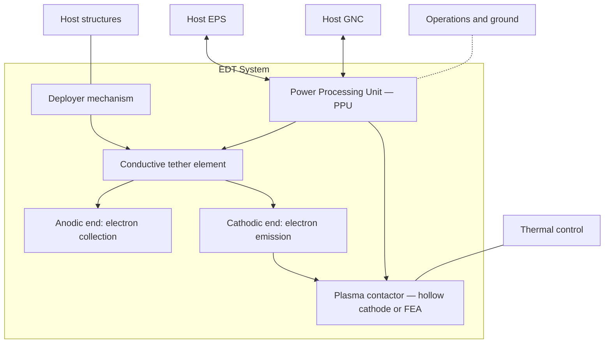
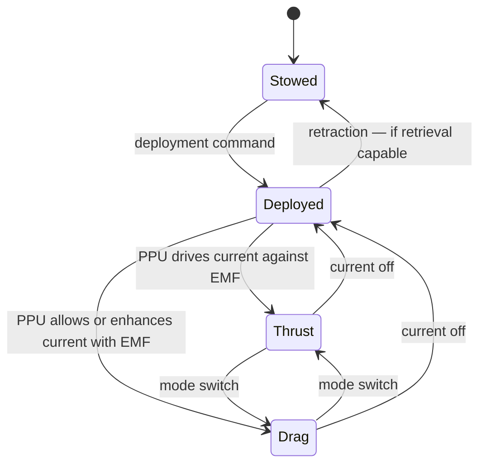
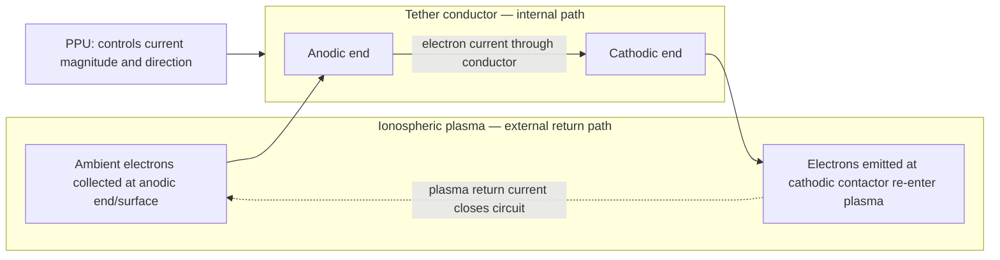

# STA 120-129 · 124-030 — Electrodynamic Tether Systems

## Index

1. [Purpose](#1-purpose)
2. [Scope](#2-scope)
3. [Glossary of Terms and Acronyms](#3-glossary-of-terms-and-acronyms)
4. [Corpus](#4-corpus)
   - [4.1 EDT System Definition and Architecture](#41-edt-system-definition-and-architecture)
   - [4.2 Operating Modes](#42-operating-modes)
   - [4.3 EDT Variants](#43-edt-variants)
   - [4.4 Circuit Model and Current Path](#44-circuit-model-and-current-path)
   - [4.5 Conductor and Material Considerations](#45-conductor-and-material-considerations)
   - [4.6 Interface Summary](#46-interface-summary)
   - [4.7 Mission Applicability](#47-mission-applicability)
5. [Notes](#5-notes)
6. [References](#6-references)
7. [Footprint](#7-footprint)

---

## 1. Purpose

Defines the `030` subsubject for subsection `124` (*Tether and Propellantless Propulsion*) within STA Section `02` (*Propulsión Espacial Tradicional y Avanzada*).

This node specifies **electrodynamic tether (EDT) systems** at the architectural and engineering-principle level. It covers the system architecture, operating modes, variants, the circuit model that governs current flow and force generation, conductor and material considerations, and the interface set that connects an EDT to its host spacecraft and to the downstream nodes that own deployment (`124-060`), plasma-environment coupling (`124-070`), performance envelopes (`124-080`), and safety/disposal (`124-090`). The controlled definition and classification of EDT within the propellantless taxonomy is inherited from `124-010` (Family A).[^definition]

---

## 2. Scope

- Specifies the EDT system architecture, operating modes, variants, circuit model, and material considerations.
- Establishes the controlled interface set between the EDT and host-spacecraft subsystems (power, thermal, structures, GNC, operations, assurance).
- Defers deployment dynamics and tether structural behaviour to `124-060`; ionospheric current collection and plasma physics to `124-070`; quantitative performance envelopes to `124-080`; and safety, severance, and disposal to `124-090`. This node owns *the system*, not the cross-cutting concerns.
- Preserves alignment with subsection governance, the subsection safety boundary, and parent architecture controls.[^baseline][^archtable]
- Supports mission design, verification planning, and evidence traceability for EDT-based propulsion decisions.

---

## 3. Glossary of Terms and Acronyms

| Term / Acronym | Expansion | Meaning in this node |
|---|---|---|
| **EDT** | Electrodynamic Tether | A conductive tether generating thrust or drag via Lorentz-force interaction with the geomagnetic field. |
| **Bare-wire EDT** | — | EDT variant using an uninsulated conductor for passive electron collection along its length (OML regime). |
| **Insulated EDT** | — | EDT variant using a fully insulated conductor with dedicated anode/cathode contactors at each end. |
| **Hybrid EDT** | — | EDT variant combining bare and insulated segments to balance collection efficiency and current control. |
| **OML** | Orbital-Motion Limited | Current-collection regime in which collected current scales with conductor radius and length rather than surface area; governs bare-wire EDT performance. |
| **Plasma contactor** | — | Device (typically a hollow-cathode electron emitter or a field-emission array) exchanging current with the ionospheric plasma to close the EDT circuit. |
| **Hollow cathode** | — | Thermionic device emitting electrons into the plasma; the most common cathodic contactor type. |
| **FEA** | Field-Emission Array | Micro-fabricated electron emitter; alternative to hollow cathodes for cathodic contact. |
| **PPU** | Power Processing Unit | Onboard electronics that switch the EDT between thrust and drag modes and regulate current. |
| **Induced EMF** | Electromotive Force | Voltage generated along the tether by its orbital motion through the geomagnetic field (V = ∫(v × B) · dL). |
| **Lorentz force** | — | Force on the current-carrying tether in the geomagnetic field (F = I L × B). |
| **B-field** | Geomagnetic field | Earth's magnetic field; the external environment source for EDT force generation. |
| **GNC** | Guidance, Navigation and Control | Coupled subsystem; EDT libration and current modulation create attitude disturbances and pointing requirements. |
| **EPS** | Electrical Power Subsystem | Spacecraft power bus; loads or receives power from the EDT depending on operating mode. |
| **Libration** | — | Pendulum-like oscillation of the deployed tether about local vertical; detail in `124-060`. |
| **Severance** | — | Physical cutting of the tether by debris or micrometeoroid impact; detail in `124-090`. |

---

## 4. Corpus

### 4.1 EDT System Definition and Architecture

An electrodynamic tether system consists of a conductive element deployed from a host spacecraft into the geomagnetic field, together with the plasma contactors that close the electrical circuit through the ionosphere and the power-processing electronics that control the current direction and magnitude. The tether, the contactors, and the PPU form the minimum functional set; the deployer mechanism, dynamic-stability actuators, and end-mass (if used) are part of the system but their detail is carried by `124-060`.[^deploy]

The system-level block diagram is shown below. Each block maps to an interface documented in §4.6; external interfaces (to host EPS, GNC, thermal, structures) are shown at the boundary.

The architecture is inherently bidirectional: the same physical hardware produces thrust **or** drag depending on the current direction through the conductor relative to the geomagnetically induced EMF. The PPU is the mode-switching element; it determines whether the system loads or feeds the EPS.

### 4.2 Operating Modes

An EDT has two primary operating modes and one transitional state. The mode is selected by the PPU and may be switched on an orbital-period or even sub-orbital-period basis to shape the thrust/drag profile.[^perf]

**Thrust mode (reboost / station-keeping).** The PPU drives current through the tether in the direction opposite to the geomagnetically induced EMF. This requires onboard power from the EPS. The resulting Lorentz force acts along the orbital velocity vector, raising the orbit. Thrust mode consumes electrical energy to produce propulsive work without expending propellant.

**Drag mode (deorbit / power generation).** The PPU allows current to flow in the direction of the induced EMF, or actively enhances it. The Lorentz force opposes the orbital velocity vector, lowering the orbit. The tether acts as a generator: the orbital kinetic energy lost to drag is partially converted to electrical energy that can power onboard loads or be dissipated as heat. Drag mode can operate with zero net power input, making it viable for end-of-life deorbit even after host-spacecraft power loss.

**Deployed-idle.** The tether is deployed but no current flows (circuit open). No Lorentz force is generated; residual aerodynamic drag on the tether structure is the only orbital effect. This state is used during eclipse or high-latitude passes where the geomagnetic geometry is unfavourable.

### 4.3 EDT Variants

Three EDT variants are recognised in the subsection taxonomy, corresponding to the sub-families under Family A in `124-010`.[^definition]

**Bare-wire EDT.** The conductor is uninsulated over most of its length. Electrons are collected passively along the bare surface operating in the orbital-motion-limited (OML) collection regime. The bare-wire approach maximises current per unit tether mass because the entire conductor length serves as the anode, eliminating the need for a large dedicated anode contactor. The cathodic end uses a plasma contactor (hollow cathode or FEA) to emit electrons back into the plasma. The principal trade-off is that current collection is distributed and varies with local plasma conditions along the tether, making the force profile less uniform than in the insulated variant.

**Insulated EDT.** The conductor is fully insulated except at two dedicated end-contactors (anode and cathode). Current collection and emission occur only at the endpoints, which simplifies the circuit model and allows precise current control. The trade-off is lower collected current per unit tether mass (smaller collection area) and the requirement for two large, reliable plasma contactors.

**Hybrid EDT.** A combination of bare and insulated segments: the upper (anodic) portion is bare for passive collection; the lower portion is insulated to carry the collected current to the cathodic contactor without parasitic re-emission. This variant seeks to balance the collection efficiency of the bare-wire approach with the current-control advantages of insulation.

### 4.4 Circuit Model and Current Path

The EDT circuit is the analytical backbone of the system. Understanding where current flows, and how the circuit closes through the ionosphere, is essential for force prediction, power budgeting, and failure-mode analysis.

The circuit consists of four segments: (1) electron collection from the plasma at the anodic end or surface; (2) current flow through the metallic conductor; (3) electron emission back into the plasma at the cathodic contactor; (4) return current through the ionospheric plasma, closing the circuit without any physical wire. The induced EMF (V = ∫(v × B) · dL) drives the natural current direction; the PPU either loads this EMF (drag/generator mode) or overcomes it with onboard power (thrust mode).

The force on the tether is the integrated Lorentz force along the current-carrying length: **F = ∫ I(s) ds × B(s)**, where I(s) is the local current (which varies along a bare-wire tether as electrons are progressively collected) and B(s) is the local geomagnetic field vector. For an insulated tether with uniform current, this simplifies to F = I L × B, where L is the tether length and I is the total circuit current.

### 4.5 Conductor and Material Considerations

The conductor must satisfy competing requirements: high electrical conductivity (to minimise resistive losses), low linear density (to maximise force per unit mass), adequate tensile strength (to survive deployment loads and long-duration libration), and survivability against the orbital environment (atomic oxygen, UV, thermal cycling, micrometeoroid impact).

The established material baseline is **aluminium alloy wire** (high conductivity-to-mass ratio), with bare-wire variants typically using round or tape cross-sections to optimise the OML collection geometry. Tape cross-sections improve the collection-to-mass ratio but introduce attitude-dependent aerodynamic torques that couple to the GNC demand.[^deploy]

Material research frontiers include carbon-nanotube yarns (higher specific conductivity and tensile strength, lower maturity) and multi-strand/braided architectures that improve survivability against single-point severance. These are tracked under Q-HORIZON support but are not part of the current baseline.

Conductor selection is a system-level trade documented at programme level; this node fixes the functional requirements (conductivity, linear density, tensile strength, environmental survivability) that any candidate must satisfy.

### 4.6 Interface Summary

The EDT system interfaces with host-spacecraft subsystems through the following controlled set. Each interface is summarised here; detailed interface-control requirements are carried at programme level.

| Interface | Direction | Description |
|---|---|---|
| **EPS (power)** | Bidirectional | Thrust mode: EPS supplies power to PPU. Drag mode: PPU feeds generated power to EPS bus or to a dump load. |
| **Thermal** | EDT → thermal | Ohmic heating in the conductor and in plasma contactors (especially the hollow cathode) must be managed. |
| **Structures / deployment** | Mechanical | Deployer mechanism, tether stowage, end-mass attachment. Detail in `124-060`. |
| **GNC** | Bidirectional | EDT libration and current-induced torques disturb spacecraft attitude; GNC provides pointing for optimal force geometry. PPU current modulation may be used as an attitude-control actuator. |
| **Plasma environment** | External | Electron collection/emission depends on ionospheric plasma density and temperature. Detail in `124-070`. |
| **Operations** | Ground → PPU | Mode commands, current profiles, eclipse management, contingency (e.g. current-off safe state). |
| **Assurance / disposal** | Constraint | Conductive-element disposal, severance-hazard management, orbital-traffic coordination. Detail in `124-090`. |

### 4.7 Mission Applicability

EDT systems are applicable to the following mission functions, as mapped in `124-020`.[^selection]

- **LEO reboost and station-keeping.** Primary application. EDT thrust mode counters atmospheric drag and maintains target altitude without propellant expenditure, extending mission lifetime indefinitely subject to hardware degradation.
- **End-of-life deorbit.** EDT drag mode accelerates re-entry. Can operate with zero net power (generator mode), making it viable after host-spacecraft power failure — a significant advantage for assured disposal.
- **Orbit lowering for debris remediation.** An EDT attached to a cooperative or captured debris object can deorbit it using drag mode. The system's ability to generate its own power from orbital energy is a key enabler for this application.
- **Combined reboost and power generation.** In orbits where drag exceeds mission needs, the EDT can alternate between reboost passes (power consumption) and drag passes (power generation), yielding net Δv while supplying auxiliary power.

EDT is **not applicable** to high-altitude orbits (GEO, MEO, HEO) where the geomagnetic field is weak and ionospheric plasma density is negligible. It is not applicable to deep-space missions. These regime limits are quantified in `124-080`.[^perf]

---

## 5. Notes

> [!NOTE]
> **N1.** The circuit model (§4.4) shows the ionospheric plasma closing the return path. This means EDT performance is coupled to ionospheric conditions — plasma density, electron temperature, and geomagnetic field geometry — that vary with altitude, latitude, local time, and solar activity. This coupling is the defining characteristic of EDT and the reason performance figures in `124-080` must carry their environment-condition envelope.[^perf][^plasma]

> [!NOTE]
> **N2.** Bare-wire EDT current collection follows orbital-motion-limited (OML) theory: collected current scales with conductor perimeter and the square root of the potential difference, not with conductor surface area. This non-linear relationship means that doubling the tether length does not double the Lorentz force — a common sizing error.

> [!IMPORTANT]
> **N3.** The EDT drag mode can operate with zero net power input. This is the property that makes EDT uniquely valuable for assured disposal: even a power-dead spacecraft can be deorbited if the tether is deployed and the circuit can close through the plasma. This property should be preserved in any system design; a PPU architecture that requires active power to enable drag mode forfeits the passive-disposal advantage.[^general]

> [!WARNING]
> **N4.** A deployed conductive tether in LEO is a collision and severance hazard. The system-level safety case must address single-point severance (micrometeoroid or debris impact cutting the tether), the post-severance trajectory of both segments, and the electrical hazard of a severed live conductor. Detail is carried by `124-090`.[^safety]

---

## 6. References

[^baseline]: **Q+ATLANTIDE controlled baseline (v1.0.0)** — [`organization/Q+ATLANTIDE.md`](../../../../organization/Q+ATLANTIDE.md).
[^general]: **Subsection general node (124-000)** — [`124-000-General.md`](./124-000-General.md).
[^definition]: **Controlled definition (124-010)** — [`124-010-Tether-and-Propellantless-Propulsion-Controlled-Definition.md`](./124-010-Tether-and-Propellantless-Propulsion-Controlled-Definition.md).
[^selection]: **Families and selection criteria (124-020)** — [`124-020-Propellantless-Families-and-Selection-Criteria.md`](./124-020-Propellantless-Families-and-Selection-Criteria.md).
[^deploy]: **Conductive elements, deployment and dynamics (124-060)** — [`124-060-Conductive-Elements-Deployment-and-Dynamics.md`](./124-060-Conductive-Elements-Deployment-and-Dynamics.md).
[^plasma]: **Plasma and geomagnetic environment interface (124-070)** — [`124-070-Plasma-and-Geomagnetic-Environment-Interface.md`](./124-070-Plasma-and-Geomagnetic-Environment-Interface.md).
[^perf]: **Performance bounds and operational envelopes (124-080)** — [`124-080-Performance-Bounds-and-Operational-Envelopes.md`](./124-080-Performance-Bounds-and-Operational-Envelopes.md).
[^safety]: **Safety, debris and assurance boundaries (124-090)** — [`124-090-Safety-Debris-and-Assurance-Boundaries.md`](./124-090-Safety-Debris-and-Assurance-Boundaries.md).
[^subsection]: **Subsection index (124 · Propulsión Sin Propelente y Amarras)** — [`README.md`](./README.md).
[^section]: **Section index (120-129 · Propulsión Espacial Tradicional y Avanzada)** — [`../README.md`](../README.md).
[^archtable]: **STA §3 Architecture Table** — [`../../README.md` §3](../../README.md#3-architecture-table).
[^xref]: **Cross-Architecture Propulsion References** — [`129-070`](../129_Aseguramiento-Calificacion-y-Expansion-de-Propulsion/129-070-Cross-Architecture-Propulsion-References.md).

---

## 7. Footprint

**Document footprint — controlled provenance and evidence anchor.**

| Field | Value |
|---|---|
| Document ID | `QATL-ATLAS-1000-STA-120-129-02-124-030` |
| Register | ATLAS-1000 |
| Path | `Q+ATLANTIDE/100-199_STA/120-129_Propulsion-Espacial-Tradicional-y-Avanzada/124_Propulsion-Sin-Propelente-y-Amarras/124-030-Electrodynamic-Tether-Systems.md` |
| Governance class | baseline |
| Owning Q-Division | Q-SPACE |
| Support Q-Divisions | Q-GREENTECH, Q-STRUCTURES, Q-DATAGOV, Q-HPC, Q-HORIZON |
| ORB functions | ORB-PMO, ORB-LEG |
| Version | 1.0.0 |
| Status | active |
| Language | en |
| Evidence anchor (IEF) | `<sha256: to-be-stamped-at-commit>` |
| Programme applicability | none at baseline (technique node; programme sizing via impact studies) |

**Change log.**

| Version | Date | Author / Division | Change |
|---|---|---|---|
| 1.0.0 | 2026-05-29 | Q-SPACE | Initial baseline issue of `124-030` Electrodynamic Tether Systems node. |

**Footprint notes.** This node specifies the EDT system at the architecture and engineering-principle level. It depends on `124-010` for the controlled definition (Family A) and `124-020` for the selection methodology. Cross-cutting concerns are owned by downstream nodes: deployment (`124-060`), plasma interface (`124-070`), performance envelopes (`124-080`), and safety/disposal (`124-090`). Programme-level sizing, detailed design, and interface-control documents are generated through impact studies and mapped to `S1000D-CSDB/DMC/` per the canonical hierarchy. The evidence anchor is stamped at commit under the IEF; until stamped, this document is `draft-of-record` for traceability purposes even while `status: active`.
