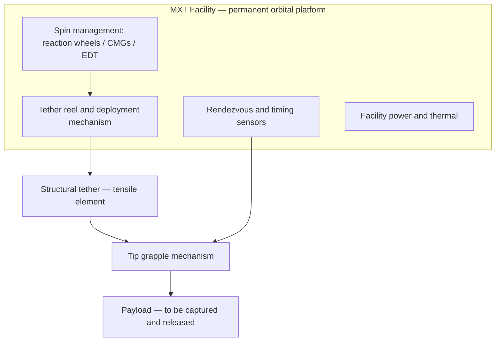
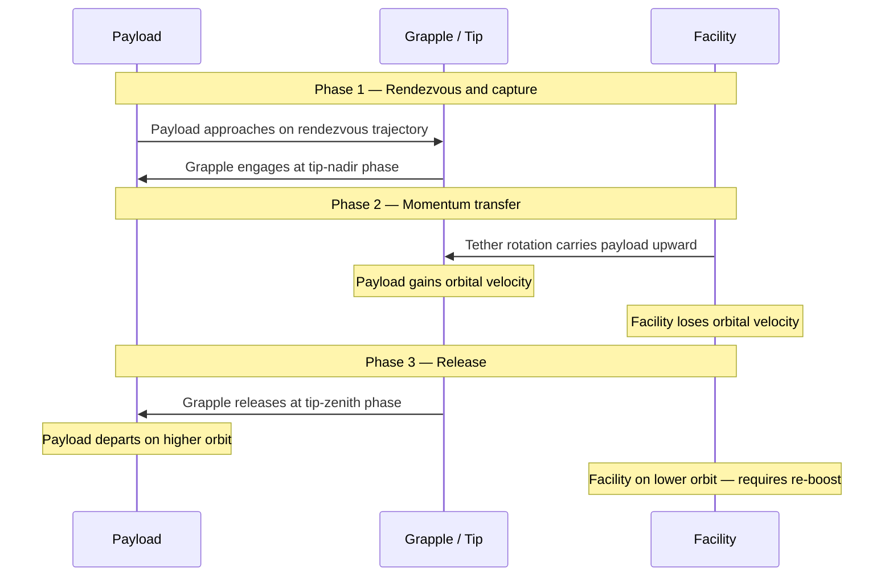
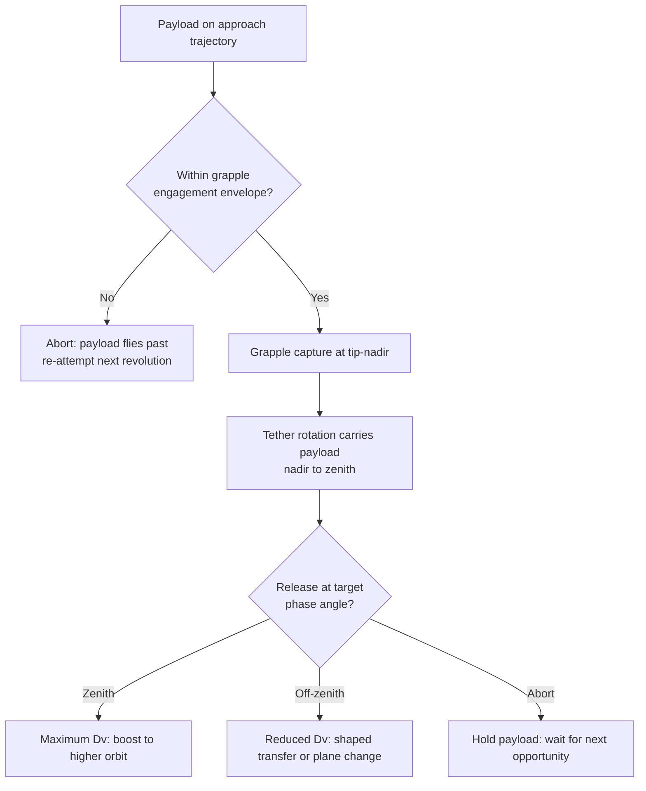

# STA 120-129 · 124-040 — Momentum Exchange and Spinning Tethers

## Index

1. [Purpose](#1-purpose)
2. [Scope](#2-scope)
3. [Glossary of Terms and Acronyms](#3-glossary-of-terms-and-acronyms)
4. [Corpus](#4-corpus)
   - [4.1 MXT System Definition and Architecture](#41-mxt-system-definition-and-architecture)
   - [4.2 Operating Principle — Momentum Conservation](#42-operating-principle--momentum-conservation)
   - [4.3 MXT Variants](#43-mxt-variants)
   - [4.4 Capture-Release Mechanics](#44-capture-release-mechanics)
   - [4.5 Facility Re-boost Strategies](#45-facility-re-boost-strategies)
   - [4.6 Interface Summary](#46-interface-summary)
   - [4.7 Mission Applicability](#47-mission-applicability)
5. [Notes](#5-notes)
6. [References](#6-references)
7. [Footprint](#7-footprint)

---

## 1. Purpose

Defines the `040` topic for node `124` (*Tether and Propellantless Propulsion*) within STA code range `120-129` (*Propulsión Espacial Tradicional y Avanzada*).

This node specifies **momentum-exchange and spinning tether (MXT) systems** at the architectural and engineering-principle level. It covers the system architecture, the momentum-conservation principle that governs propellantless orbit transfer, MXT variants, capture-release mechanics, facility re-boost strategies, and the interface set that connects an MXT facility to cooperating payloads and to downstream nodes that own deployment dynamics (`124-060`), performance envelopes (`124-080`), and safety/disposal (`124-090`). The controlled definition and classification of MXT within the propellantless taxonomy is inherited from `124-010` (Family B).[^definition]

---

## 2. Scope

- Specifies the MXT system architecture, operating principle, variants, capture-release mechanics, and re-boost strategies.
- Establishes the controlled interface set between the MXT facility, cooperating payloads, and host-spacecraft/facility subsystems.
- Defers tether deployment dynamics and structural behaviour to `124-060`; quantitative performance envelopes (tip velocity, Δv per exchange, mass ratios) to `124-080`; and safety, severance, and disposal to `124-090`. This node owns *the system and its operating principle*, not the cross-cutting concerns.
- Preserves alignment with subsection governance, the subsection safety boundary, and parent architecture controls.[^baseline][^archtable]
- Supports mission design, verification planning, and evidence traceability for MXT-based orbit-transfer decisions.

---

## 3. Glossary of Terms and Acronyms

| Term / Acronym | Expansion | Meaning in this node |
|---|---|---|
| **MXT** | Momentum-Exchange Tether | Family B — a rotating tether that transfers orbital momentum between a facility and a payload. |
| **Facility** | — | The permanent orbital platform that hosts the tether, grapple mechanism, and spin-management systems. |
| **Payload** | — | The object (spacecraft, cargo, upper stage) to be boosted or de-boosted by the MXT. |
| **Tip velocity (V_tip)** | — | Velocity of the tether tip relative to the facility centre of mass; adds to or subtracts from orbital velocity at capture/release. |
| **Grapple** | — | Mechanism at the tether tip that captures and releases the payload; the critical timing element. |
| **Capture window** | — | The time interval during which the tether tip and the approaching payload are within grapple-engagement parameters. |
| **Release phase** | — | The rotational phase angle at which the payload is released to achieve the target orbit. |
| **Spin-up / spin-down** | — | Increasing or decreasing the facility's tether rotation rate, typically using reaction wheels or an EDT. |
| **Orbital momentum** | — | Product of orbital velocity and mass; the conserved quantity exchanged in an MXT transfer. |
| **Facility re-boost** | — | Restoring the facility's orbital energy after a momentum-exchange transfer has lowered it. |
| **Rendezvous** | — | The approach trajectory that brings the payload into the capture window. |
| **EDT** | Electrodynamic Tether | A Family A sibling technique; a candidate for propellantless facility re-boost. |
| **GNC** | Guidance, Navigation and Control | Coupled subsystem; MXT imposes extreme timing and spin-management demands. |
| **TRL** | Technology Readiness Level | MXT is the lowest-maturity family in subsection 124. |

---

## 4. Corpus

### 4.1 MXT System Definition and Architecture

A momentum-exchange tether system consists of a permanent orbital facility connected to a payload by a long structural tether, with a grapple mechanism at the tether tip for capture and release. The facility spins the tether so that the tip velocity adds to (or subtracts from) the orbital velocity at the appropriate rotational phase, enabling propellantless orbit transfer. The minimum functional set is: a facility with spin-management capability, a structural tether of controlled length and strength, and a tip grapple. Supporting elements include rendezvous sensors, spin actuators (reaction wheels, CMGs, or an integrated EDT), and facility station-keeping propulsion.[^definition]

Unlike an EDT, the MXT tether is primarily a **structural** element, not an electrical conductor. Its governing requirements are tensile strength, fatigue life under cyclic spin loading, and mass efficiency (tip velocity scales with tether specific strength). Electrical conductivity is only relevant if the facility uses an integrated EDT for re-boost (§4.5).

### 4.2 Operating Principle — Momentum Conservation

The MXT operates on the principle that **orbital momentum is conserved in the exchange**: when the facility transfers momentum to a payload (boosting it to a higher orbit), the facility itself drops to a lower orbit by exactly the amount required to conserve the total momentum of the system. No propellant is consumed in the exchange itself.

The sequence proceeds in three phases:

**Phase 1 — Rendezvous and capture.** The payload approaches the facility on a calculated rendezvous trajectory. The tether tip, rotating about the facility centre of mass, sweeps through a capture window during which the grapple must engage the payload. Capture occurs at or near the **tip-nadir phase** (tip pointing toward Earth), where the tip velocity subtracts from the facility's orbital velocity, matching the payload's lower-orbit velocity.

**Phase 2 — Momentum transfer.** Once captured, the tether rotation carries the payload from the nadir phase through to the zenith phase. As the tip swings upward, the payload's velocity increases (orbital velocity plus tip velocity); the facility's orbital energy decreases correspondingly. The transfer is governed by conservation of momentum and energy within the two-body (facility + payload) system.

**Phase 3 — Release.** The grapple releases the payload at or near the **tip-zenith phase** (tip pointing away from Earth), where the tip velocity adds to the facility's orbital velocity. The payload departs on a transfer orbit to a higher altitude; the facility remains on a lower orbit and must be re-boosted before the next exchange (§4.5).

### 4.3 MXT Variants

Three variants are recognised in the subsection taxonomy, corresponding to the sub-families under Family B in `124-010`.[^definition]

**Rotating momentum-exchange tether.** The baseline concept: a single tether arm rotates about the facility centre of mass. The facility provides spin management and the tether tip carries the grapple. Spin rate and tether length together determine the tip velocity and hence the achievable Δv per exchange. This is the simplest variant and the basis for most analytical studies.

**Spinning tether with tip mass.** A variant in which a significant mass is attached at the tether tip, separate from the grapple. The tip mass increases the system's moment of inertia, stabilising the spin rate against perturbations during capture and reducing the spin-rate change caused by payload capture/release. The trade-off is increased total system mass and deployment complexity.

**Multi-stage tether boost facility.** A concept in which multiple MXT stages are arranged in series, each transferring momentum to the payload at progressively higher orbits, analogous to a staged rocket but without propellant. Each stage is itself a rotating tether facility; payload hand-off between stages occurs at matched orbital conditions. This variant addresses the tip-velocity limitation of a single stage (achievable Δv per stage is bounded by tether material specific strength) but multiplies the facility infrastructure and operational complexity.

### 4.4 Capture-Release Mechanics

Capture and release are the critical operational events in an MXT exchange. Their timing precision drives the system's GNC demand, which is the highest of any family in subsection 124.[^general]

**Capture geometry.** The tether tip traces an epicyclic path in the inertial frame (orbital motion plus rotation). The payload must arrive at the capture point within a window defined by the grapple's engagement envelope — typically a few metres in position and a fraction of a metre per second in relative velocity. The capture window is short (seconds) and occurs once per tether revolution.

**Release geometry.** The release phase angle determines the payload's departure velocity vector and hence its transfer orbit. Releasing at exact tip-zenith maximises the Δv; releasing off-zenith trades Δv for inclination change or phasing adjustment. The release-phase accuracy requirement is driven by the target-orbit tolerance.

A missed capture is not a failure — the payload flies past and returns for a re-attempt on the next revolution (or the next orbit, depending on phasing). The system must be designed for multiple capture attempts, and the abort case must be safe (the payload must not collide with the facility or the tether).

### 4.5 Facility Re-boost Strategies

After every momentum-exchange transfer that boosts a payload, the facility's orbit is lowered. To operate repeatedly, the facility must be re-boosted. The re-boost strategy is a system-level trade that determines whether the MXT facility is truly propellantless over its operational life or merely propellant-reduced.[^selection]

| Strategy | Mechanism | Propellant use | Subsection ownership |
|---|---|---|---|
| EDT re-boost | Integrated electrodynamic tether on the facility | None (propellantless) | `124-030` (EDT) + `124-040` (MXT) |
| Stored-propellant re-boost | Chemical or electric thruster on the facility | Yes (reduces but does not eliminate propellant) | `120`–`122` or `126` (cross-reference) |
| Catch-return re-boost | Facility catches a returning payload (or ballast mass) from a higher orbit, recovering momentum | None (momentum recovery) | `124-040` (internal) |
| Gravitational re-boost | Facility uses natural orbital perturbations (J2, third-body) to recover altitude over time | None (passive, slow) | Not a propulsion technique — astrodynamics |

The **EDT re-boost** strategy is the most important for architecture-level decisions: it couples Family A (EDT) and Family B (MXT) into a single integrated facility that is propellantless in both its transfer and its re-boost function. This combination is documented in `124-020` §4.5 and creates a cross-technique dependency within subsection 124.

The **catch-return** strategy is propellantless by definition (momentum in = momentum out) but requires a return-traffic model — payloads or ballast masses must be available for the facility to catch on the descending leg. This limits the strategy to high-traffic routes (e.g. LEO-to-MEO cargo).

### 4.6 Interface Summary

The MXT facility interfaces with cooperating payloads and with its own subsystems through the following controlled set. Each interface is summarised here; detailed interface-control requirements are carried at programme level.

| Interface | Direction | Description |
|---|---|---|
| **Payload (grapple)** | Bidirectional | Mechanical capture and release; relative-position/velocity sensing; engagement-envelope definition. |
| **Structures / tether** | Mechanical | Tensile element: spin loads, cyclic fatigue, deployment/retraction. Detail in `124-060`. |
| **Spin management** | Internal | Reaction wheels, CMGs, or integrated EDT for spin-rate control and momentum management. |
| **GNC** | Bidirectional | Spin-phase tracking, capture-window prediction, release-phase control, rendezvous guidance to the payload. |
| **Power** | Internal | Spin actuators, sensors, grapple actuation, communications. Lower power demand than EDT unless an integrated EDT is used for re-boost. |
| **Thermal** | Internal | Cyclic thermal environment (spin-induced sun/shade alternation); grapple mechanism thermal conditioning. |
| **Operations** | Ground → facility | Spin-up/spin-down commands, capture/release authorisation, abort commands, re-boost scheduling. |
| **Payload rendezvous** | Payload → facility | Relative navigation data, approach-corridor management, abort triggers. |
| **Assurance / disposal** | Constraint | Facility end-of-life, tether severance hazard, orbital-traffic coordination. Detail in `124-090`. |

### 4.7 Mission Applicability

MXT systems are applicable to the following mission functions, as mapped in `124-020`.[^selection]

- **LEO-to-MEO or LEO-to-GTO orbit transfer.** Primary application. A rotating tether facility captures payloads from LEO and releases them onto transfer orbits to higher altitudes, replacing or supplementing upper-stage propulsion. The achievable Δv per exchange is limited by tether specific strength and tip velocity.
- **Cislunar cargo delivery.** A multi-stage MXT architecture could in principle deliver cargo from LEO toward lunar transfer injection. This is a high-infrastructure, long-horizon concept requiring multiple coordinated facilities.
- **Reusable launch-vehicle upper-stage recovery.** An MXT facility could catch a spent upper stage and de-boost it to a lower, more easily recoverable orbit while simultaneously boosting the payload. This couples MXT to launch-vehicle design and operational cadence.

MXT is **not applicable** to deorbit (it is a bidirectional transfer mechanism, not a drag device), to station-keeping (it transfers discrete payloads, not continuous thrust), or to missions without a cooperating facility. These regime limits are quantified in `124-080`.[^perf]

MXT is the **lowest-maturity family** in subsection 124. No operational MXT system has been demonstrated in orbit. Concept maturity is at TRL 2–3 for the single-arm rotating variant and below TRL 2 for multi-stage architectures. Schedule and TRL risk weight heavily in the selection methodology (`124-020` §4.2).[^selection]

---

## 5. Notes

> [!NOTE]
> **N1.** The momentum-conservation principle (§4.2) means that every payload boost is paid for by a facility orbit drop. The system is not a "free" source of Δv — it is a mechanism that converts facility orbital energy into payload kinetic energy without propellant. The re-boost cost (§4.5) determines whether the facility is propellantless over its operational life or merely propellant-reduced.[^general]

> [!NOTE]
> **N2.** Capture-window precision (§4.4) drives the GNC demand, which is the highest of any family in subsection 124. The payload must arrive within a position/velocity envelope of a few metres / fractions of m/s during a window of seconds. Autonomous rendezvous and grapple are required; ground-in-the-loop timing is not feasible.

> [!IMPORTANT]
> **N3.** The EDT re-boost strategy (§4.5) creates a cross-technique dependency within subsection 124: the MXT facility becomes dependent on an EDT system (`124-030`) for its sustained operability. This dependency must be carried in the interface-control documentation at programme level and registered in the section link register at `129-070`.[^xref]

> [!WARNING]
> **N4.** MXT is the lowest-maturity family in subsection 124 (TRL 2–3). Selection of MXT for a programme carries significant schedule risk. The selection methodology in `124-020` weights TRL explicitly; programmes with firm EIS dates should evaluate this risk before committing to an MXT architecture.[^selection]

---

## 6. References

[^baseline]: **Q+ATLANTIDE controlled baseline (v1.0.0)** — [`organization/Q+ATLANTIDE.md`](../../../../organization/Q+ATLANTIDE.md).
[^general]: **Subsection general node (124-000)** — [`124-000-General.md`](./124-000-General.md).
[^definition]: **Controlled definition (124-010)** — [`124-010-Tether-and-Propellantless-Propulsion-Controlled-Definition.md`](./124-010-Tether-and-Propellantless-Propulsion-Controlled-Definition.md).
[^selection]: **Families and selection criteria (124-020)** — [`124-020-Propellantless-Families-and-Selection-Criteria.md`](./124-020-Propellantless-Families-and-Selection-Criteria.md).
[^edt]: **Electrodynamic tether systems (124-030)** — [`124-030-Electrodynamic-Tether-Systems.md`](./124-030-Electrodynamic-Tether-Systems.md).
[^deploy]: **Conductive elements, deployment and dynamics (124-060)** — [`124-060-Conductive-Elements-Deployment-and-Dynamics.md`](./124-060-Conductive-Elements-Deployment-and-Dynamics.md).
[^perf]: **Performance bounds and operational envelopes (124-080)** — [`124-080-Performance-Bounds-and-Operational-Envelopes.md`](./124-080-Performance-Bounds-and-Operational-Envelopes.md).
[^safety]: **Safety, debris and assurance boundaries (124-090)** — [`124-090-Safety-Debris-and-Assurance-Boundaries.md`](./124-090-Safety-Debris-and-Assurance-Boundaries.md).
[^subsection]: **Subsection index (124 · Propulsión Sin Propelente y Amarras)** — [`README.md`](./README.md).
[^section]: **Section index (120-129 · Propulsión Espacial Tradicional y Avanzada)** — [`../README.md`](../README.md).
[^archtable]: **STA §3 Architecture Table** — [`../../README.md` §3](../../README.md#3-architecture-table).
[^xref]: **Cross-Architecture Propulsion References** — [`129-070`](../129_Aseguramiento-Calificacion-y-Expansion-de-Propulsion/129-070-Cross-Architecture-Propulsion-References.md).

---

## 7. Footprint

**Document footprint — controlled provenance and evidence anchor.**

| Field | Value |
|---|---|
| Document ID | `QATL-STA-120-129-124-040` |
| Register | Q+ATLANTIDE1000 |
| Path | `Q+ATLANTIDE/100-199_STA/120-129_Propulsion-Espacial-Tradicional-y-Avanzada/124_Propulsion-Sin-Propelente-y-Amarras/124-040-Momentum-Exchange-and-Spinning-Tethers.md` |
| Governance class | baseline |
| Owning Q-Division | Q-SPACE |
| Support Q-Divisions | Q-GREENTECH, Q-STRUCTURES, Q-DATAGOV, Q-HPC, Q-HORIZON |
| ORB functions | ORB-PMO, ORB-LEG |
| Version | 1.0.0 |
| Status | draft-of-record |
| Language | en |
| Evidence anchor (IEF) | `<sha256: to-be-stamped-at-commit>` |
| Programme applicability | none at baseline (technique node; programme trades via impact studies) |

**Change log.**

| Version | Date | Author / Division | Change |
|---|---|---|---|
| 1.0.0 | 2026-05-29 | Q-SPACE | Initial baseline issue of `124-040` Momentum Exchange and Spinning Tethers node. |

**Footprint notes.** This node specifies the MXT system at the architecture and engineering-principle level. It depends on `124-010` for the controlled definition (Family B) and `124-020` for the selection methodology. The EDT re-boost strategy (§4.5) creates a governed cross-technique dependency with `124-030`; this dependency is registered at `129-070`. Cross-cutting concerns are owned by downstream nodes: deployment (`124-060`), performance envelopes (`124-080`), and safety/disposal (`124-090`). Programme-level sizing, facility design, and interface-control documents are generated through impact studies and mapped to `S1000D-CSDB/DMC/` per the canonical hierarchy. The evidence anchor is stamped at commit under the IEF; until stamped, this document is `draft-of-record` for traceability purposes.
